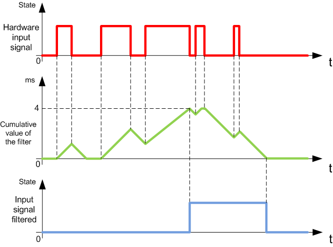

# Integrator Filter Principle

Integrator Filter Principle

The integrator filter is designed to reduce the effect of noise. Setting a filter value allows the controller to ignore sudden changes of input levels caused by noise.

The following timing diagram illustrates the integrator filter effects for a value of 4 ms:

NOTE: The value selected for the filter's time parameter specifies the cumulative time in ms that must elapse before the input can be 1.