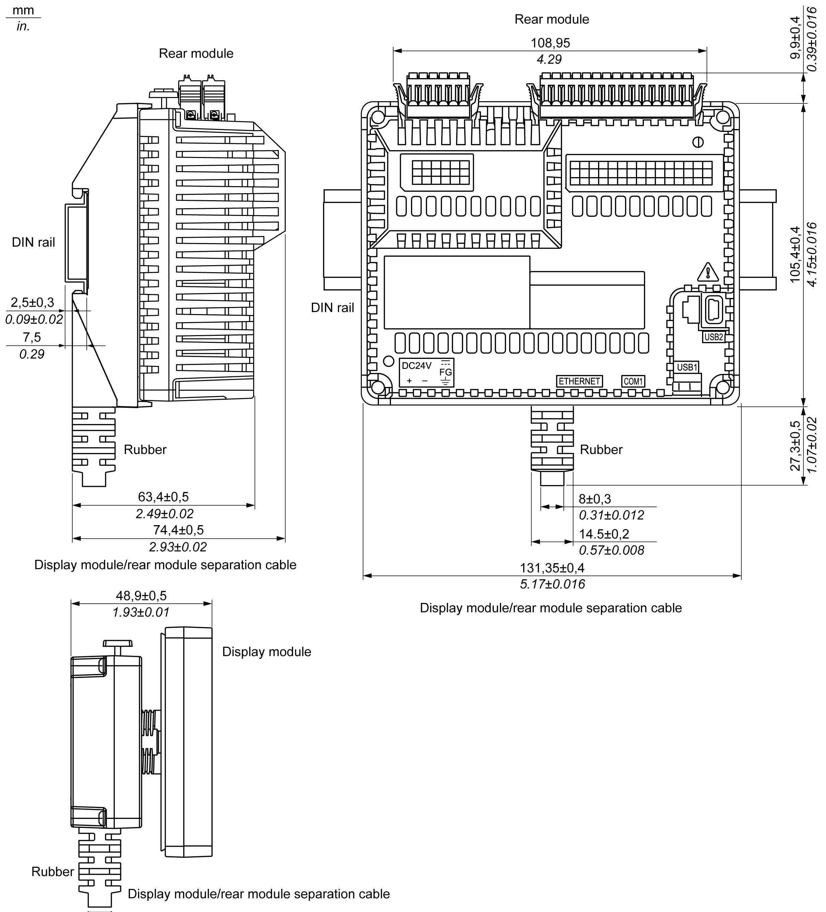

# Display Module/Rear Module Separation Cable

Display Module/Rear Module Separation Cable

NOTE:

Use this display module/rear module separation cable when the rear module is installed on the rail:

oThe outer diameter of the cable is 8 mm (0.31 in.).

oThe cable has 3 versions: 3 m (9.84 ft), 5 m (16.4 ft), and 10 m (32.8 ft).

oTo assemble this product, you need 20 mm (0.78 in.) more space to bend the cable in the end of the rubber.