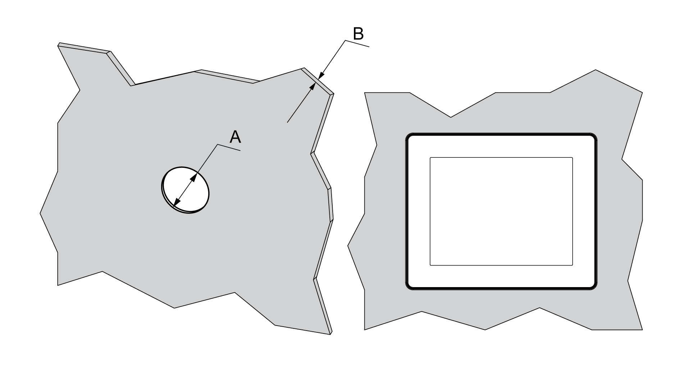

# Inserting a Display Module Without an Anti-Rotation Tee

Inserting a Display Module Without an Anti-Rotation Tee

Create a panel cut-out and insert the display module into the panel from the front.

The figure shows the panel cut-out:

Cut-out dimensions for mounting on a flat surface:

| A | B (1) | B (2) |
| --- | --- | --- |
| 22.500/-0.30 mm  (0.880/-0.01 in.) | 1.5...6 mm  (0.06...0.23 in.) | 3...6 mm  (0.11...0.23 in.) |
| (1)   Steel sheet  (2)   Glass fiber reinforced plastics (minimum GF30) | | |

NOTE: Without the tee option, the display module supports a rotating torque of 2.5 N•m (22.12 lb-in).