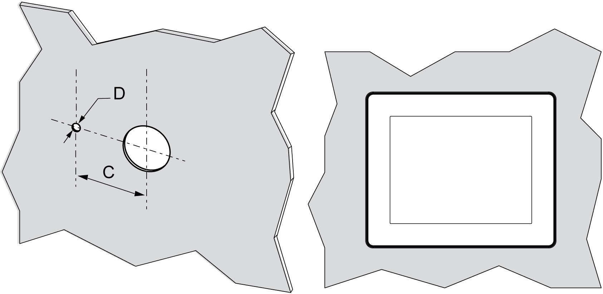

# Inserting a Display Module With an Anti-Rotation Tee

Inserting a Display Module With an Anti-Rotation Tee

Create a panel cut-out and insert the display module into the panel from the front.

The figure shows the panel cut-out for a HMISCU Controller using a tee:

Cut-out dimensions for mounting on a flat surface:

| C | D |
| --- | --- |
| 300/-0.20 mm  (1.180/-0.0007 in.) | 40/-0.20 mm  (0.150/-0.007 in.) |

NOTE: With the tee option, the display module supports a rotating torque of 6 N•m (53.10 lb-in).