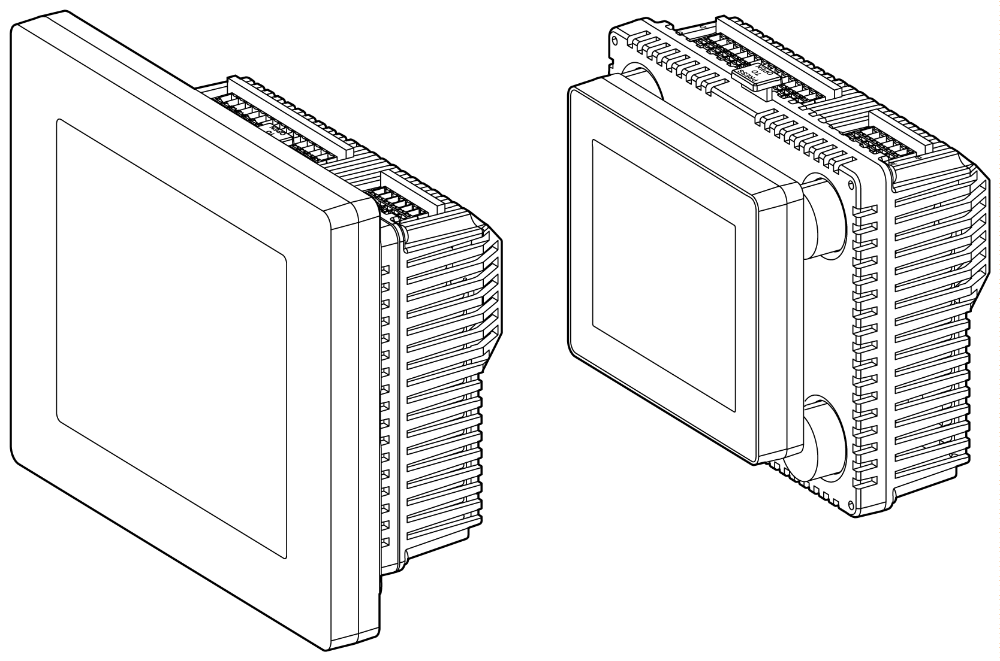

# Installing the HMISCU Controller

Installing the HMISCU Controller

In order to correctly run an application on the Magelis SCU, both the display module and the rear module must be connected.

|  |
| --- |
| Warning_Color.gifWARNING |
| EXPLOSION HAZARD |
| oDo not connect or disconnect while circuit is live.  oPotential electrostatic charging hazard: wipe the front panel of the terminal with a damp cloth before turning ON. |
| Failure to follow these instructions can result in death, serious injury, or equipment damage. |

If you power up the rear module without connecting the display module, the logic controller does not start and all outputs remain in the initial state. The power must be off before connecting the modules.

There are 2 ways to install the HMISCU.

Installing the HMISCU on the panel:

Installing the rear module on a DIN rail with a display module/rear module separation cable:

