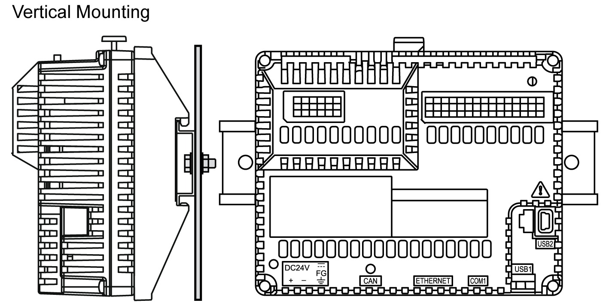

# Correct Mounting Position

Correct Mounting Position

If the display module is mounted separately, the rear module must be mounted vertically:

NOTE: Keep adequate spacing for proper ventilation to maintain an ambient temperature between 0...50 °C (32...122 °F).