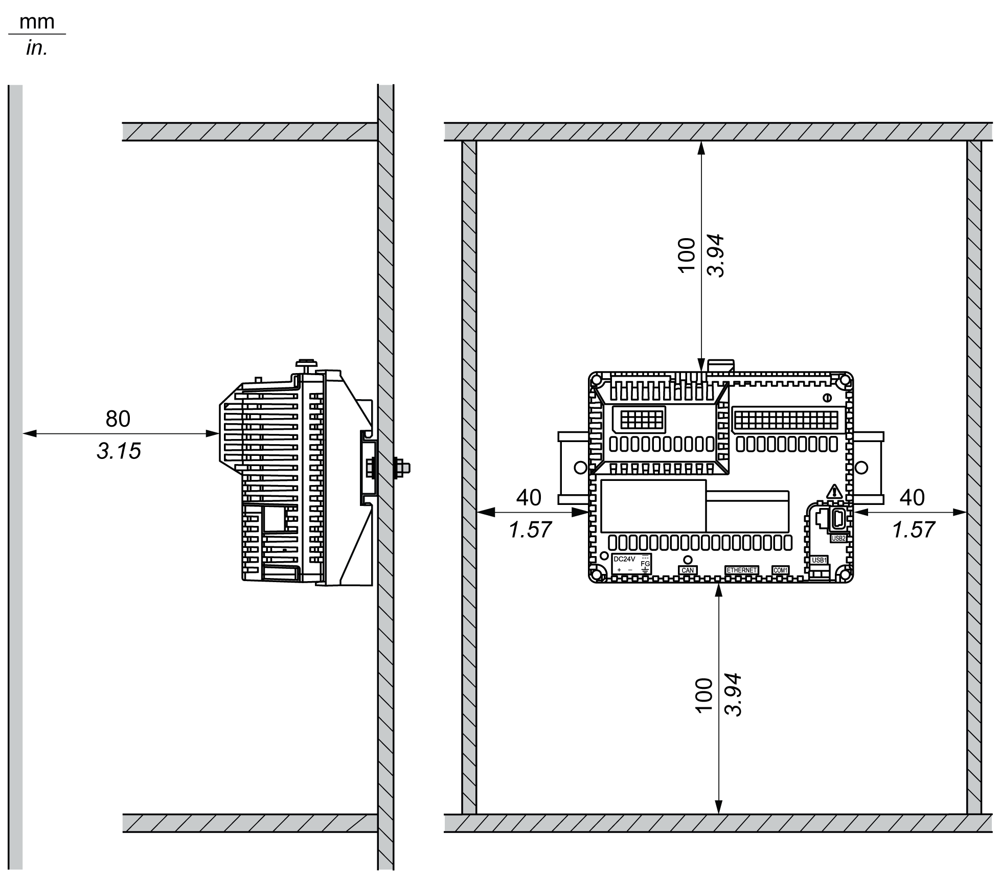

# Mounting and Keeping HMISCU Ventilated

Mounting and Keeping HMISCU Ventilated

The rear module has been designed as an IP20 product and must be installed in an enclosure. The clearances must be respected when installing the product:

oBetween the rear module and all sides of the cabinet (including the panel door).

oBetween the rear module terminal blocks and the wiring ducts. This distance reduces Electromagnetic Interference (EMI) between the controller and the wiring ducts.

oBetween the rear module and other heat generating devices installed in the same cabinet.

The figure shows the minimum clearances for the HMISCU controller:

