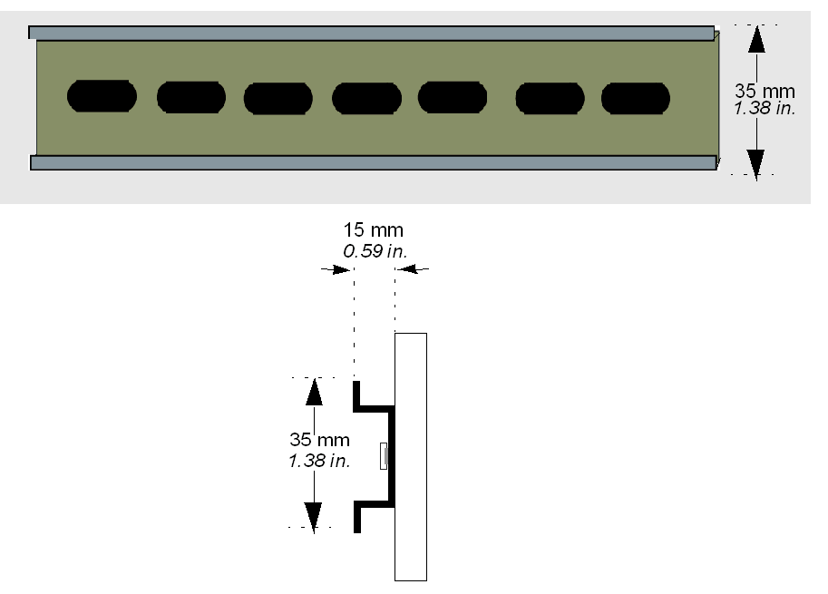

# Dimensions of the DIN Rail

Dimensions of the DIN Rail

 You can mount the controller and its expansion parts on a DIN rail. A DIN rail can be attached to a smooth mounting surface or suspended from a [EIA rack](../glossary/glossary.htm#XREF_D_SE_0024697_685) or a [NEMA](../glossary/glossary.htm#XREF_D_SE_0024697_324) cabinet.

The DIN rail measures 35 mm (1.38 in.) high and 15 mm (0.59 in.) deep, as shown below:

