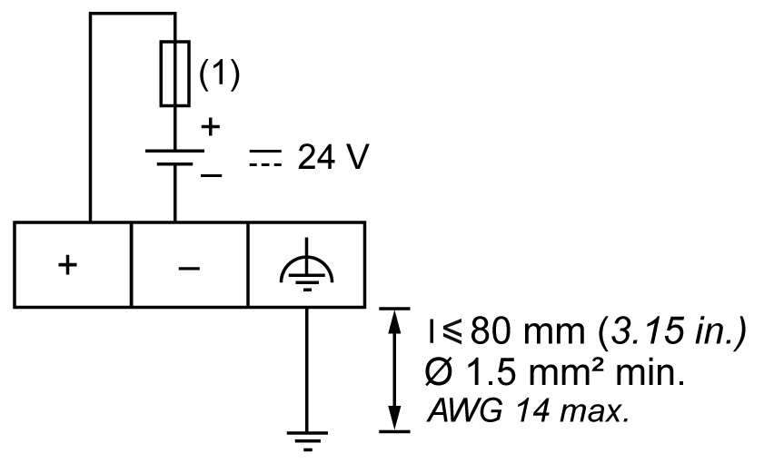

# DC Power Supply Wiring Diagram

DC Power Supply Wiring Diagram

1   Use an external, slow-blow, 2 A type T fuse.

|  |
| --- |
| Danger_Color.gifDANGER |
| FIRE HAZARD |
| Use only the correct wire sizes for the current capacity of the power supplies. |
| Failure to follow these instructions will result in death or serious injury. |

|  |
| --- |
| Warning_Color.gifWARNING |
| UNINTENDED EQUIPMENT OPERATION |
| Do not exceed any of the rated values specified in the environmental and electrical characteristics tables. |
| Failure to follow these instructions can result in death, serious injury, or equipment damage. |