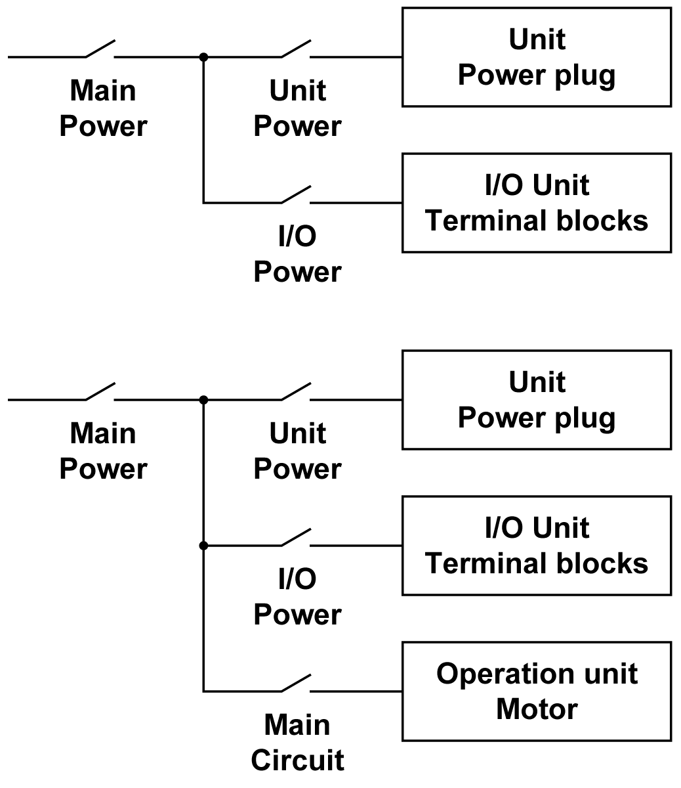
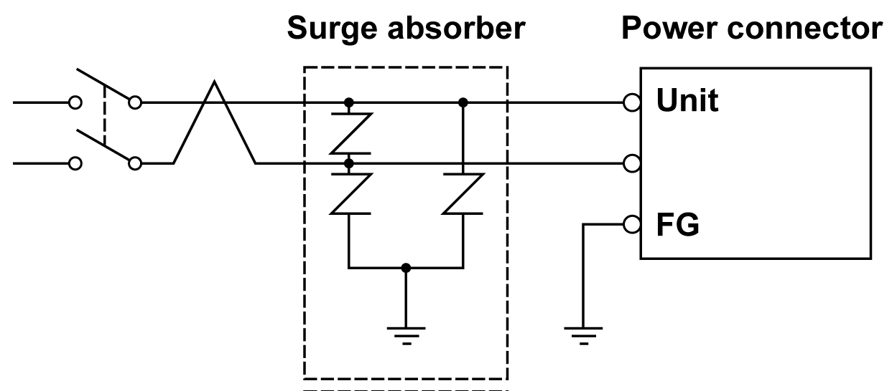

# Power Supply Connections

Power Supply Connections

For maintenance purpose, use the following connection diagram to set up your power supply connections:

NOTE:

oGround the surge absorber separately from the rear module.

oSelect a surge absorber that has a maximum circuit voltage greater than the peak voltage of the power supply.

The diagram illustrates a lightning surge absorber connection:

