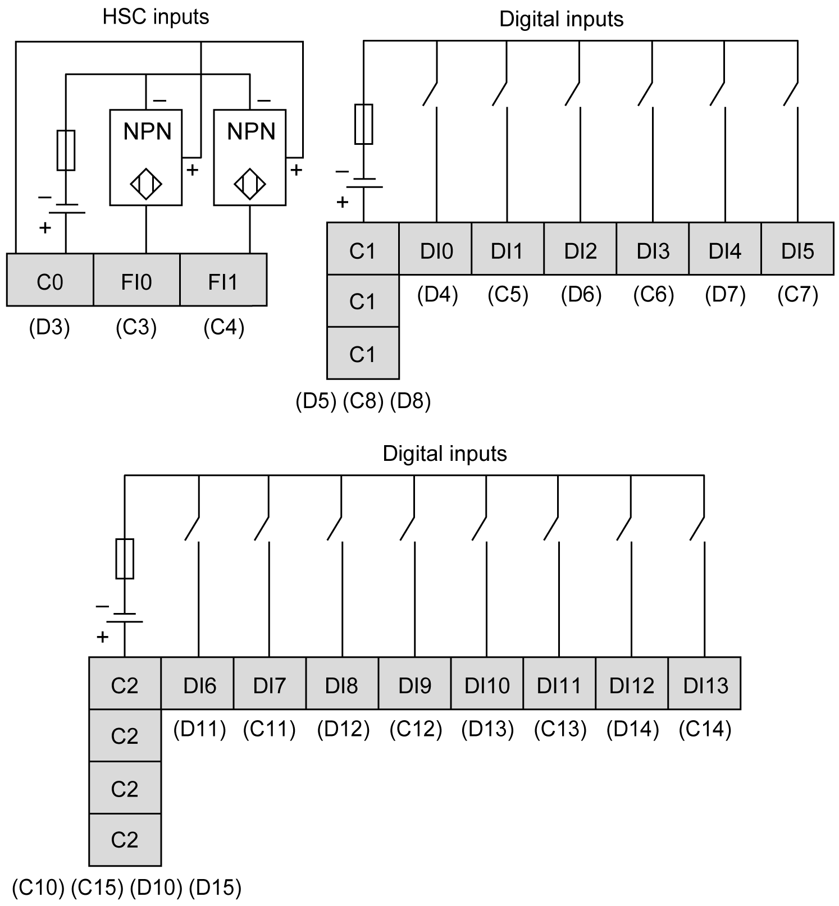

# Wiring Diagram

Wiring Diagram

The figure describes the wiring diagram of the HMISCU6A5, HMISCU8A5, and HMISAC digital input sink type (positive logical):

NOTE: The digital inputs are sink type (positive logical).

The figure describes the wiring diagram of the HMISCU6A5, HMISCU8A5, and HMISAC digital input source type (negative logical):

NOTE: The digital inputs are source type (negative logical).

|  |
| --- |
| Warning_Color.gifWARNING |
| UNINTENDED EQUIPMENT OPERATION |
| Do not connect wires to unused terminals and/or terminals indicated as “No Connection (N.C.)”. |
| Failure to follow these instructions can result in death, serious injury, or equipment damage. |

|  |
| --- |
| Warning_Color.gifWARNING |
| UNINTENDED EQUIPMENT OPERATION |
| Use the sensor and actuator power supply only for supplying power to sensors or actuators connected to the module. |
| Failure to follow these instructions can result in death, serious injury, or equipment damage. |