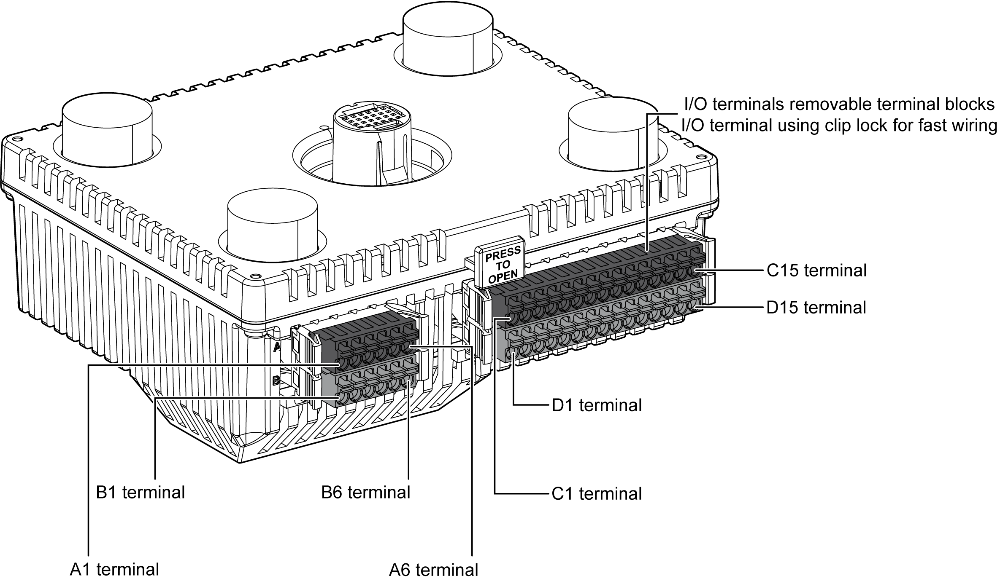
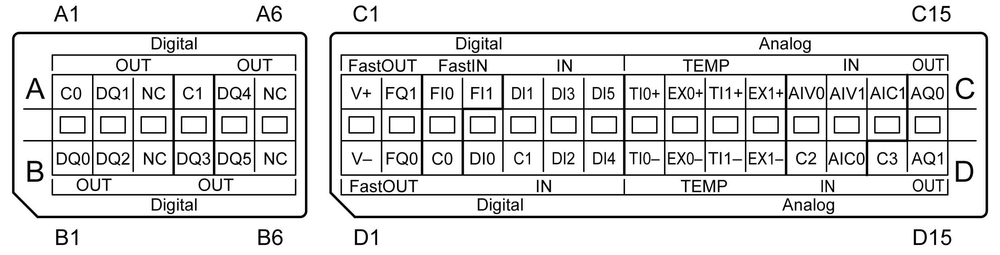

# Terminal Blocks

Terminal Blocks

The figure shows the terminal blocks:

The figure shows the pin assignment of the terminal blocks:

NOTE: Confirm the connector label ABCD and the stamp ABCD on the unit before wiring.

The table shows the group and the signal name of the terminal blocks:

| Pin Arrangement | Group | Pin | Signal Name | Group | Pin | Signal Name |
| --- | --- | --- | --- | --- | --- | --- |
| G-SE-0022397.2.gif-high.gif | 1 | A1 | C0 | 1 | B1 | DQ0 |
| A2 | DQ1 | B2 | DQ2 |
|  | A3 | NC |  | B3 | NC |
| 2 | A4 | C1 | 2 | B4 | DQ3 |
| A5 | DQ4 | B5 | DQ5 |
|  | A6 | NC |  | B6 | NC |

The table shows the group and signal names of the terminal blocks:

| Pin Arrangement | Group | Pin | Signal Name | Group | Pin | Signal Name |
| --- | --- | --- | --- | --- | --- | --- |
| G-SE-0022398.2.gif-high.gif | 3 | C1 | V+ | 3 | D1 | V- |
| C2 | FQ1 | D2 | FQ0 |
| 4 | C3 | FI0 | 4 | D3 | C0 |
| C4 | FI1 | 5 | D4 | DI0 |
| 5 | C5 | DI1 | D5 | C1 |
| C6 | DI3 | D6 | DI2 |
| C7 | DI5 | D7 | DI4 |
| 6 | C8 | TI0+ | 6 | D8 | TI0- |
| C9 | EX0+ | D9 | EX0- |
| C10 | TI1+ | D10 | TI1- |
| C11 | EX1+ | D11 | EX1- |
| 7 | C12 | AIV0 | 7 | D12 | C2 |
| C13 | AIV1 | D13 | AIC0 |
| C14 | AIC1 | 8 | D14 | C3 |
| 8 | C15 | AQ0 | D15 | AQ1 |

|  |
| --- |
| DangerElectrical_Color.gifDanger_Color.gifDANGER |
| HAZARD OF ELECTRIC SHOCK, EXPLOSION OR ARC FLASH |
| oDisconnect all power from all equipment including connected devices prior to removing any covers or doors, or installing or removing any accessories, hardware, cables, or wires except under the specific conditions specified in the appropriate hardware guide for this equipment.  oAlways use a properly rated voltage sensing device to confirm the power is off where and when indicated.  oReplace and secure all covers, accessories, hardware, cables, and wires and confirm that a proper ground connection exists before applying power to the unit.  oUse only the specified voltage when operating this equipment and any associated products. |
| Failure to follow these instructions will result in death or serious injury. |