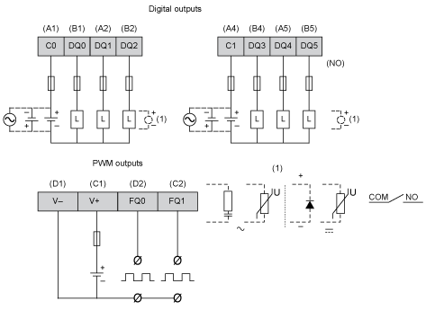

# Wiring Diagram

Wiring Diagram

The figure describes the wiring diagram of the HMISCU6B5, HMISCU8B5 and HMISBC digital outputs:

To improve the life time of the contacts, and to protect from potential damage by reverse EMF when using inductive load, connect:

oa free wheeling diode in parallel to each inductive DC load

oan RC snubber in parallel of each inductive AC load

|  |
| --- |
| Warning_Color.gifWARNING |
| UNINTENDED EQUIPMENT OPERATION |
| Do not connect wires to unused terminals and/or terminals indicated as “No Connection (N.C.)”. |
| Failure to follow these instructions can result in death, serious injury, or equipment damage. |