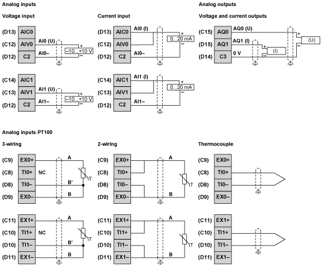

# Wiring Diagram

Wiring Diagram

The figure describes the wiring diagram of the rear module analog inputs and analog outputs:

|  |
| --- |
| Warning_Color.gifWARNING |
| UNINTENDED EQUIPMENT OPERATION |
| Do not connect wires to unused terminals and/or terminals indicated as “No Connection (N.C.)”. |
| Failure to follow these instructions can result in death, serious injury, or equipment damage. |

|  |
| --- |
| Warning_Color.gifWARNING |
| UNINTENDED EQUIPMENT OPERATION |
| oUse shielded cables for all fast I/O, analog I/O, and communication signals.  oGround cable shields for all fast I/O, analog I/O, and communication signals at a single point1.  oRoute communications and I/O cables separately from power cables. |
| Failure to follow these instructions can result in death, serious injury, or equipment damage. |

1Multipoint grounding is permissible if connections are made to an equipotential ground plane dimensioned to help avoid cable shield damage in the event of power system short-circuit currents.

|  |
| --- |
| Warning_Color.gifWARNING |
| UNINTENDED EQUIPMENT OPERATION |
| oUse shielded cables for all fast I/O, analog I/O and communication signals.  oGround cable shields for all analog I/O, fast I/O and communication signals at a single point1.  oRoute communication and I/O cables separately from power cables. |
| Failure to follow these instructions can result in death, serious injury, or equipment damage. |