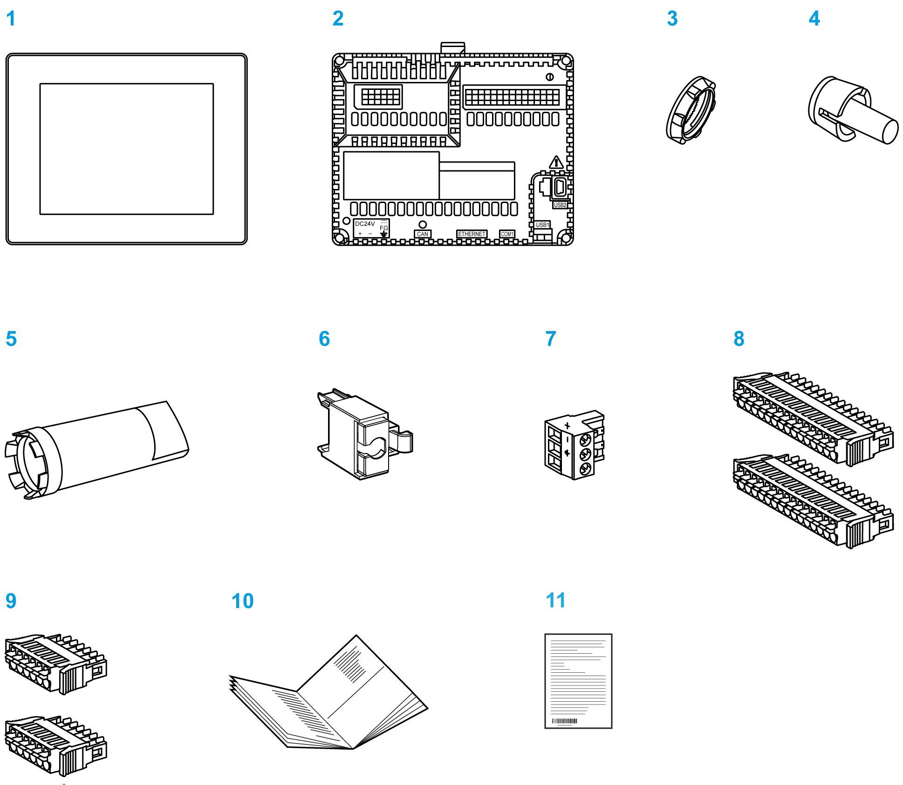
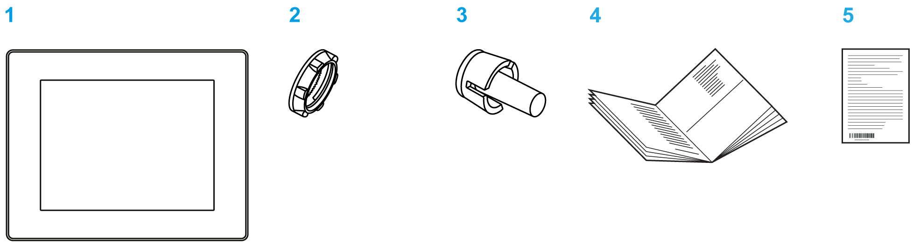
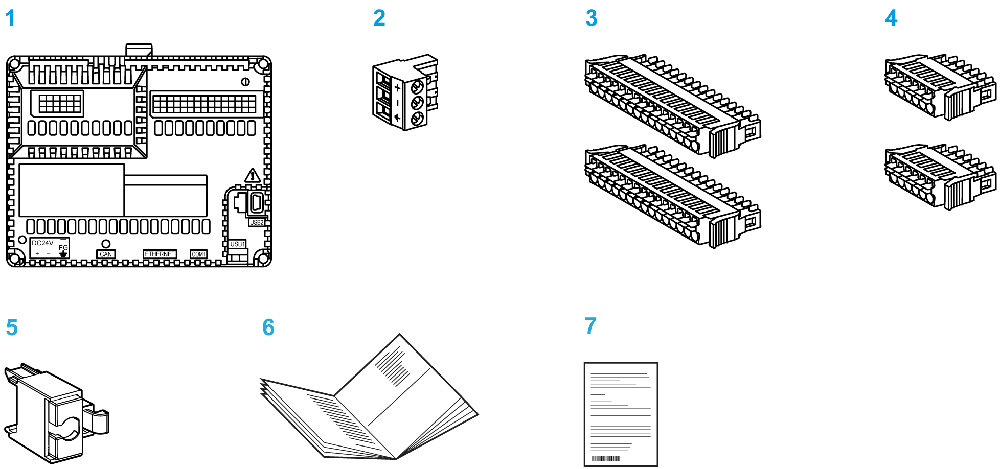

# Package Contents

Package Contents

HMISCU Package Contents

Verify that all items shown in the figure are present in your package:

1   Display module

2   Rear module

3   Display installation nut (attached to the display module)

4   Anti-rotation tee

5   Socket wrench

6   USB clamp type A

7   DC power supply connector

8   I/O connector 15-pin x 2

9   I/O connector 6-pin x 2

10   HMISCU Installation Guide

11   Warning / Caution information

Display Module Package Contents

Verify that all items shown in the figure are present in your package:

1   Display module

2   Display installation nut (attached to the display module)

3   Anti-rotation tee

4   HMISCU Installation Guide

5   Warning / Caution information

Rear Module Package Contents

Verify that all items shown in the figure are present in your package:

1   Rear module

2   DC power supply connector

3   I/O connector 15-pin x 2

4   I/O connector 6-pin x 2

5   USB clamp type A

6   HMISCU Installation Guide

7   Warning / Caution information

Product Label Sticker

You can identify the product version (PV), revision level (RL), and the software version (SV) from the product label on the panel.

The following diagram is a representation of a typical label:

EIO0000001232.05

© 2016 Schneider Electric. All rights reserved.