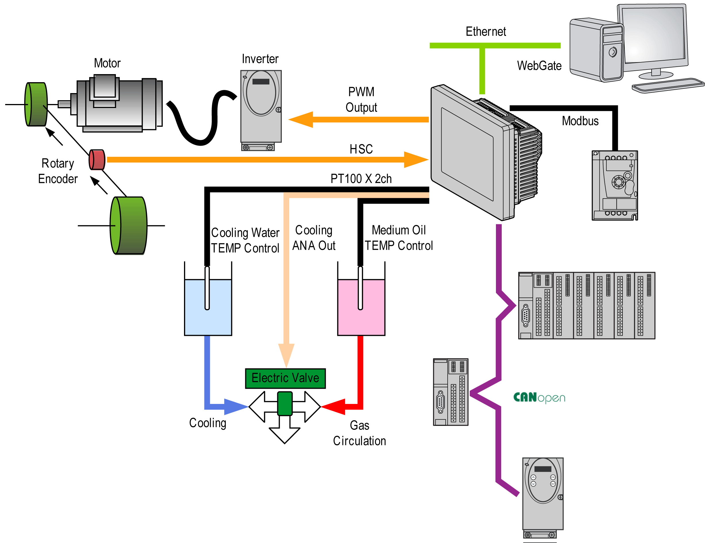
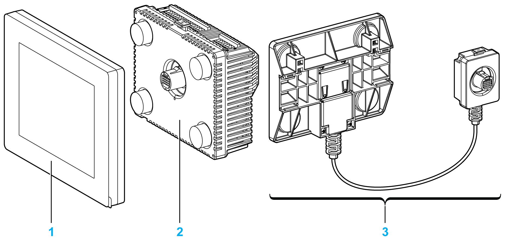

# System Architecture

System Architecture

Introduction

The HMISCU system is a compact control system with the HMI and I/O embedded. The HMISCU system offers an all-in-one solution for an optimized configuration and an expandable architecture.

Architecture Example

The following figure provides an example of the HMISCU hardware environment:

HMISCU System Architecture

Optimized configuration and flexibility is provided by the association of:

orear module that provides the logic and HMI functions

o[front module that provides the display feature](../Display_Modules/Display_Modules.htm#XREF_D_SE_0024498_1)

odisplay module/rear module separation cable allows you to separate the display module from the rear module

Application requirements determine the architecture of your HMISCU system:

ohigh speed counter (HSC) inputs

opulse width modulation (PWM) outputs

opulse train output (PTO) outputs

The figure shows the components of the HMISCU system:

1    Display module

2    Rear module

3    Display module/rear module separation cable

EIO0000001232.05

© 2016 Schneider Electric. All rights reserved.