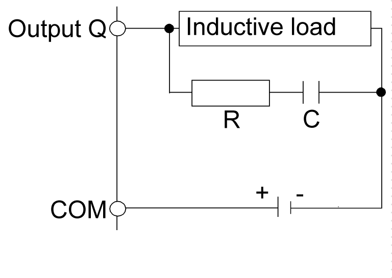
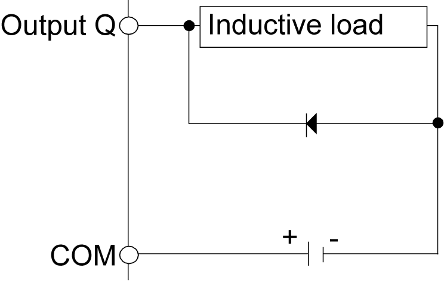
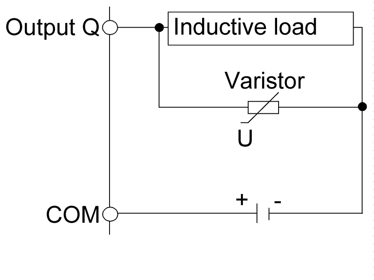

# Wiring Rules and Recommendations

Wiring Rules and Recommendations

Introduction

There are several rules that must be followed when wiring the HMISCU system.

Wiring Guidelines

|  |
| --- |
| DangerElectrical_Color.gifDanger_Color.gifDANGER |
| HAZARD OF ELECTRIC SHOCK, EXPLOSION OR ARC FLASH |
| oDisconnect all power from all equipment including connected devices prior to removing any covers or doors, or installing or removing any accessories, hardware, cables, or wires except under the specific conditions specified in the appropriate hardware guide for this equipment.  oAlways use a properly rated voltage sensing device to confirm the power is off where and when indicated.  oReplace and secure all covers, accessories, hardware, cables, and wires and confirm that a proper ground connection exists before applying power to the unit.  oUse only the specified voltage when operating this equipment and any associated products. |
| Failure to follow these instructions will result in death or serious injury. |

The following rules must be applied when wiring a HMISCU system:

oI/O and communication wiring must be kept separate from the power wiring. Route these 2 types of wiring in separate cable ducting.

oVerify that the operating conditions and environment are within specification.

oUse proper wire sizes to meet voltage and current requirements.

oUse copper conductors (highly recommended).

oUse twisted-pair, shielded cables for analog, and/or fast I/O.

oUse twisted-pair, shielded cables for networks, and fieldbus.

oFor the power connector, refer to [DC power supply wiring diagram](../HMI_SCU_Logic_Controller_Installation/HMI_SCU_Logic_Controller_Installation-11.htm#XREF_D_SE_0024597_12).

oTo help prevent malfunctions due to noise, separate all control, communication and power lines by placing them in separate ducts.

|  |
| --- |
| Warning_Color.gifWARNING |
| UNINTENDED EQUIPMENT OPERATION |
| oUse shielded cables for all fast I/O, analog I/O, and communication signals.  oGround cable shields for all fast I/O, analog I/O, and communication signals at a single point1.  oRoute communications and I/O cables separately from power cables. |
| Failure to follow these instructions can result in death, serious injury, or equipment damage. |

1Multipoint grounding is permissible if connections are made to an equipotential ground plane dimensioned to help avoid cable shield damage in the event of power system short-circuit currents.

For more details, refer to [Grounding Shielded Cables](HMI_SCU_System_General_Rules_for_Implementing-7.htm#XREF_D_SE_0024578_1).

The wire sizes to use with the removable terminal blocks is 0.20 to 0.81 mm2 (AWG 24 to 18).

|  |
| --- |
| Danger_Color.gifDANGER |
| FIRE HAZARD |
| Use only the correct wire sizes for the current capacity of the power supplies. |
| Failure to follow these instructions will result in death or serious injury. |

Terminal Block

Plugging a terminal block into the incorrect rear module can cause an electric shock or unintended operation of the application and/or can damage the rear module.

|  |
| --- |
| DangerElectrical_Color.gifDanger_Color.gifDANGER |
| ELECTRIC SHOCK OR UNINTENDED EQUIPMENT OPERATION |
| Connect the terminal blocks to their designated location. |
| Failure to follow these instructions will result in death or serious injury. |

Avoid temperature changes on the thermocouple’s connection terminal. Temperature measurements may not be accurate due to temperature changes in the cold junction.

NOTE: When installing the terminal blocks to the rear module, please keep the display module unmounted.

NOTE: To help prevent a terminal block from being inserted incorrectly, clearly and uniquely code and label each terminal block and rear module.

The figure shows the labels on each terminal block:

NOTE: Terminal blocks A, B, C, and D can only use the respective connectors A, B, C, and D.

Protecting Outputs from Inductive Load Damage

Depending on the load, a protection circuit may be needed for the outputs on the controllers and certain modules. Inductive loads using DC voltages may create voltage reflections resulting in overshoot that will damage or shorten the life of output devices.

|  |
| --- |
| Caution_Color.gifCAUTION |
| OUTPUT CIRCUIT DAMAGE DUE TO INDUCTIVE LOADS |
| Use an appropriate external protective circuit or device to reduce the risk of inductive direct current load damage. |
| Failure to follow these instructions can result in injury or equipment damage. |

If your controller or module contains relay outputs, these types of outputs can support up to 240 Vac. Inductive damage to these types of outputs can result in welded contacts and loss of control. Each inductive load must include a protection device such as a peak limiter, RC circuit or flyback diode. Capacitive loads are not supported by these relays.

|  |
| --- |
| Warning_Color.gifWARNING |
| RELAY OUTPUTS WELDED CLOSED |
| oAlways protect relay outputs from inductive alternating current load damage using an appropriate external protective circuit or device.  oDo not connect relay outputs to capacitive loads. |
| Failure to follow these instructions can result in death, serious injury, or equipment damage. |

Protective circuit A: this protection circuit can be used for DC load power circuits.

oC represents a value from 0.1 to 1 μF.

oR represents a resistor of approximately the same resistance value as the load.

Protective circuit B: this protection circuit can be used for DC load power circuits.

Use a diode with the following ratings:

oReverse withstand voltage: power voltage of the load circuit x 10.

oForward current: more than the load current.

Protective circuit C: this protection circuit can be used for DC load power circuits.

oIn applications where the inductive load is switched on and off frequently and/or rapidly, ensure that the continuous energy rating (J) of the varistor exceeds the peak load energy by 20% or more.

EIO0000001232.05

© 2016 Schneider Electric. All rights reserved.