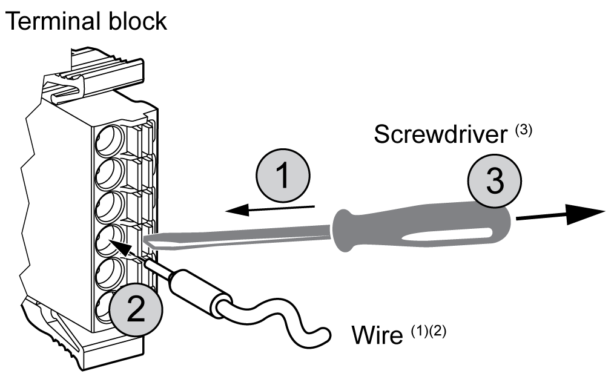

# Wiring to the DIO Terminal Block

Wiring to the DIO Terminal Block

Introduction

[Wiring Rules and Recommendations.](HMI_SCU_System_General_Rules_for_Implementing-5.htm#XREF_D_SE_0024577_1)

|  |
| --- |
| Caution_Color.gifCAUTION |
| EQUIPMENT DAMAGE |
| Be sure to remove the terminal blocks from the equipment prior to wiring. |
| Failure to follow these instructions can result in injury or equipment damage. |

Screwdriver Required to Wire Terminal Blocks

Recommended type: 1891348-1 (Tyco Electronics AMP)

If another manufacturer is used, be sure the part has the following dimensions:

opoint depth: 1.5 mm (0.06 in.)

opoint height: 2.4 mm (0.09 in.)

Point shape must be DIN5264A and meet standard DN EN60900.

Also, the screwdriver tip must be flat, as indicated, to access the narrow hole of the terminal block:

The terminal blocks are a spring clamp type.

Procedure

Use the following procedure to connect the wires to the terminal blocks:

| Step | Action |
| --- | --- |
| 1 | Insert the screwdriver into the square-shaped hole.  This will open the wire’s round-shaped hole. |
| 2 | Hold the screwdriver and insert the wire into the wire's round-shaped hole. |
| 3 | Take out the screwdriver from the square-shaped hole.  The round-shaped hole will then close, and the wire will be held securely in place. |

NOTE: To remove the wire, reinsert the screwdriver into the square-shaped hole and when the wire's spring clamp releases, pull out the wire.

(1) Wire should be 0.20...0.81 mm2 (AWG 24...18), with the end twisted. Applicable wire style are UL1015 and UL1007.

(2) Strip 7.0 mm (0.28 in) of jacket from the wire. Strip only the amount of jacket required. If too much jacket is removed, the ends may short against each other or against the terminals, which can create an electric short. If not enough jacket is removed, the wire may not make sufficient contact with the terminal.

Insert each wire completely into its opening. Improper insertion can lead to a loss of unit power or short circuit, either against the wire filaments or against the terminals, or to over heating of the wire and terminal.

(3) Do not rotate the point of the screwdriver inside the square-shaped opening. It may damage the equipment.

|  |
| --- |
| Warning_Color.gifWARNING |
| IMPROPER WIRING PRACTICES CAN MAKE EQUIPMENT INOPERABLE |
| oUse only the specified wire sizes for I/O channels and power supplies.  oPrepare wires and make connections as specified in this documentation.  oDo not connect more than one wire per terminal block connector. |
| Failure to follow these instructions can result in death, serious injury, or equipment damage. |

EIO0000001232.05

© 2016 Schneider Electric. All rights reserved.