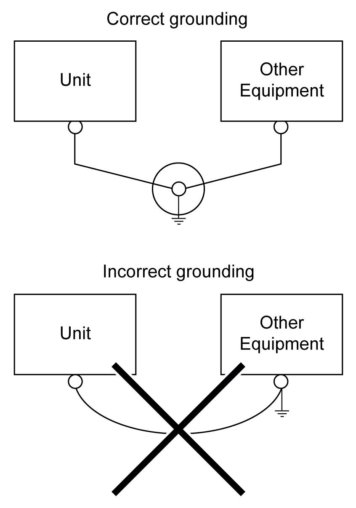

# Grounding the System

Grounding the System

Overview

To minimize the effects of electromagnetic interference, cables carrying the fast Input/Output, analog Input/Output, and Serial communication signals must be shielded.

|  |
| --- |
| Warning_Color.gifWARNING |
| UNINTENDED EQUIPMENT OPERATION |
| oUse shielded cables for all fast I/O, analog I/O, and communication signals.  oGround cable shields for all fast I/O, analog I/O, and communication signals at a single point1.  oRoute communications and I/O cables separately from power cables. |
| Failure to follow these instructions can result in death, serious injury, or equipment damage. |

1Multipoint grounding is permissible if connections are made to an equipotential ground plane dimensioned to help avoid cable shield damage in the event of power system short-circuit currents.

The   use of shielded cables requires compliance with the following wiring rules:

oFor protective ground ([PE](../glossary/glossary.htm#XREF_D_SE_0024697_501)) connections, metal conduit or ducting can be used for part of the shielding length, provided there is no break in the continuity of the ground connections. For functional ground ([FE](../glossary/glossary.htm#XREF_D_SE_0024697_704)), the shielding is intended to attenuate electromagnetic interference and the shielding must be continuous for the length of the cable. If the purpose is both functional and protective, as is often the case for communication cables, the cable must have continuous shielding.

oWherever possible, keep cables carrying one type of signal separate from the cables carrying other types of signals or power.

Protective Ground (PE) on the Backplane

The protective ground (PE) is connected to the conductive backplane by a heavy-duty wire, usually a braided copper cable with the maximum allowable cable section.

Functional Ground on the DIN Rail

The DIN rail for your HMISCU system is common with the functional ground plane and must be mounted on a conductive backplane.

|  |
| --- |
| Warning_Color.gifWARNING |
| UNINTENDED EQUIPMENT OPERATION |
| Connect the DIN rail to the functional ground (FE) of your installation. |
| Failure to follow these instructions can result in death, serious injury, or equipment damage. |

Shielded Cables Connections

Cables carrying the fast I/O, analog I/O, and fieldbus communication signals must be shielded. The shielding must be securely connected to ground. The fast I/O and analog I/O shields may be connected either to the functional ground (FE) or to the protective ground (PE) of your HMISCU logic controller. The fieldbus communication cable shields must be connected to the protective ground (PE) with a connecting clamp secured to the conductive backplane of your installation.

|  |
| --- |
| DangerElectrical_Color.gifDanger_Color.gifDANGER |
| HAZARD OF ELECTRIC SHOCK |
| oThe grounding terminal connection (PE) must be used to provide a protective ground at all times.  oMake sure that an appropriate, braided ground cable is attached to the PE/PG ground terminal before connecting or disconnecting the network cable to the equipment. |
| Failure to follow these instructions will result in death or serious injury. |

The shielding of the cables must be connected to the protective ground (PE).

|  |
| --- |
| Danger_Color.gifDANGER |
| HAZARD OF ELECTRIC SHOCK |
| Make sure that cables are securely connected to the protective ground (PE). |
| Failure to follow these instructions will result in death or serious injury. |

NOTE: The functional ground of the Ethernet connection is internal.

Functional Ground (FE) Cable Shielding

| Step | Description | |
| --- | --- | --- |
| 1 | Install the grounding bar directly on the conductive backplane below the HMISCU rear module as illustrated. | G-SE-0021342.1.gif-high.gif |
| 2 | Strip the shielding for a length of 15 mm (0.59 in.). | G-SE-0004794.1.gif-high.gif |
| 3 | Tightly clamp on the blade connector (1) using nylon fastener (2) (width 2.5...3 mm (0.1...0.12 in.)) and appropriate tool. | G-SE-0004796.2.gif-high.gif |

Protective Ground (PE) Cable Shielding

| Step | Description | |
| --- | --- | --- |
| 1 | Strip the shielding for a length of 15 mm (0.59 in.) | G-SE-0004794.1.gif-high.gif |
| 2 | Attach the cable to the conductive backplane plate (1) by attaching the grounding clamp (2) to the stripped part of the shielding as close as possible to the HMISCU rear module. | G-SE-0021209.1.gif-high.gif |

NOTE: The shielding must be clamped securely to the conductive backplane to ensure a good contact.

Exclusive Grounding

Connect the frame ground (FG) terminal on the power plug to an exclusive ground.

Grounding Procedure

| Step | Action |
| --- | --- |
| 1 | Check that the grounding resistance is less than 100 Ω. |
| 2 | Create the connection point as close to the unit as possible, and make the wire as short as possible. When using a long grounding wire, replace the thin wire with a thicker wire, and place it in a duct. |

Common Grounding

Precautions:

Electromagnetic interference (EMI) can be created if the devices are improperly grounded. Electromagnetic interference (EMI) can cause loss of communication.

Do not use common grounding, except for the authorized configuration described below.

If exclusive grounding is not possible, use a common connection point.

EIO0000001232.05

© 2016 Schneider Electric. All rights reserved.