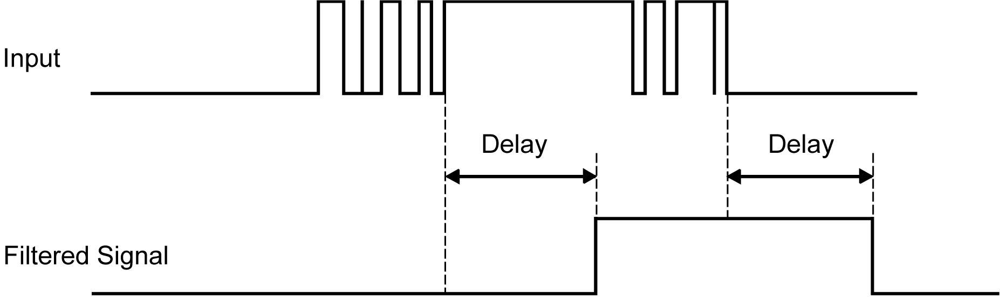
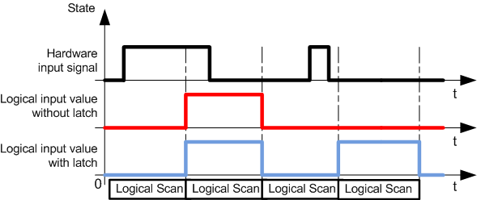

# Input Management

Input Management

Overview

The HMISCU includes 2 fast inputs.

The following functions are configurable on regular and/or fast inputs:

oFilters (depends on the function associated with the input).

o2 fast inputs can be either latched or used for events (rising edge, falling edge, or both) and thus be linked to an external task (up to 2).

oAny digital input can be used for the Run/Stop function.

oSome of the inputs can be used by HSC, PTO, and [PWM](../glossary/glossary.htm#XREF_D_SE_0024697_503) functions.

NOTE: All inputs by default can be used as regular inputs.

Integrator Filter Principle

The integrator filter is designed to reduce the effect of noise. Setting a filter value allows the controller to ignore sudden changes of input levels caused by noise.

The following timing diagram illustrates the integrator filter effects for a value of 4 ms:

NOTE: The value selected for the filter's time parameter specifies the cumulative time in ms that must elapse before the input can be 1.

Bounce Filter Principle

The bounce filter is designed to reduce the bouncing effect at the inputs. Setting a bounce filter value allows the controller to ignore sudden changes of input levels caused by noise. The bounce filter is only available on the fast inputs.

The following timing diagram illustrates the anti-bounce filter effects:

Bounce Filter Availability

You can use the bounce filter on a fast input when:

oUsing a latch or event.

oNo HSC is enabled.

Latching

Latching is a function that can be assigned to the HMISCU fast inputs. Use this function to memorize (or latch) any pulse with a duration less than the HMISCU scan time. When a pulse is shorter than one scan, the controller latches the pulse, which is then updated in the next scan. This latching mechanism only recognizes rising edges. Falling edges cannot be latched. Assigning inputs to latch with the I/O configuration screen in SoMachine.

The following timing diagram illustrates the latching effects:

Event

You can associate an input configured for Event with an [External Task](../../../../../../api/crossBook?lang=en-US&virtualBookName=SCUprg&topicID=D_SE_0008842_16).

RUN/STOP

Use the Run/Stop function to start or stop a program using an input:

oWhen the configured Run/Stop input is at logic 0, the controller is put into a Stop state and any outside command to enter the Run state is ignored.

oA rising edge (passing from 0 to 1) of the Run/Stop input starts the application as the controller enters the Run state.

oRun/Stop commands to SoMachine may also be issued from the HMI via touch switches on a panel. Refer to [Commanding State Transitions](../../../../../../api/crossBook?lang=en-US&virtualBookName=SCUprg&topicID=D_SE_0008938_1).

oVijeo Designer has an Controller Lockout feature for added safety, which will help prevent Run when active (this has priority over all methods of RUN). Refer to [Controller Lockout feature](../../../../../../api/crossBook?lang=en-US&virtualBookName=SCUprg&topicID=D_SE_0002679_12).

oWhen the configured Run/Stop input is at logic 1, then the controller program is running unless otherwise commanded by SoMachine (Run/Stop commands from SoMachine are allowed).

|  |
| --- |
| Warning_Color.gifWARNING |
| UNINTENDED MACHINE OR PROCESS START-UP |
| oVerify the state of security of your machine or process environment before applying power to the Run/Stop input.  oUse the Run/Stop input to help prevent the unintentional start-up from a remote location. |
| Failure to follow these instructions can result in death, serious injury, or equipment damage. |

For more information, refer to [Embedded I/O configuration](../../../../../../api/crossBook?lang=en-US&virtualBookName=SCUprg&topicID=D_SE_0031156_1).

EIO0000001232.05

© 2016 Schneider Electric. All rights reserved.