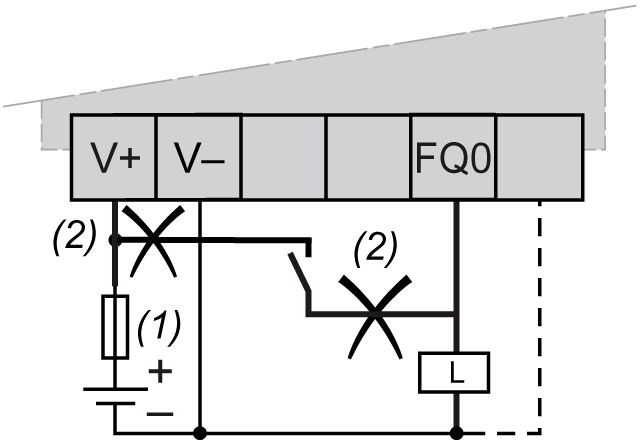

# Output Management

Output Management

Introduction

The HMISCU Controller includes regular outputs and fast outputs.

The following output functions are configurable on fast outputs:

opulse train output (PTO)

opulse width modulation (PWM)

NOTE: By default, all outputs can be used as regular outputs.

Fast Output Management Availability

The information refers to all HMISCU Controllers with fast outputs:

| Function | | PTO / PWM |
| --- | --- | --- |
| Channel Number | | Channel Name |
| Transistor output | FQ0 | PTO0 Output0 |
| FQ1 | PTO1 Output1 |

Fallback Modes (Behavior for Outputs in Stop)

When the controller enters the STOP or EXCEPTION state for any reason, the local outputs are set to the fallback values. 2 modes are available:

Set all outputs to default: Each output is set to the configured default value, either 0 or 1 (initially set to 0 in the configuration).

Keep current values: Each output remains in its current state.

The fallback settings that may be configured (fallback to 0, fallback to 1, or fallback to the current state) do not apply to fast outputs if these outputs are configured for embedded function. If a detected error results in the controller entering fallback mode, these outputs will assume a value of 0 regardless of the configured fallback setting.

|  |
| --- |
| Warning_Color.gifWARNING |
| UNINTENDED EQUIPMENT OPERATION |
| Design and program your system so that controlled equipment assumes a safe state when the controller enters fallback mode if you use fast outputs for embedded function. |
| Failure to follow these instructions can result in death, serious injury, or equipment damage. |

NOTE:

oFallback configuration for outputs does not apply when fast outputs are used for embedded function. In these cases fallback value is always 0.

oIn case of fallback for PTO embedded function, any ongoing move is aborted and ramp-down to 0 (controlled stop feature).

Short-circuit or Over-Current on Outputs

In the case of short-circuit or over-current on outputs, there are 2 groups of outputs:

oGroup 3: fast outputs

oGroup 1 and 2: relay outputs

There is a short circuit protection for Group 1 from outputs to V-. However there is no other short circuit protection on the outputs.

For HMISCU•A5 (type DIO), in the case of short-circuit or over-current on outputs, there are different considerations for the 2 groups of outputs:

oGroup 3 (FQ0 to FQ1): 2 fast outputs

oGroup 1 and 2 (DQ0 to DQ7): 8 regular outputs

For HMISCU•B5 (type DIO and AIO), in the case of short-circuit or over-current on outputs, there are different considerations for the 2 groups of outputs:

oGroup 3 (FQ0 to FQ1): 2 fast outputs

oGroup 1 and 2 (DQ0 to DQ5): 6 regular outputs

NOTE: Groups are defined in terminal block description in the presentation of each controller chapter.

The table describes the detection:

| If... | then... |
| --- | --- |
| you have a short-circuit at 0 V on group 3 | group 3 automatically goes into thermal protection mode (all fast, PWM outputs set to 0 and PTO outputs run an immediate stop) and then periodically rearmed every 10 seconds to test the connection state (see warning below). |
| you have a short-circuit at 24 V on group 3 | group 3 automatically goes into protection mode and is then periodically rearmed every 200 microseconds to test the connection state. |

NOTE: The information in the table does not apply to relay outputs.

For more information on protecting outputs, refer to your controller wiring diagram and to the [general wiring rules](../HMI_SCU_System_General_Rules_for_Implementing/HMI_SCU_System_General_Rules_for_Implementing-5.htm#XREF_D_SE_0024577_1).

NOTE: The short-circuit diagnostic for each category is provided by the [function GetshortcutStatus](../../../../../../api/crossBook?lang=en-US&virtualBookName=SCUsys&topicID=D_SE_0031054_1).

The regular outputs of this equipment do not have built-in reverse polarity protection. Incorrectly connecting polarity can permanently damage the output circuits or otherwise result in unintended operation of the equipment.

|  |
| --- |
| NOTICE |
| DAMAGE TO FAST OUTPUTS |
| oEnsure the use of adequate protection against short-circuits on the power supply to the fast outputs.  oDo not connect positive voltage to any of the DC fast output terminals.  oComply with the wiring diagrams immediately that follow this message. |
| Failure to follow these instructions can result in equipment damage. |

Example of incorrect wiring:

1   2 A fast-blow fuse

2   Incorrect wiring

|  |
| --- |
| Warning_Color.gifWARNING |
| UNINTENDED MACHINE START-UP |
| Inhibit the automatic rearming of outputs if this feature is an undesirable behavior for your machine or process. |
| Failure to follow these instructions can result in death, serious injury, or equipment damage. |

Wiring Considerations

NOTE: The power supply of PTO/PWM circuit runs before the system power runs, otherwise the error of PTO/PWM occurs.

|  |
| --- |
| Warning_Color.gifWARNING |
| UNINTENDED EQUIPMENT OPERATION |
| Wire the outputs correctly according to the wiring diagram. |
| Failure to follow these instructions can result in death, serious injury, or equipment damage. |

If your controller or module contains relay outputs, these types of outputs can support up to 240 Vac. Inductive damage to these types of outputs can result in welded contacts and loss of control. Each inductive load must include a protection device such as a peak limiter, RC circuit or flyback diode. Capacitive loads are not supported by these relays.

|  |
| --- |
| Warning_Color.gifWARNING |
| RELAY OUTPUTS WELDED CLOSED |
| oAlways protect relay outputs from inductive alternating current load damage using an appropriate external protective circuit or device.  oDo not connect relay outputs to capacitive loads. |
| Failure to follow these instructions can result in death, serious injury, or equipment damage. |

EIO0000001232.05

© 2016 Schneider Electric. All rights reserved.