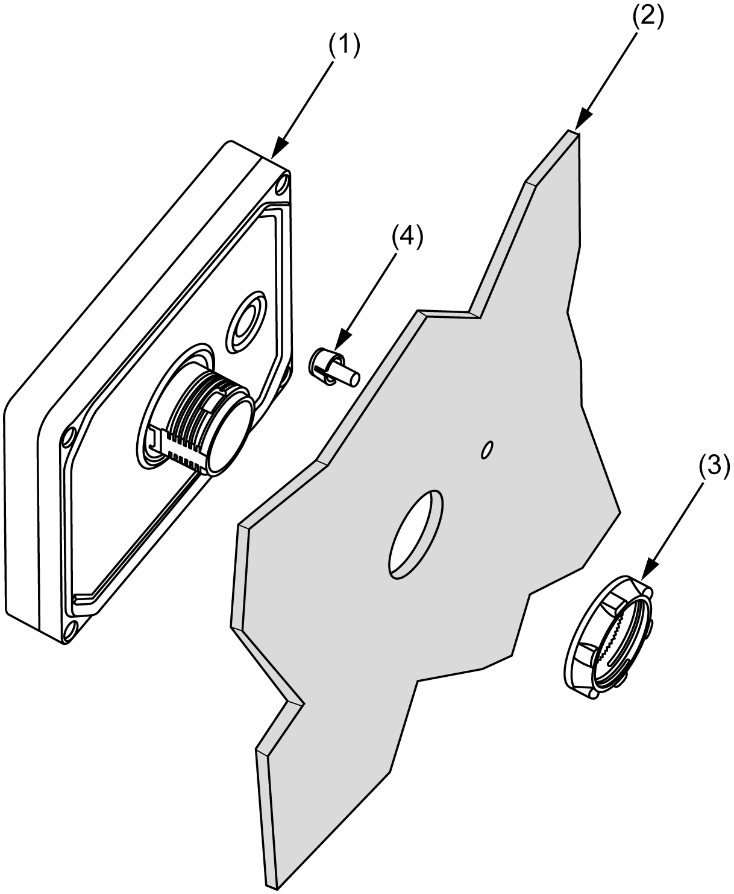
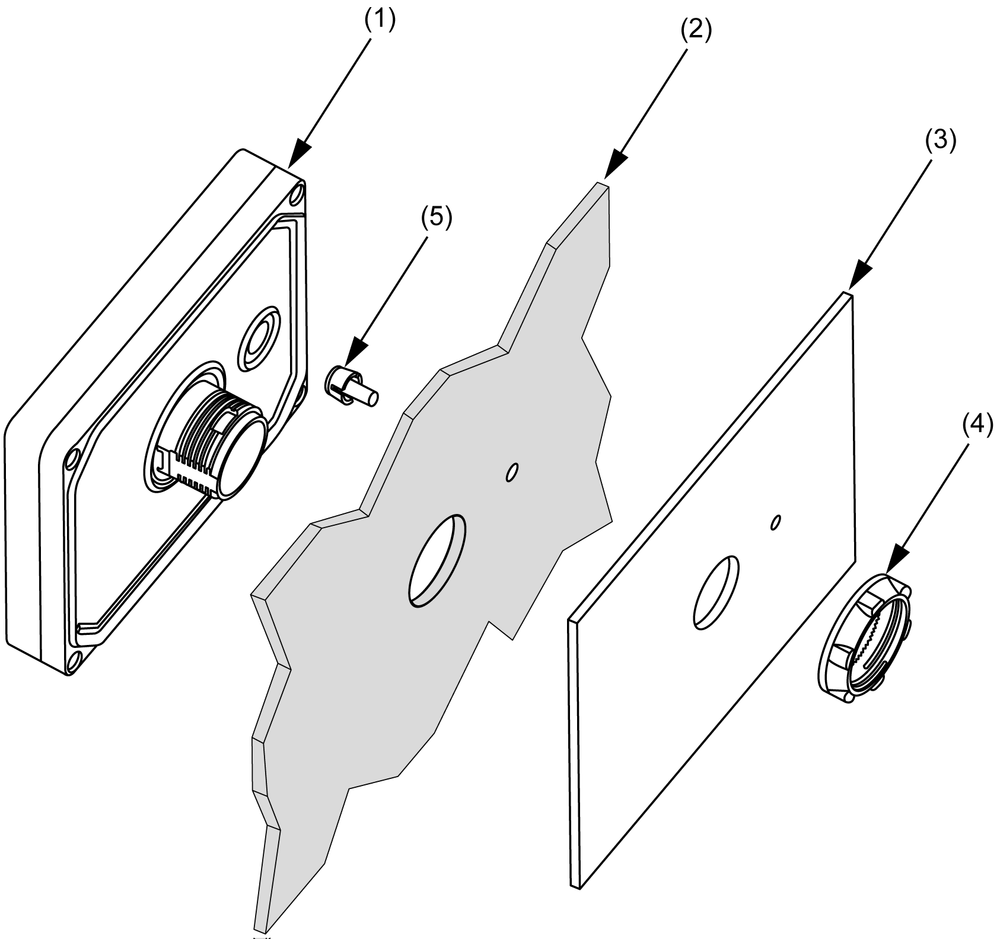

# Panel Cut-Out Dimensions and Installation

Panel Cut-Out Dimensions and Installation

Inserting a Display Module Without an Anti-Rotation Tee

Create a panel cut-out and insert the display module into the panel from the front.

The figure shows the panel cut-out:

Cut-out dimensions for mounting on a flat surface:

| A | B (1) | B (2) |
| --- | --- | --- |
| 22.500/-0.30 mm  (0.880/-0.01 in.) | 1.5...6 mm  (0.06...0.23 in.) | 3...6 mm  (0.11...0.23 in.) |
| (1)   Steel sheet  (2)   Glass fiber reinforced plastics (minimum GF30) | | |

NOTE: Without the tee option, the display module supports a rotating torque of 2.5 N•m (22.12 lb-in).

Inserting a Display Module With an Anti-Rotation Tee

Create a panel cut-out and insert the display module into the panel from the front.

The figure shows the panel cut-out for a HMISCU Controller using a tee:

Cut-out dimensions for mounting on a flat surface:

| C | D |
| --- | --- |
| 300/-0.20 mm  (1.180/-0.0007 in.) | 40/-0.20 mm  (0.150/-0.007 in.) |

NOTE: With the tee option, the display module supports a rotating torque of 6 N•m (53.10 lb-in).

Installing the HMISCU Display

The figure shows the assembly:

(1)   Display module

(2)   Panel

(3)   Display installation nut

(4)   Anti-rotation tee

Installing the HMISCU Display with an Adaptor

The panel adaptor, supplied in the accessory kit HMIZSUKIT, allows mounting the product on a:

osteel sheet support with a thickness between 1 and 1.5 mm (0.039 in. and 0.059 in.)

oplastic support with a thickness between 1 and 3 mm (0.039 in. and 0.118 in.)

oglass fiber reinforced plastic with a thickness between 2 and 3 mm (0.078 in. and 0.118 in.)

The figure shows the assembly with the HMI adaptor:

(1)   Display module

(2)   Panel

(3)   Panel adaptor

(4)   Display installation nut

(5)   Anti-rotation tee

EIO0000001232.05

© 2016 Schneider Electric. All rights reserved.