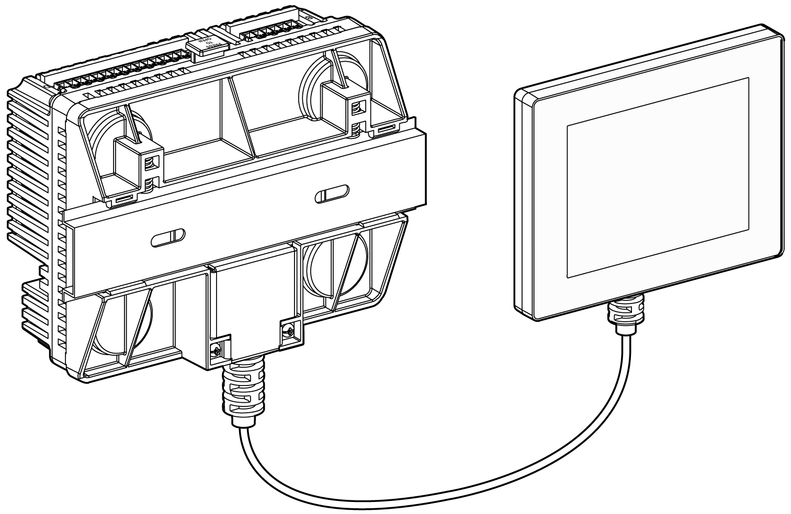
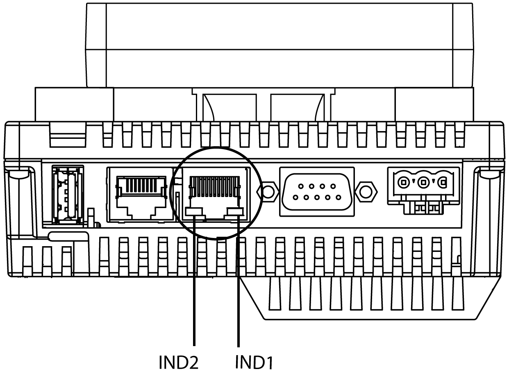
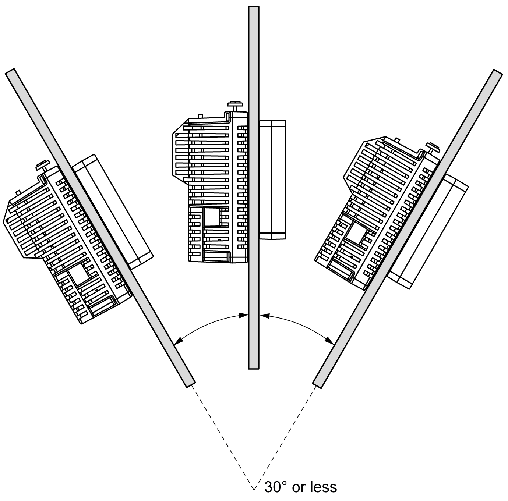
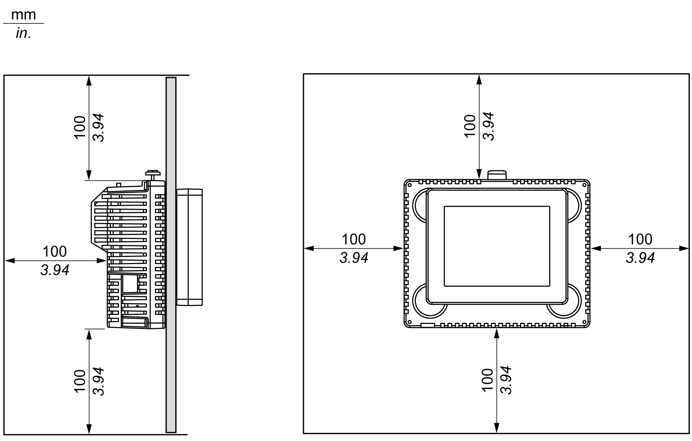

# Installation Procedures

Installation Procedures

Installing the HMISCU Controller

In order to correctly run an application on the Magelis SCU, both the display module and the rear module must be connected.

|  |
| --- |
| Warning_Color.gifWARNING |
| EXPLOSION HAZARD |
| oDo not connect or disconnect while circuit is live.  oPotential electrostatic charging hazard: wipe the front panel of the terminal with a damp cloth before turning ON. |
| Failure to follow these instructions can result in death, serious injury, or equipment damage. |

If you power up the rear module without connecting the display module, the logic controller does not start and all outputs remain in the initial state. The power must be off before connecting the modules.

There are 2 ways to install the HMISCU.

Installing the HMISCU on the panel:

Installing the rear module on a DIN rail with a display module/rear module separation cable:

HMISCU Setup Procedure

Mount the unit in an enclosure that provides a clean, dry, robust, and controlled environment [(IP65 enclosure or UL508 4x, if indoors).](../HMI_SCU_System_General_Rules_for_Implementing/HMI_SCU_System_General_Rules_for_Implementing-4.htm#XREF_D_SE_0024576_8)

Before installing the HMISCU verify that:

oThe installation panel or cabinet surface is flat (planarity tolerance: 0.5 mm (0.019 in.)), in good condition and has no jagged edges. Metal reinforcing strips may be attached to the inside of the panel, near the panel cut-out, to increase the rigidity.

oThe panel is designed to avoid any induced vibration resonance on the rear module exceeding a punctual factor of 10 and avoids any induced permanent vibration resonance.

To reduce the resonance use the panel adaptor accessory.

oThe ambient operating temperature and the ambient humidity are within their specified [ranges](../HMI_SCU_System_General_Rules_for_Implementing/HMI_SCU_System_General_Rules_for_Implementing-4.htm#XREF_D_SE_0024576_8). (When installing the panel in a cabinet or enclosure, the ambient operation temperature is the internal temperature of the cabinet or enclosure).

oThe heat from surrounding equipment does not cause the unit to exceed its [specified operating temperature](../HMI_SCU_System_General_Rules_for_Implementing/HMI_SCU_System_General_Rules_for_Implementing-4.htm#XREF_D_SE_0024576_8).

oWhen installing the display module in a horizontal position, the display must be on the top side:

oThe panel face is not inclined more than 30° when installing the unit in a slanted panel:

oThe power plug is positioned vertically when the unit is vertically installed.

oThe unit is at least 100 mm (3.94 in.) away from adjacent structures and other equipment for easier maintenance, operation, and improved ventilation:

| Step | Action |
| --- | --- |
| 1 | Place the unit on a clean and level surface with the display panel facing downward. |
| 2 | The support thickness depends on the material:  oMetallic: between 1.5 and 6 mm (0.059 in. and 0.236 in.)  oPlastic: between 3 and 6 mm (0.118 in. and 0.236 in.)  If the thickness is between 1 and 1.5 mm (0.039 in. and 0.059 in.) for a metallic support or between 1 and 3 mm (0.039 in. and 0.118 in.) for plastic, use the panel adaptor supplied in [accessory kit HMIZSUKIT](../HMI_SCU_Device_Connectivity/HMI_SCU_Device_Connectivity-3.htm#XREF_D_SE_0024688_92) (sold separately). |
| 3 | Create the correct sized holes required to install the unit, using the [Panel Cut-Out Dimension and Installation](HMI_SCU_Logic_Controller_Installation-4.htm#XREF_D_SE_0024525_1). |
| 4 | Insert the display module (with the tee, if required) into the panel hole:  G-SE-0021176.1.gif-high.gif      Use a torque between 1.2 and 2 N•m (10.62 lb-in and 17.70 lb-in) to screw the nut with the tightening wrench. |
| 5 | Insert and push the rear module until it locks into place:  G-SE-0021226.2.gif-high.gif |
| 6 | To remove the rear module, push the yellow button to unlock it, and then pull out the rear module:  G-SE-0021227.2.gif-high.gif |

|  |
| --- |
| NOTICE |
| EQUIPMENT DAMAGE |
| Be sure to remove the rear module from the display module without twisting. |
| Failure to follow these instructions can result in equipment damage. |

EIO0000001232.05

© 2016 Schneider Electric. All rights reserved.