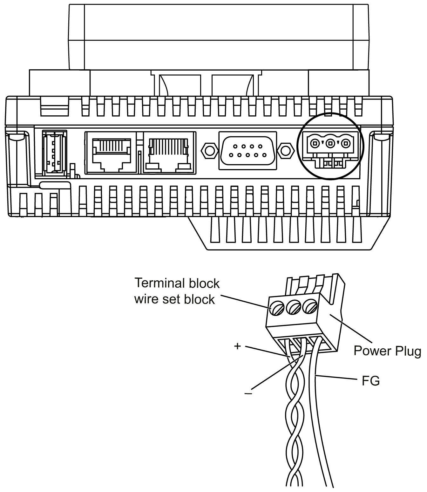

# Connecting the Power Cord

Connecting the Power Cord

Introduction

Follow these instructions when supplying power to the unit:

oWhen the frame ground (FG) terminal is connected, verify the wire is grounded. Not grounding the unit can result in excessive Electromagnetic Interference (EMI). Grounding is required to meet EMC level immunity.

oThe shield ground (SG) and FG terminals are connected internally in the unit.

oRemove power before wiring to the power terminals of the unit.

oThe unit uses 24 Vdc power. Using any other level of power can damage both the power supply and the unit.

oSince the unit is not equipped with a power switch, connect a power switch to the unit’s power supply.

oField wiring terminal marking for wire type (75 °C (167 °F) copper conductors only).

Power Cord Preparation

Before using your power cord:

oVerify that the ground wire is the same gauge or heavier than the power wires.

oDo not use aluminum wires for the power cord for power supply.

oIf the conductor end (individual) wires are not twisted correctly, the end wires may either short loop to each other or against an electrode. To avoid this, use D25CE/AZ5CE cable ends.

oUse wires that are 0.75 to 2.5 mm2 (18 to 12 AWG) for the power cord, and twist the wire ends before attaching the terminals.

oThe conductor type is solid or stranded wire.

oTo reduce electromagnetic noise, make the power cord as short as possible.

Power Plug

| Connection | Wire |
| --- | --- |
| + | 24 Vdc |
| - | 0 Vdc |
| FG | Grounded terminal connected to the unit chassis |

Connecting the Power Cord

| Step | Action |
| --- | --- |
| 1 | Remove the power cord from the power supply. |
| 2 | Remove the power plug from the unit. |
| 3 | Remove 7 mm (0.28 in.) of the vinyl cover of each of the power cord wires.  G-SA-0033908.2.gif-high.gif |
| 4 | If using stranded wire, twist the ends. Tinning the ends with solder reduces the risk of fraying and enhances electrical transfer. |
| 5 | Connect the wires to the power plug by using a flat-blade screwdriver (size 0.6 x 3.5 mm (0.02 x 0.14 in)). |
| 6 | Torque the mounting screws: 0.5...0.6 N•m (4.4...5.2 lb-in). |
| 7 | Replace the power plug to the power connector. |

NOTE:

oDo not solder the wire directly to the power receptacle pin.

oThe power supply cord must meet the specification shown above. Twist the power cords together, up to the power plug, for EMC compliance.

oUse field wiring terminal marking for wire type (75 °C (167 °F) copper conductors only).

The figure shows the connection of the power cord:

EIO0000001232.05

© 2016 Schneider Electric. All rights reserved.