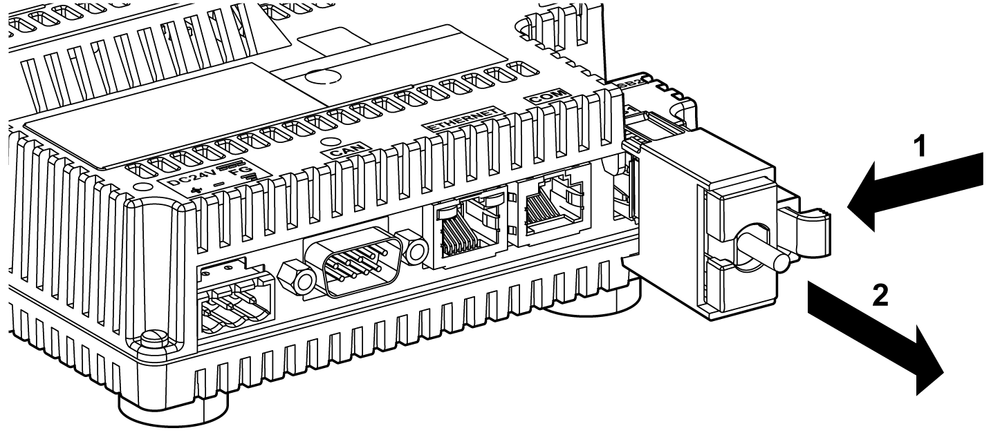

# USB (Type A)

USB (Type A)

Introduction

|  |
| --- |
| Warning_Color.gifWARNING |
| RISK OF EXPLOSION IN HAZARDOUS LOCATIONS |
| In hazardous locations as described in ANSI/ISA - 12.12.01:  oConfirm that the USB cable has been attached with the USB cable clamp before using the USB host interface.  oRemove power before attaching or detaching any connector(s) to or from the unit. |
| Failure to follow these instructions can result in death, serious injury, or equipment damage. |

When using a USB device, you can attach a USB holder to the USB interface on the side of the unit to help prevent the USB cable from being disconnected.

Attaching the USB Holder

| Step | Action |
| --- | --- |
| 1 | Attach the USB holder to the USB host interface on the rear module. Hook the upper pick of the USB holder to the attachment hole of the main unit, and insert the lower pick as shown below to affix the USB holder.  G-SE-0021333.1.gif-high.gif    1   USB holder |
| 2 | Insert the USB cable into the USB host interface.  G-SE-0021334.1.gif-high.gif    1   USB holder  2   USB cable |
| 3 | Attach the USB cover to fix the USB cable in place. Insert the USB cover into the tab of the USB holder.  G-SE-0021331.1.gif-high.gif    1   USB holder  2   USB cable  3   USB cover |

Removing the USB Holder

Push the tab of the USB holder to the left and then remove the USB cover.

EIO0000001232.05

© 2016 Schneider Electric. All rights reserved.