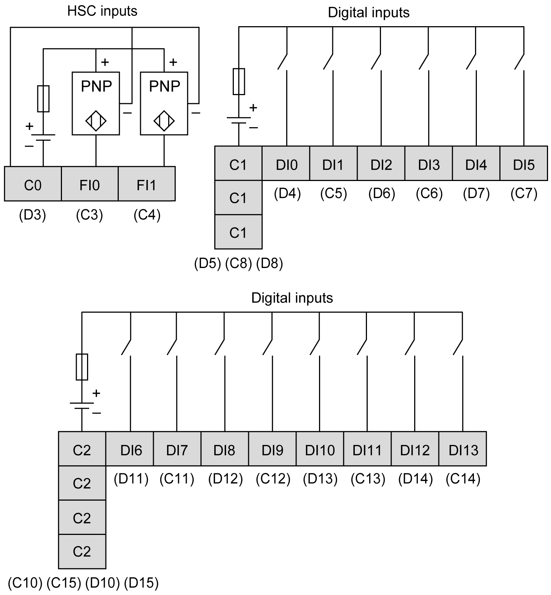

# Digital Inputs

Digital Inputs

Overview

The rear module is equipped with 16 digital inputs.

|  |
| --- |
| Danger_Color.gifDANGER |
| FIRE HAZARD |
| Use only the correct wire sizes for the current capacity of the power supplies. |
| Failure to follow these instructions will result in death or serious injury. |

Input Management Functions Availability

The table describes the possible usage of the rear module inputs:

| Function | | Input Function | | | | HSC/PTO/PWM Function | | |
| --- | --- | --- | --- | --- | --- | --- | --- | --- |
| None | Run/Stop | Latch | Event | HSC | PTO | PWM |
| Filter Type | | Integrator | Integrator | Bounce | Bounce |
| Fast  Input1 | FI0 | X | X | X | X | A | – | – |
| FI1 | X | X | X | X | B/EN | – | – |
| Regular  Input | DI0 | X | X | – | – | SYNC | – | – |
| DI1 | X | X | – | – | CAP | – | – |
| DI2 | X | X | – | – | – | AUX - Drive Ready | EN |
| DI3 | X | X | – | – | – | – | SYNC |
| DI4 | X | X | – | – | – | – | EN |
| DI5 | X | X | – | – | – | – | SYNC |
| DI6 | X | X | – | – | – | – | – |
| DI7 | X | X | – | – | – | – | – |
| DI8 | X | X | – | – | – | – | – |
| DI9 | X | X | – | – | – | – | – |
| DI10 | X | X | – | – | – | – | – |
| DI11 | X | X | – | – | – | – | – |
| DI12 | X | X | – | – | – | – | – |
| DI13 | X | X | – | – | – | – | – |
| X   Yes  –   No  1   Can also be used as a regular input | | | | | | | | |

NOTE: You can use filters and functions to [manage the HMI controller inputs](../../../../../../api/crossBook?lang=en-US&virtualBookName=SCUprg&topicID=D_SE_0031156_1).

Wiring Diagram

The figure describes the wiring diagram of the HMISCU6A5, HMISCU8A5, and HMISAC digital input sink type (positive logical):

NOTE: The digital inputs are sink type (positive logical).

The figure describes the wiring diagram of the HMISCU6A5, HMISCU8A5, and HMISAC digital input source type (negative logical):

NOTE: The digital inputs are source type (negative logical).

|  |
| --- |
| Warning_Color.gifWARNING |
| UNINTENDED EQUIPMENT OPERATION |
| Do not connect wires to unused terminals and/or terminals indicated as “No Connection (N.C.)”. |
| Failure to follow these instructions can result in death, serious injury, or equipment damage. |

|  |
| --- |
| Warning_Color.gifWARNING |
| UNINTENDED EQUIPMENT OPERATION |
| Use the sensor and actuator power supply only for supplying power to sensors or actuators connected to the module. |
| Failure to follow these instructions can result in death, serious injury, or equipment damage. |

EIO0000001232.05

© 2016 Schneider Electric. All rights reserved.