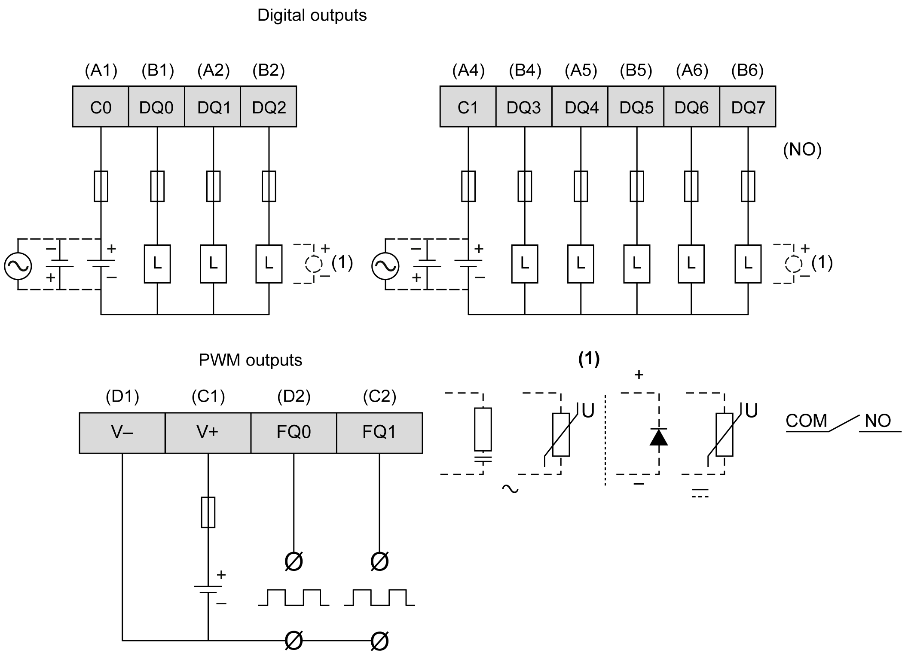

# Digital Outputs

Digital Outputs

Overview

The rear module is equipped with 8 relay outputs and 2 transistor [outputs that you can manage](../HMI_SCU_Logic_Controller_Description/HMI_SCU_Logic_Controller_Description-5.htm#XREF_D_SE_0024587_1).

|  |
| --- |
| Danger_Color.gifDANGER |
| FIRE HAZARD |
| Use only the correct wire sizes for the current capacity of the power supplies. |
| Failure to follow these instructions will result in death or serious injury. |

Output Management Functions Availability

The table describes the possible usage of the rear module outputs:

| Function | | Output Function | | |
| --- | --- | --- | --- | --- |
| None/RUN/STOP | Latch/Event | PWM/PTO/HSC |
| Filter Type | | Integrator | Bounce |
| Fast  Output1 | FQ0 | X | X | X |
| FQ1 | X | X | X |
| Digital  Output | DQ0 | X | – | – |
| DQ1 | X | – | – |
| DQ2 | X | – | – |
| DQ3 | X | – | – |
| DQ4 | X | – | – |
| DQ5 | X | – | – |
| DQ6 | X | – | – |
| DQ7 | X | – | – |
| X   Yes  –   No  1   Can also be used as a regular output | | | | |

Fast Output Wiring Diagram

For additional information about fast output protection, refer to [Protecting Outputs from Inductive Load Damage](../HMI_SCU_System_General_Rules_for_Implementing/HMI_SCU_System_General_Rules_for_Implementing-5.htm#XREF_D_SE_0024577_8).

|  |
| --- |
| Warning_Color.gifWARNING |
| UNINTENDED EQUIPMENT OPERATION |
| Wire the outputs correctly according to the wiring diagram. |
| Failure to follow these instructions can result in death, serious injury, or equipment damage. |

Wiring Diagram

The figure describes the wiring diagram of the HMISCU6A5, HMISCU8A5 and HMISAC digital outputs:

To improve the life time of the contacts, and to protect from potential damage by reverse EMF when using inductive load, connect:

oa free wheeling diode in parallel to each inductive DC load

oan RC snubber in parallel of each inductive AC load

|  |
| --- |
| Warning_Color.gifWARNING |
| UNINTENDED EQUIPMENT OPERATION |
| Do not connect wires to unused terminals and/or terminals indicated as “No Connection (N.C.)”. |
| Failure to follow these instructions can result in death, serious injury, or equipment damage. |

EIO0000001232.05

© 2016 Schneider Electric. All rights reserved.