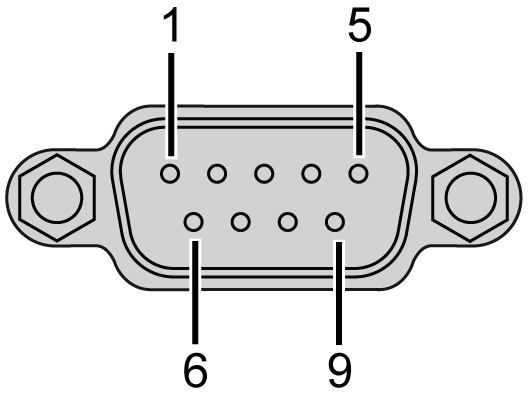

# CANopen Master Unit

CANopen Master Unit

CANopen Capabilities

The table describes the HMISCU [CANopen](../glossary/glossary.htm#XREF_D_SE_0024697_650) [master](../glossary/glossary.htm#XREF_D_SE_0024697_82) features:

|  |  |
| --- | --- |
| Maximum number of [slaves](../glossary/glossary.htm#XREF_D_SE_0024697_82) on the bus | 16 CANopen slave devices |
| Maximum length of CANopen fieldbus cables | According to the CAN specification (see Cable Length and Transmission Speed). |
| Maximum number of PDOs managed by the master | 32 [TPDOs](../glossary/glossary.htm#XREF_D_SE_0024697_90) + 32 [RPDOs](../glossary/glossary.htm#XREF_D_SE_0024697_363) |

For each additional CANopen slave:

oThe application size increases by an average of 10 kbytes, which can result in a memory size overload.

oThe configuration initialization time at the startup increases, which can lead to a watchdog condition.

Although HMISCU does not restrict you from doing so, you should not exceed 16 CANopen slave modules (and/or 32 TPDOs and 32 RPDOs) for sufficient performance tolerance and to avoid performance degradation.

|  |
| --- |
| Warning_Color.gifWARNING |
| UNINTENDED EQUIPMENT OPERATION |
| Do not connect more than 16 CANopen slave devices to the controller. |
| Failure to follow these instructions can result in death, serious injury, or equipment damage. |

|  |
| --- |
| NOTICE |
| DEGRADATION OF PERFORMANCE |
| Do not exceed 32 TPDOs and 32 RPDOs for the HMISCU Controller. |
| Failure to follow these instructions can result in equipment damage. |

Characteristics

The table describes the CAN characteristics:

| Characteristic | Description |
| --- | --- |
| Standard | CAN-CiA (ISO 11898-2:2002 Part 2)1 |
| Connector type | Sub-D9, 9 pins male |
| Protocol supported | CANopen |
| CAN power distribution | No |
| Maximal cable length | See table below4 |
| Isolation | See note2 |
| Bit rate | See table below4 |
| Line termination | No. See note3 |

1 Part 1 and Part 2 of ISO 11898:2002 are equivalent to ISO 11898:1993.

2 The isolation of the rear module is 500 Vac RMS between the module and the terminal blocks connected to the rear module. The two parts reference the same functional ground (FE) through specific components designed to reduce effects of electromagnetic interference. These components are rated at 30 Vdc or 60 Vdc. This effectively reduces isolation of the entire system from the 500 Vac RMS.

3 A resistor (R) is needed on each end of the CAN field bus.

4 The table describes the maximum cable lengths:

| Baud rate | | 800 Kbit/s | 250 Kbit/s | 125 Kbit/s | 50 Kbit/s | 20 Kbit/s | 10 Kbit/s |
| --- | --- | --- | --- | --- | --- | --- | --- |
| Maximum cable length | m | 25 | 250 | 500 | 1000 | 2500 | 5000 |
| ft. | 82.02 | 820.20 | 1640.41 | 3280.83 | 8202.07 | 16404.15 |

Pin Assignment

The graphic describes the pins of the CANopen interface:

The table describes the pins of the CANopen interface:

| PIN | Signal | Description |
| --- | --- | --- |
| 1 | N.C. | Reserved |
| 2 | CAN\_L | CAN\_L bus Line (Low) |
| 3 | CAN\_GND | CAN 0 Vdc |
| 4 | N.C. | Reserved |
| 5 | CAN\_SHLD | N.C. |
| 6 | GND | 0 Vdc |
| 7 | CAN\_H | CAN\_H bus Line (High) |
| 8 | N.C. | Reserved |
| 9 | N.C. | Reserved |

The shield is connected to pin 6, the 0 Vdc pin.

NOTE: Pin 9 is not connected internally. The controller does not provide power on CAN\_V+.

|  |
| --- |
| Warning_Color.gifWARNING |
| UNINTENDED EQUIPMENT OPERATION |
| Do not connect wires to unused terminals and/or terminals indicated as “No Connection (N.C.)”. |
| Failure to follow these instructions can result in death, serious injury, or equipment damage. |

Status LED

The table describes the CAN status LED:

| Marking | Description | LED | |
| --- | --- | --- | --- |
| Color | Description |
| CAN STS | CANopen status | Green / Red | See CAN STS status LED below |

The table describes the CAN STS status LED:

| CAN0 LED | CANopen Status | Description |
| --- | --- | --- |
| OFF | No CANopen configured | CANopen is not active in the application. |
| Single flash red / with green ON | Acceptable detected error limit threshold has been reached | The controller has detected that the maximum number of error frames has been reached or exceeded. |
| Double flash red / with green ON | Node Guarding or Heartbeat event | The controller has detected either a Node Guarding or Heartbeat exception for the CANopen master or slave device. |
| Red ON | Bus off | The CANopen bus is stopped. |
| Green ON | The CANopen bus is operational. | |

NOTE: CanOpen LED is mounted alongside the cover.

CANopen Data Transfer Settings

The CANopen networking concept is based on the international standard CAN. CANopen is defined as a uniform application layer by the DS301 specifications of the CiA (CAN in Automation).

CANopen Cable Arrangement

The CANopen interface uses a D-SUB 9-pin plug connector. The plug is assigned with the CAN\_H, CAN\_L and, CAN\_GND connections. CAN\_H and CAN\_L are the two conductors of the CAN bus. CAN\_GND is the common reference potential.

NOTE:

oThe resistance of the cable value must be 70 mΩ/m (1.77 mΩ/in.) or less.

oTo minimize signal reflections from the end of the cable, a 120 Ω. (5%, 1/4 W maximum) line termination must be placed at both ends of the bus.

CANopen Communication Cable and Connectors

NOTE: CANopen communication cables and cable connectors are not supplied with the CANopen Master Unit. The user must prepare the cables.

Recommended Cable Connector

D-SUB (DIN41652) connector compliant with CANopen Standard (CiA DR-303-1)

CANopen Recommended Transfer Cable

Transfer cable (a twisted pair cable with a shield) compliant with CANopen Standard (CiA DR-303-1)

EIO0000001232.05

© 2016 Schneider Electric. All rights reserved.