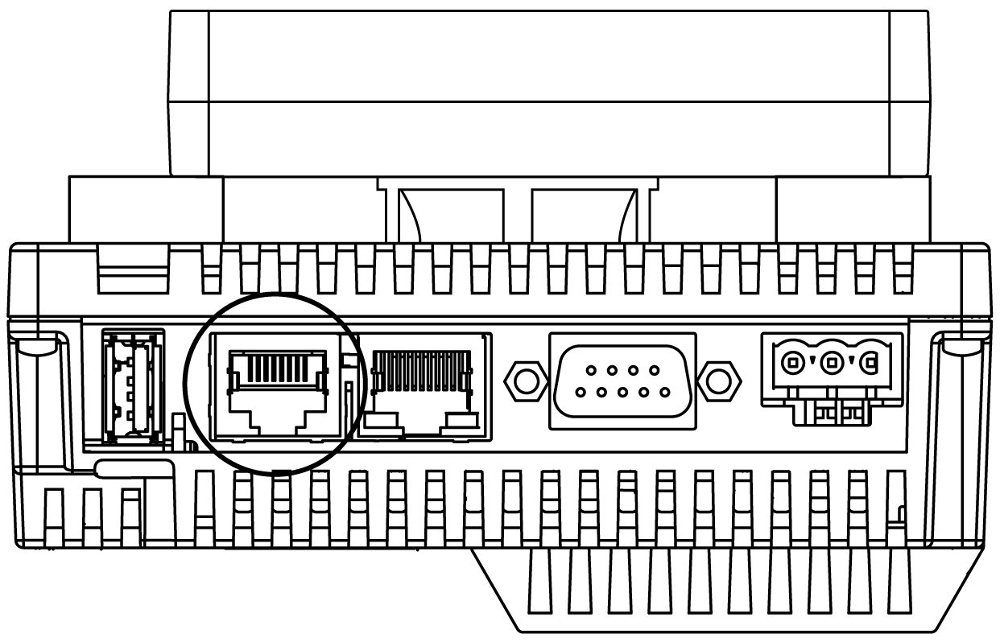
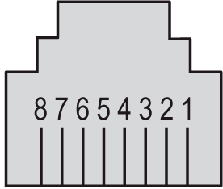

# Serial Link Port (COM1)

Serial Link Port (COM1)

Introduction

The serial link port is used to communicate with devices via RS-232 or RS-485.

NOTE: Vijeo Designer has many serial protocols supported as well that can be used independently of SoMachine if the COM1 port is not required for use within SoMachine.

This isolated serial port allows HMISCU controller component to communicate with 2 protocols:

SoMachine for link with SoMachine compliant device (routing or variable access)

Modbus in order to meet the needs of master/slave architectures with Schneider Electric or third-party devices

NOTE: Under most circumstances, you should avoid connecting multiple instances of SoMachine to the same controller via the serial line, Ethernet and/or the USB port simultaneously. It is possible that conflicts could arise in actions taken by the various instances of SoMachine such as program, configuration or data edits, or control commands to the controller or its application. For more information, see the programming guide for your particular controller.

NOTE: If the user chooses to use Vijeo Designer serial protocols, they must delete any nodes (Modbus/SoMachineNetwork) under the COM1 node in their SoMachine Editor project.

Serial Port Connector

The figure shows the location of the RJ45 serial port on the rear module:

Do not confuse the RJ45 serial port with the RJ45 Ethernet connector.

RS-232C Characteristics

| Characteristic | | Description |
| --- | --- | --- |
| Connector type | | RJ45 |
| Isolation | | Non-isolated |
| Baud rates | | 9600, 19200, 38400, 57600, 115,200 bps |
| Protocol supported | | oModbus (RTU)  oSoMachine |
| Cable | Type | Shielded |
| Maximum length | 15 m (49 ft) |
| 5 Vdc power supply for RS-485 | | No |

NOTE: The maximum baud rate for the serial link port depends on the protocol used.

RS-485 Characteristics

| Characteristic | | Description |
| --- | --- | --- |
| Connector type | | RJ45 |
| Isolation | | Non-isolated |
| Baud rates | | 9600, 19200, 38400, 57600, 115,200 bps |
| Protocol supported | | oModbus (RTU)  oSoMachine |
| Cable | Type | Shielded |
| Maximum length | 200 m (656 ft) |
| Polarization | | Configured via software to connect when the node is configured as a master.  560 Ω or 5.11 kΩ resistors are optional. |
| 5 Vdc power supply for RS-485 | | No |

Pin Assignment

The figure shows the pins of the RJ45 connector:

The table describes the pin assignment of the RJ45 connector:

| Pin | [RS-232C](../glossary/glossary.htm#XREF_D_SE_0024697_505) | [RS-485](../glossary/glossary.htm#XREF_D_SE_0024697_506) | Description |
| --- | --- | --- | --- |
| 1 | RxD | N.C. | Received data (RS-232C) |
| 2 | TxD | N.C. | Transmitted data (RS-232C) |
| 3 | N.C. | N.C. | Not connected |
| 4 | N.C. | D1 | Differential data (RS-485) |
| 5 | N.C. | D0 | Differential data (RS-485) |
| 6 | RTS | RTS | Ready to send |
| 7 | N.C. | N.C. | Not connected |
| 8 | GND | GND | Signal ground |

|  |
| --- |
| Warning_Color.gifWARNING |
| UNINTENDED EQUIPMENT OPERATION |
| Do not connect wires to unused terminals and/or terminals indicated as “No Connection (N.C.)”. |
| Failure to follow these instructions can result in death, serious injury, or equipment damage. |

EIO0000001232.05

© 2016 Schneider Electric. All rights reserved.