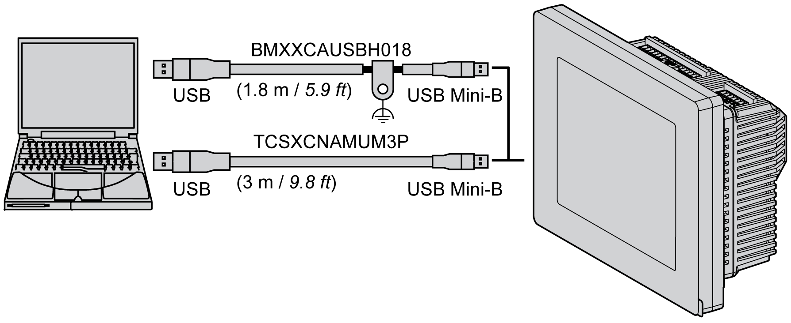
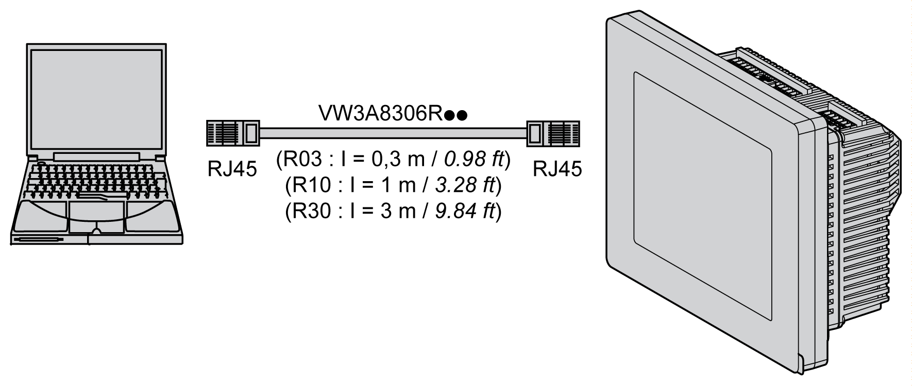

# Connecting the HMISCU to a PC

Connecting the HMISCU to a PC

Connecting the Controller to a PC

Overview

To transfer, run, and monitor applications, using either a USB cable or an Ethernet connection, connect the controller to a computer that has minimum version on SoMachine and Vijeo-Designer 6.1 SP3 add-on installed.

|  |
| --- |
| NOTICE |
| INOPERABLE EQUIPMENT |
| Always connect the communication cable to the PC before connecting it to the controller. |
| Failure to follow these instructions can result in equipment damage. |

USB Mini-B Port Connection

Attach the data transfer cable (BMXXCAUSBH018) to the USB port to allow data transfer from the computer to the unit.

TSXCNAMUM3P: This USB cable is suitable for short duration connections like quick updates or retrieving data values.

BMXXCAUSBH018: Grounded and shielded, this USB cable is suitable for long duration connections.

NOTE: You can connect 1 controller to the PC at a time.

Use the USB mini-B programming port to connect a PC with a USB host port. Using a typical USB cable, this connection is suitable for quick updates of the program or short duration connections to perform maintenance and inspect data values. It is not suitable for long term connections such as commissioning or monitoring without the use of specially adapted cables to help minimize electromagnetic interference.

|  |
| --- |
| Warning_Color.gifWARNING |
| INOPERABLE EQUIPMENT OR UNINTENDED EQUIPMENT OPERATION |
| oYou must use a shielded USB cable secured to the functional ground (FE) of the system for any long term connections.  oDo not connect more than one controller at a time using USB connections. |
| Failure to follow these instructions can result in death, serious injury, or equipment damage. |

The figure shows the USB connection to a PC:

To connect the USB cable to your controller, do the following:

| Step | Action |
| --- | --- |
| 1 | a If making a long term connection using a USB cable with a ground shield connection, securely connect the shield connector to the functional ground (FE) or protective ground (PE) of your system before connecting the cable to your controller and your PC.  b If making a short term connection using a non-grounded USB cable, proceed to step 2. |
| 2 | Connect the USB cable connector to the PC. |
| 3 | Connect the mini connector of the USB cable to the controller USB connector. |

Ethernet Port Connection

You can also connect the controller to a PC using an Ethernet cable.

The figure shows the Ethernet connection to a PC:

| Step | Action |
| --- | --- |
| 1 | Connect your Ethernet cable to the PC. |
| 2 | Connect your Ethernet cable to the Ethernet port on the controller. |

EIO0000001232.05

© 2016 Schneider Electric. All rights reserved.