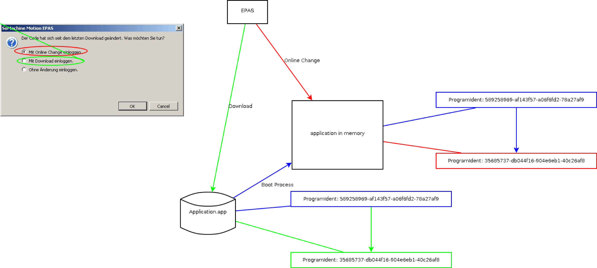
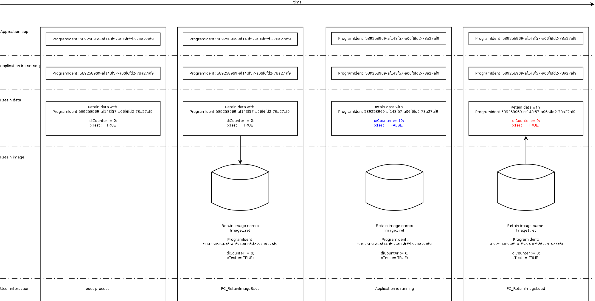
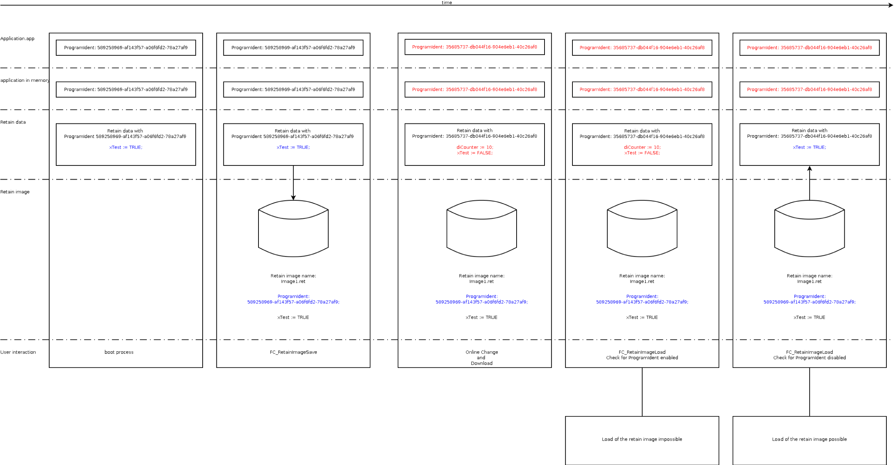

# Retain

## Task

During commissioning or a replacement of the controller, retain variables would need to be initialized. Therefore, you should avoid defining variables as retain variables.

| WARNING | |
| --- | --- |
|  | UNINTENDED EQUIPMENT OPERATION  * Do not use interfaces from the SystemConfigurationItf library in the retain program section (VAR RETAIN). * Do not use function blocks from the SystemConfiguration library in the retain program section (VAR RETAIN).  Failure to follow these instructions can result in death, serious injury, or equipment damage. |

## ProgramIdent and Application Change

The application "Application.app" has a unique identification feature, the ProgramIdent. With each change of the application, the ProgramIdent is also changed. During the boot process, the application - including ProgramIdent - is loaded into the main memory.

If a change to the application is effected with Logic Builder, it may be decided during the next logon procedure:

* Whether the changes are transmitted via online change (online), or
* Whether the application Application.app is being changed (download).

The application is loaded into the memory using Online-Change. At the end of the cycle, that is after the tasks have been processed, the changeover to the changed application is effected. This means that the ProgramIdent of the application in memory has also changed.

Using Download, the file Application.app on the Compact-Flash is replaced.

Transferring a changed application

## Retain Data

With the following functions the retain area can be stored and reloaded again:

* [FC\_RetainImageSave](D-SE-0085291.html#D-SE-0085291)
* [FC\_RetainImageLoad](D-SE-0085289.html#D-SE-0085289)

When storing the retain data in a file, among others, the ProgramIdent of the application in the main memory is also stored. When loading the image, the stored ProgramIdent is used for checking.

NOTE: In the case of a change in the application, the retain variables will also be reassigned in memory. It cannot be clearly predicted whether the memory address of a retain variable has changed or not.

With the function [FC\_RetainImageSave](D-SE-0085291.html#D-SE-0085291), an image of the retain memory is written into a file. This means that only the values of the retain variables are stored but not their assignments. Following a change of the application, another retain variable may have been assigned to a random address due to the program change. If a retain image is now loaded before the change, this may have a serious effect within the application. For this reason, the ProgramIdent is used for checking.

| WARNING | |
| --- | --- |
|  | UNINTENDED EQUIPMENT OPERATION  Be sure to use the function FC\_RetainImageSave after any program modification that affects the definitions or values of retained variables.  Failure to follow these instructions can result in death, serious injury, or equipment damage. |

## Retain Image

Storing the retain data in a file and reloading the same is to support the initialization of a machine after being energized. The retain area can be backed up into a file at any time, for example on commissioning or enabling. Following an error or machine start-up it is possible to use a backup set of retain data.

The loading of a retain image at any point in time while an application is executed may lead to errors being detected.

Loading the retain image at any given point in time

| 1. | After commissioning of the machine, for example, an image of the retain data is generated. |
| 2. | Following any given period of time, you can reload this image. |
| 3. | Due to the operation of the machine, the retain data in the retain memory have changed in the meantime. |
| 4. | Due to loading of the retain image, the current retain data would be overwritten by the values from the backup set. This can result in detected errors. |

| WARNING | |
| --- | --- |
|  | UNINTENDED EQUIPMENT OPERATION  Be sure to use the function FC\_RetainImageSave after any program modification that affects the definitions or values of retained variables.  Failure to follow these instructions can result in death, serious injury, or equipment damage. |

A change of the application in the memory via Online-Change may result in a change of the retain data. This leads to a change of the ProgramIdent of the application in the main memory. When loading a retain image, it is possible to check for a change of the ProgramIdent. If the check has been activated, the retain image is not loaded. If the check is deactivated, the retain image is loaded into the retain area. This may mean that the assignment of the retain data is no longer correct, and consequential errors may occur. The following illustration is to describe this behavior more clearly:

Loading a retain image following a change in the application

| WARNING | |
| --- | --- |
|  | UNINTENDED EQUIPMENT OPERATION  Be sure to use the function FC\_RetainImageSave after any program modification that affects the definitions or values of retained variables.  Failure to follow these instructions can result in death, serious injury, or equipment damage. |

EIO0000002680.05