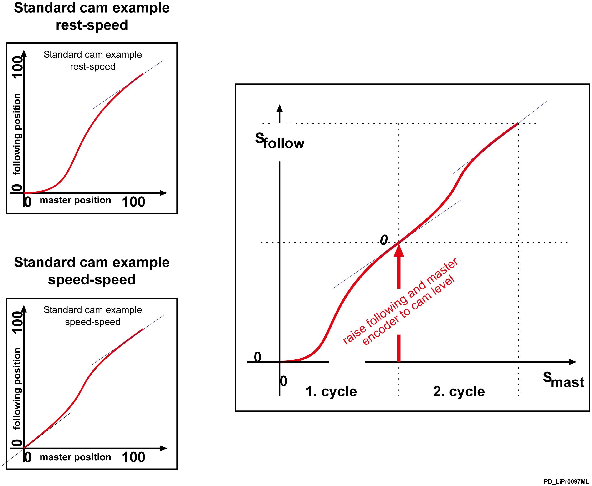
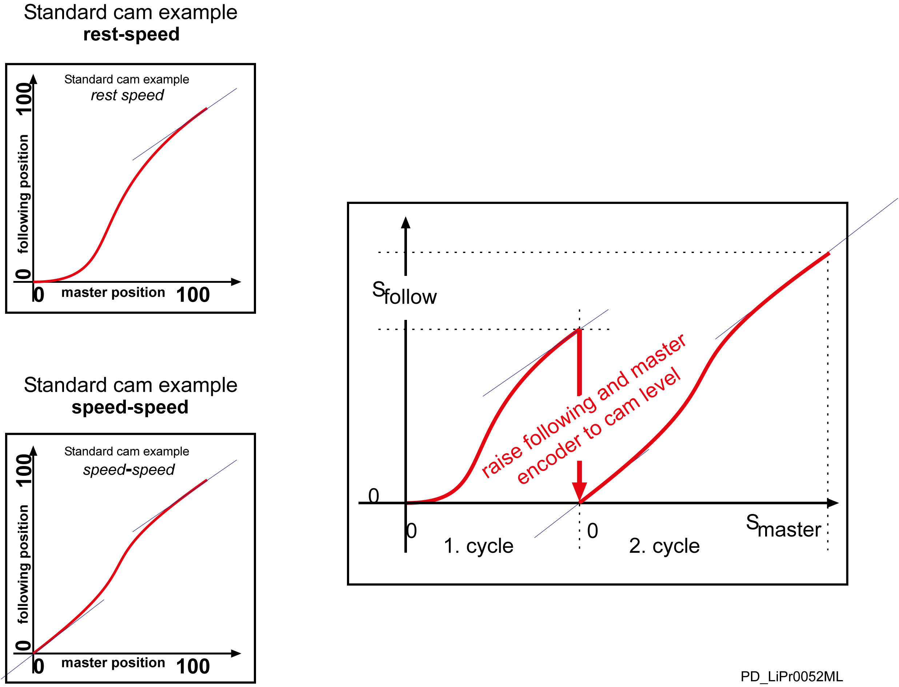

# VarioCamFunctions - Cam

## Cam

Use the CAM functions to perform a synchronous run of an axis to a master axis.

## Automatic end detection

* End criterion that can be set for ending profile processing
* Own end criteria for master and slave profile
* Distinguishing a lower and upper limit (XLimMin, XLimMax)
* End criteria can be activated or de-activated (XLimMaxOn, XLimMinOn)

Taking the end criterion into account

```
 IF xUser > XLimMax AND XLimMaxOn = TRUE OR 
   xUser < XLimMin AND XLimMinOn = TRUE 
THEN 
   <Auftrag beendet> 
END_IF;
```

| Symbol | Meaning |
| --- | --- |
| yNorm =f(xNorm) | Standardized profile |
| xUser | Master value after scaling in units  xUser=xNorm\* XFactor +XOffset |
| xNorm | Master value in standardized representation (0, ..., 1)  xNorm = (xUser-XOffset)/XFactor |
| yUser | Slave position after scaling [U];  yUser=yNorm\* YFactor +YOffset |
| yNorm | Slave position in standardized representation (0, ..., 1)  yNorm = (yUser-YOffset)/YFactor |
| XOffset | Offset for master value scaling [U] |
| XFactor | Factor for master value scaling [U] |
| YOffset | Offset for slave value scaling [U] |
| YFactor | Factor for slave value scaling [U] |
| XLimMin | Position for lower end criterion [U] |
| XLimMax | Position for upper end criterion [U] |
| XLimMinOn | Activation switch for "low" end criterion, TRUE: end criterion active |
| XLimMaxOn | Activation switch for "high" end criterion, TRUE: end criterion active |
| AxisId | Reference of a MotorController |
| EncId | Reference of a logical encoder |
| ProfilId | Reference of a profile |

## Encoder Manipulation and Offset

If you join several CAM profiles or if a profile is started cyclically, the master position and/or orientation position keeps on running for endless systems. The entire motion sequence, also called cycle, always runs in a specific "section of the path" such as from 0...360 degrees or from 0... 100 %. A position manipulation is required to reset positions after a profile run. This is done using SETPOS or the next CAM function.

Two CAM profiles are joined in the following example. Before starting the second profile, the slave position is set back in relation to the value it has been moved in the first profile.

## Principle

Example of joining curves with encoder manipulation:



**Program implementation**

```
TYPE ET_States :
(
    Start := 10,
    Cyclic := 20,
    Stop := 30,
    Idle := 100
);
END_TYPE

PROGRAM SR_JoiningCamsEncoder
VAR
    xInit 				: BOOL := TRUE;
    xStartFinished		: BOOL := FALSE;
    xCyclicFinished 	: BOOL := FALSE;
    xStopFinished		: BOOL := FALSE;

    etState				: ET_States := ET_States.Idle;

    diResult			: DINT := 0;
    diStartCamId 		: DINT := 100;
    diCyclicCamId 		: DINT := 200;
    diStopCamId			: DINT := 300;

    lrProductLength		: LREAL := 100.0;
    lrYFactor1 			: LREAL := 100.0;
    lrYFactor2			: LREAL := 200.0;
    lrYFactor3			: LREAL := 100.0;

    stMasterEncoderX 	: ST_SetEncoder;
    stSlaveAxisY		: ST_SetEncoder;
    arEncoderGroupStart : SystemInterface.EncoderArray;

    arEncoderGroupCycle : SystemInterface.EncoderArray;
END_VAR

IF (xInit = TRUE) THEN
    xInit := FALSE;

    stMasterEncoderX.stEncoderId := LE_Master.stLogicalAddress;
    stSlaveAxisY.stEncoderId := DRV_SlaveAxis.stLogicalAddress;

    arEncoderGroupStart[0] := stMasterEncoderX;
    arEncoderGroupStart[1] := stSlaveAxisY;

	etState := ET_States.Start;
END_IF

CASE etState OF

    ET_States.Start:
        arEncoderGroupStart[0].etMode := ET_SetposMode.Absolute;
        arEncoderGroupStart[0].lrValue := 0.0;

        arEncoderGroupStart[1].etMode := ET_SetposMode.Absolute;
        arEncoderGroupStart[1].lrValue := 0.0;

        diResult := FC_CamStart(i_stAxisId := DRV_SlaveAxis.stLogicalAddress,
            i_stEncId := LE_Master.stLogicalAddress, 
            i_diProfilId := diStartCamId,
            i_lrXOffset := 0.0,
            i_lrYOffset := 0.0,
            i_lrXFactor := lrProductLength,
            i_lrYFactor := lrYFactor1,
            i_lrXLimMin := 0.0,
            i_lrXLimMax := lrProductLength,
            i_etXLimMinMode := ET_CamLimitMode.Active,
            i_etXLimMaxMode := ET_CamLimitMode.Active,
            i_EncoderGroupStart := arEncoderGroupStart,
            i_diEncoderCountStart := 2,
            i_EncoderGroupCycle := arEncoderGroupCycle,
            i_diEncoderCountCycle := 0,
            i_diJobId := 1001);

        // ...

        IF (xStartFinished = TRUE) THEN
             etState := ET_States.Cyclic;
        END_IF

    ET_States.Cyclic:
        arEncoderGroupStart[0].etMode := ET_SetposMode.Relative;
        arEncoderGroupStart[0].lrValue := -lrProductLength;

        arEncoderGroupStart[1].etMode := ET_SetposMode.Relative;
        arEncoderGroupStart[1].lrValue := -lrYFactor1;

        diResult := FC_CamStart(i_stAxisId := DRV_SlaveAxis.stLogicalAddress,
            i_stEncId := LE_Master.stLogicalAddress,
            i_diProfilId := diCyclicCamId,
            i_lrXOffset := 0.0,
            i_lrYOffset := 0.0,
            i_lrXFactor := lrProductLength,
            i_lrYFactor := lrYFactor2,
            i_lrXLimMin := 0.0,
            i_lrXLimMax := lrProductLength,
            i_etXLimMinMode := ET_CamLimitMode.Inactive,
            i_etXLimMaxMode := ET_CamLimitMode.Active,
            i_EncoderGroupStart := arEncoderGroupStart,
            i_diEncoderCountStart := 2,
            i_EncoderGroupCycle := arEncoderGroupCycle,
            i_diEncoderCountCycle := 0,
            i_diJobId := 1002);

        // ...

        IF (xCyclicFinished = TRUE) THEN
            etState := ET_States.Stop;
        END_IF

    ET_States.Stop:
        arEncoderGroupStart[0].etMode := ET_SetposMode.Relative;
        arEncoderGroupStart[0].lrValue := -lrProductLength;

        arEncoderGroupStart[1].etMode := ET_SetposMode.Relative;
        arEncoderGroupStart[1].lrValue := -lrYFactor2;

        diResult := FC_CamStart(i_stAxisId := DRV_SlaveAxis.stLogicalAddress,

            i_stEncId := LE_Master.stLogicalAddress,
            i_diProfilId := diCyclicCamId,
            i_lrXOffset := 0.0,
            i_lrYOffset := 0.0,
            i_lrXFactor := lrProductLength,
            i_lrYFactor := lrYFactor3,
            i_lrXLimMin := 0.0,
            i_lrXLimMax := lrProductLength,
            i_etXLimMinMode := ET_CamLimitMode.Active,
            i_etXLimMaxMode := ET_CamLimitMode.Active,
            i_EncoderGroupStart := arEncoderGroupStart,
            i_diEncoderCountStart := 2,
            i_EncoderGroupCycle := arEncoderGroupCycle,
            i_diEncoderCountCycle := 0,
            i_diJobId := 1002);

        // ...

        IF (xStopFinished = TRUE) THEN
            etState := ET_States.Idle;
		END_IF

    ET_States.Idle:
        ;

END_CASE
```

It is not always useful to perform encoder manipulation in one cycle. There is the option of avoiding this encoder manipulation in the cycle using X-offset and Y-offset of the CAM function.

Two curves are joined in the following example. When starting the second curve, the slave position is not manipulated but taken into account in the offset.

Example of joining curves with an offset



**Program implementation**

```
TYPE ET_States :
(
    Start := 10,
    Cyclic := 20,
    Stop := 30,
    Idle := 100
);
END_TYPE

PROGRAM SR_JoiningCamsWithOffset
VAR
    xInit 				: BOOL := TRUE;
    xStartFinished		: BOOL := FALSE;
    xCyclicFinished 	: BOOL := FALSE;
    xStopFinished		: BOOL := FALSE;

    etState				: ET_States := ET_States.Idle;

    diResult			: DINT := 0;
    diStartCamId 		: DINT := 100;
    diCyclicCamId 		: DINT := 200;
    diStopCamId			: DINT := 300;

    lrProductLength		: LREAL := 100.0;
    lrYFactor1 			: LREAL := 100.0;
    lrYFactor2			: LREAL := 200.0;
    lrYFactor3			: LREAL := 100.0;

    stMasterEncoderX 	: ST_SetEncoder;
    stSlaveAxisY		: ST_SetEncoder;
    arEncoderGroupStart : SystemInterface.EncoderArray;

    arEncoderGroupCycle : SystemInterface.EncoderArray;
END_VAR

IF (xInit = TRUE) THEN
    xInit := FALSE;

    stMasterEncoderX.stEncoderId := LE_Master.stLogicalAddress;
    stSlaveAxisY.stEncoderId := LE_SlaveAxis.stLogicalAddress;

    arEncoderGroupStart[0] := stMasterEncoderX;
    arEncoderGroupStart[1] := stSlaveAxisY;

    etState := ET_States.Start;
END_IF

CASE etState OF

    ET_States.Start:
        stMasterEncoderX.etMode := ET_SetposMode.Absolute;
        stMasterEncoderX.lrValue := 0.0;

        stSlaveAxisY.etMode := ET_SetposMode.Absolute;
        stSlaveAxisY.lrValue := 0.0;

        diResult := FC_CamStart(i_stAxisId := DRV_SlaveAxis.stLogicalAddress,
            i_stEncId := LE_Master.stLogicalAddress,
            i_diProfilId := diStartCamId,
            i_lrXOffset := 0.0,
            i_lrYOffset := 0.0,
            i_lrXFactor := lrProductLength,
            i_lrYFactor := lrYFactor1,
            i_lrXLimMin := 0.0,
            i_lrXLimMax := lrProductLength,
            i_etXLimMinMode := ET_CamLimitMode.Active,
            i_etXLimMaxMode := ET_CamLimitMode.Active,
            i_EncoderGroupStart := arEncoderGroupStart,
            i_diEncoderCountStart := 2,
            i_EncoderGroupCycle := arEncoderGroupCycle,
            i_diEncoderCountCycle := 0,
            i_diJobId := 1001);

        // ...

        IF (xStartFinished = TRUE) THEN
            etState := ET_States.Cyclic;
        END_IF

    ET_States.Cyclic:
        stMasterEncoderX.etMode := ET_SetposMode.Relative;
        stMasterEncoderX.lrValue := -lrProductLength;

        stSlaveAxisY.etMode := ET_SetposMode.Relative;
        stSlaveAxisY.lrValue := -lrYFactor1;

        diResult := FC_CamStart(i_stAxisId := DRV_SlaveAxis.stLogicalAddress, 
            i_stEncId := LE_Master.stLogicalAddress,
            i_diProfilId := diCyclicCamId,
            i_lrXOffset := lrProductLength,
            i_lrYOffset := lrYFactor1,
            i_lrXFactor := lrProductLength,
            i_lrYFactor := lrYFactor2,
            i_lrXLimMin := 0.0,
            i_lrXLimMax := lrProductLength,
            i_etXLimMinMode := ET_CamLimitMode.Inactive,
            i_etXLimMaxMode := ET_CamLimitMode.Active,
            i_EncoderGroupStart := arEncoderGroupStart,
            i_diEncoderCountStart := 0,
            i_EncoderGroupCycle := arEncoderGroupCycle,
            i_diEncoderCountCycle := 0,
            i_diJobId := 1002);

        // ...

        IF (xCyclicFinished = TRUE) THEN
            etState := ET_States.Stop;
        END_IF

    ET_States.Stop:

        stMasterEncoderX.etMode := ET_SetposMode.Relative;
        stMasterEncoderX.lrValue := -lrProductLength;

        stSlaveAxisY.etMode := ET_SetposMode.Relative;
        stSlaveAxisY.lrValue := -lrYFactor2;

        diResult := FC_CamStart(i_stAxisId := DRV_SlaveAxis.stLogicalAddress,
            i_stEncId := LE_Master.stLogicalAddress,
            i_diProfilId := diCyclicCamId,
            i_lrXOffset := 2 * lrProductLength,
            i_lrYOffset := lrYFactor1 + lrYFactor2,
            i_lrXFactor := lrProductLength,
            i_lrYFactor := lrYFactor3,
            i_lrXLimMin := 0.0,
            i_lrXLimMax := lrProductLength,
            i_etXLimMinMode := ET_CamLimitMode.Active,
            i_etXLimMaxMode := ET_CamLimitMode.Active,
            i_EncoderGroupStart := arEncoderGroupStart,
            i_diEncoderCountStart := 0,
            i_EncoderGroupCycle := arEncoderGroupCycle,
            i_diEncoderCountCycle := 0,
            i_diJobId := 1002);

        // ...

        IF (xStopFinished = TRUE) THEN
            etState := ET_States.Idle;
        END_IF

    	ET_States.Idle:
        	;

END_CASE
```

EIO0000002680.05