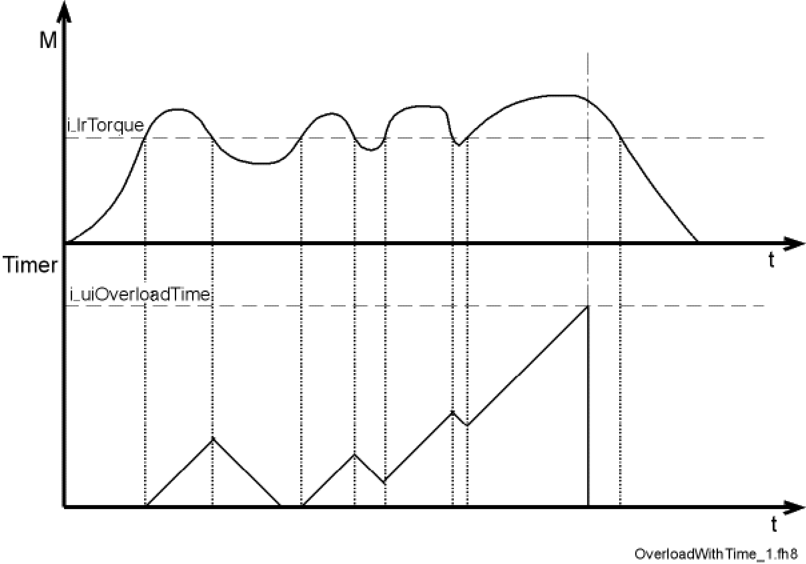
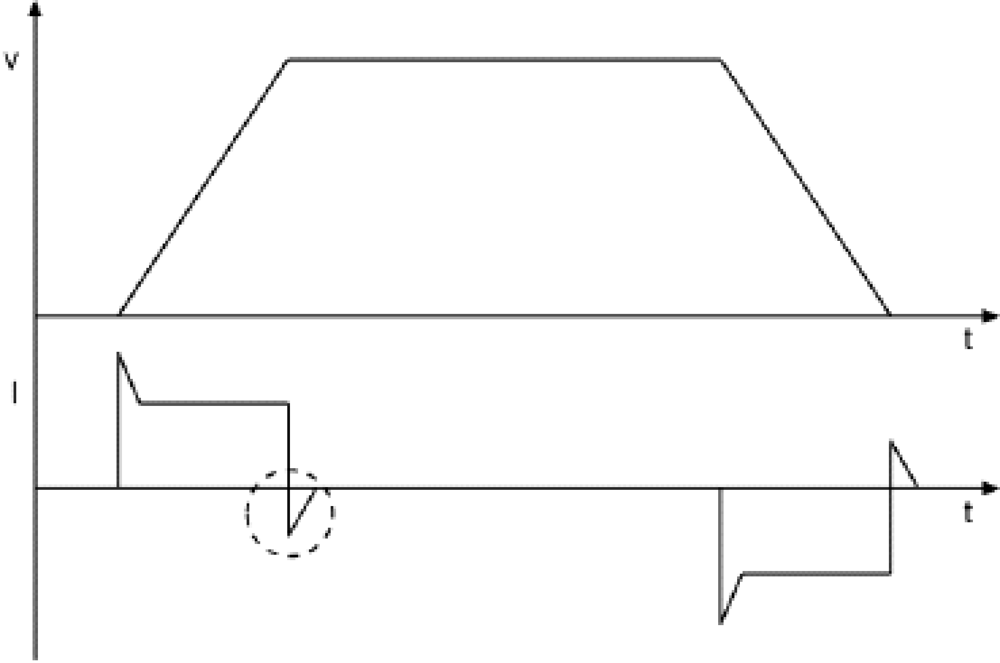
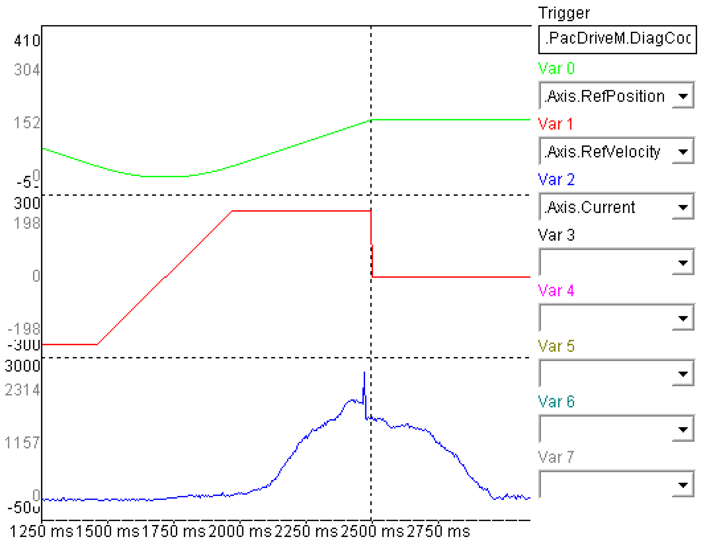

# FC\_OverloadDetectionSet

## Overview

|  |  |
| --- | --- |
| Type: | Function |
| Available as of: | SystemInterface\_1.32.6.0 |
| Versions: | Current version |

## Task

Axis overload after the torque exceeding lasted a certain time.

## Description

This function activates overload monitoring in the axis i\_stAxisId.

Overload detection is used to monitor the deviation of the torque (relative to the motor shaft) from the expected torque (feed forward). When the monitoring system is enabled, the drive is stopped (overload stop). The power supply must be parameterized so that the expected torque is calculated.

i\_lrTorque indicates the threshold of the deviation from the expected torque. The deviation can be detected via the *[FeedbackCurrent](../../../../../api/crossBook?lang=en-US&virtualBookName=PD.Parameter.LXM52Drive&topicID=D_SE_0071520)*. The FeedbackCurrent can be converted into the deviation from the expected torque using the [TorqueConstant](../../../../../api/crossBook?lang=en-US&virtualBookName=PD.Parameter.LXM52Drive&topicID=D_SE_0071785).

Torque deviations are caused for instance by:

* Friction (if not taken into account in the parameters [StaticFriction](../../../../../api/crossBook?lang=en-US&virtualBookName=PD.Parameter.LXM52Drive&topicID=D_SE_0071845) and [ViscousFriction](../../../../../api/crossBook?lang=en-US&virtualBookName=PD.Parameter.LXM52Drive&topicID=D_SE_0071846))
* External torques (for example, moving against limit stop)
* Variable moment of inertia
* Oscillations in the system (for example, mechanical resonances)
* Transient response of the controller (especially at strong jerks)

NOTE: [J\_Load](../../../../../api/crossBook?lang=en-US&virtualBookName=PD.Parameter.LXM52Drive&topicID=D_SE_0071843) must be entered correctly in the PLC configuration. It is also assumed that the mass moment of inertia is constant.

Monitoring is only active in a specific position range. This position range is defined by i\_lrLowLimit (low position limit) and i\_lrHighLimit (high position limit).

If the threshold i\_lrTorque is exceeded within the position range, an internal timer is incremented. If the threshold is undershot during the time i\_uiOverloadTime, the internal timer is decremented. If the internal timer reaches the value i\_uiOverloadTime, the monitoring system is enabled. The following diagram illustrates this behavior.



If an overload occurs, the position of the axis i\_stAxisId is kept in an internal parameter after the time i\_uiOverloadTime has elapsed. This position is used as reference position. The drive remains in position control.

The state of the monitoring system can be read using the function FC\_OverloadDetectionGetState.

The threshold i\_lrTorque is exceeded if the overall torque is greater than the expected torque plus the parameterized threshold of the deviation.



Current oscillation and high noise in the current signal (FeedbackCurrent) may cause mistripping. You can avoid this by using smooth motions.

NOTE: Processing this function typically takes 10 ms as parameters are transferred to the axis via the Sercos service channel. There must be a one-time increase in the times for the cycle check of the task in which the function is executed. For example FC\_CycleCheckTimeSet(500, 2).

## Interface

| Input | Data type | Description |
| --- | --- | --- |
| i\_stAxisId | ST\_LogicalAddress | Logical address of the axis |
| i\_lrTorque | LREAL | Maximum permitted deviation from the expected torque (in Nm) |
| i\_lrLowLimit | LREAL | Lower position limit (in user-defined units) |
| i\_lrHighLimit | LREAL | Upper position limit (in user-defined units) |
| i\_uiOverloadTime | UINT | Time after which the axis is stopped in an overload case (in ms) |

## Return Value

| Data type | Description |
| --- | --- |
| DINT | 0: OK  -1: Logical address of the servo amplifier or motor invalid  -2: LowLimit greater or equal to HighLimit  -3: Torque exceeds maximum torque  -4: Value i\_uiOverloadTime is out of the range (>1000)  -5: Firmware version of the servo amplifier is not supported |

## Examples

The following program example moves an axis with two positioning instructions. Torque monitoring (FC\_Overload) is activated during the procedure.

```
PROGRAM PLC_PRG 
VAR 
   lState: DINT:=1; 
   lResult: DINT; 
END_VAR 
CASE lState OF 
1:
```

```
   FC_CycleCheckTimeSet(100, 200); 
   FC_ControllerEnableSet(Axis.stLogicalAddress); 
   lResult:=FC_OverloadDetectionSet(i_stAxisId:= Axis.stLogicalAddress, i_lrTorque :=0.08, 
   i_lrLowLimit:=10, i_lrHighLimit:=350, i_uiOverloadTime:=500); 
   lState:=lState+1; 
2:
```

```
   IF Axis.AxisState = 3 THEN 
      FC_PosStartSmooth(Axis.stLogicalAddress,0, 250, 0, 1000, 1000, 0, 0, 
      ET_PosMode.Absolute, 0); 
      lState:=lState+1; 
   END_IF; 
3:
```

```
   IF Axis.AxisState = 3 THEN
      FC_PosStartSmooth(Axis.stLogicalAddress,360, 250, 0, 1000, 1000, 0, 0, ET_PosMode.Absolute, 0);
      lState:=2; 
   END_IF; 
END_CASE;
```

The axis (motor shaft) was braked to test the function, resulting in a rise in current and an increase in torque. The figure shows the current increase (or torque increase) and the triggering of the diagnostic message (vertical dotted line).



EIO0000002680.05