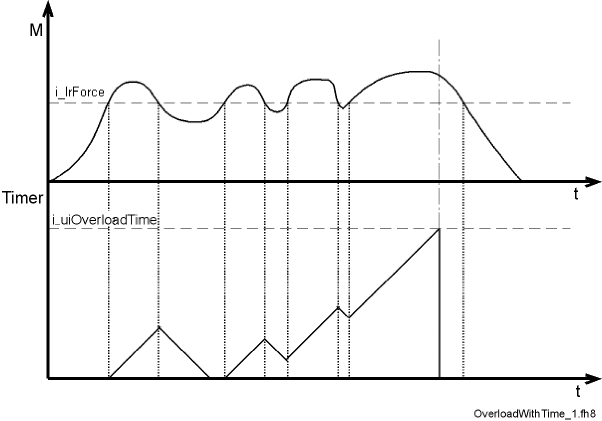

# FC\_OverloadDetectionSetLinear

## Overview

|  |  |
| --- | --- |
| Type: | Function |
| Available as of: | SystemInterface\_1.36.2.1 |
| Versions: | Current version |

## Task

Stop the axis due to overload after the expected force was exceeded for a given time.

## Description

This function activates overload monitoring in the axis i\_stAxisId.

Overload detection is used to monitor the deviation of the actual force from the expected force (feed forward). When the overload detection is enabled, the drive is stopped. The axis must be parameterized so that the expected mass inertia is calculated.

i\_lrForce indicates the threshold of the deviation from the expected force. The deviation can be detected via the *[FeedbackCurrent](../../../../../api/crossBook?lang=en-US&virtualBookName=PD.Parameter.LXM52Drive&topicID=D_SE_0071520)*. The FeedbackCurrent can be converted into the deviation from the expected force using the ForceConstant.

Force deviations are caused for instance by:

* Friction (if not taken into account in the parameters *[StaticFrictionLinear](../../../../../api/crossBook?lang=en-US&virtualBookName=PD.Parameter.LXM62LinearDrive&topicID=D_SE_0072185)* and *[ViscousFrictionLinear](../../../../../api/crossBook?lang=en-US&virtualBookName=PD.Parameter.LXM52LinearDrive&topicID=D_SE_0072186)*)
* External mass inertias (for example, moving against limit stop)
* Variable forces of mass inertia
* Oscillations in the system (for example, mechanical resonances)
* Transient response of the controller (especially at strong jerks)

NOTE: *[LoadInertiaLinear](../../../../../api/crossBook?lang=en-US&virtualBookName=PD.Parameter.LXM62LinearDrive&topicID=D_SE_0072184)* must be correctly specified in the PLC configuration. It is also assumed that the mass inertia is constant.

Monitoring is only active in a specific position range. This position range is defined by i\_lrLowLimit (low position limit) and i\_lrHighLimit (high position limit).

If the threshold i\_lrForce is exceeded within the position range, an internal timer is incremented. If the threshold is undershot during the time i\_uiOverloadTime, the internal timer is decremented. If the internal timer reaches the value i\_uiOverloadTime, the monitoring system is enabled. The following diagram illustrates this behavior.



If an overload occurs, the position of the axis i\_stAxisId is kept in an internal parameter after the time i\_uiOverloadTime has elapsed. This position is used as reference position. The drive remains in position control.

The state of the monitoring system can be read using the function FC\_OverloadDetectionGetState.

The threshold i\_lrForce is exceeded if the overall force is greater than the expected force plus the parameterized threshold of the deviation.


Current oscillation and high noise in the current signal (FeedbackCurrent) may cause mistripping. You can avoid this by using smooth motions.

NOTE: Processing this function typically takes 10 ms as parameters are transferred to the axis via the Sercos service channel. There must be a one-time increase in the times for the cycle check of the task in which the function is executed. For example FC\_CycleCheckTimeSet(500, 2).

## Interface

| Input | Data type | Description |
| --- | --- | --- |
| i\_stAxisId | ST\_LogicalAddress | Logical address of the axis |
| i\_lrForce | LREAL | Maximum permitted deviation from the expected mass inertia (in N) |
| i\_lrLowLimit | LREAL | Lower position limit (in user-defined units) |
| i\_lrHighLimit | LREAL | Upper position limit (in user-defined units) |
| i\_uiOverloadTime | UINT | Time after which the axis is stopped in an overload case (in ms) |

## Return Value

| Data type | Description |
| --- | --- |
| DINT | 0: OK  -1: Logical address of the servo amplifier or motor invalid  -2: mass inertia exceeds max. mass inertia  -3: LowLimit greater or equal to HighLimit  -4: Value FC\_OverloadTime is out of the range  -5: Firmware version of the servo amplifier is not supported |

## Examples

The following program example moves an axis with two positioning instructions. Force monitoring (FC\_OverloadDetectionSetLinear) is activated during the procedure.

```
PROGRAM PLC_PRG 
VAR 
   lState: DINT:=1; 
   lResult: DINT; 
END_VAR 
CASE lState OF 
1:
```

```
   FC_CycleCheckTimeSet(100, 200); 
   FC_ControllerEnableSet(Axis.stLogicalAddress); 
   lResult:=FC_OverloadDetectionSetLinear(i_stAxisId:= Axis.stLogicalAddress, i_lrForce:=0.08, i_lrLowLimit:=10, i_lrHighLimit:=350, i_uiOverloadTime:=500);
   lState:=lState+1; 
2:
```

```
   IF Axis.AxisState = 3 THEN 
   FC_PosStartSmooth(Axis.stLogicalAddress,0, 250, 0, 1000, 1000, 0, 0, ET_PosMode.Absolute, 0); 
   lState:=lState+1; 
   END_IF; 
3:
```

```
   IF Axis.AxisState = 3 THEN 
   FC_PosStartSmooth(Axis.stLogicalAddress,360, 250, 0, 1000, 1000, 0, 0, ET_PosMode.Absolute, 0); 
   lState:=2; 
   END_IF; 
END_CASE;
```

The figure shows the current increase (or force increase) and the triggering of the diagnostic message (vertical dotted line) when there is a rise in current and an increase in force.


EIO0000002680.05