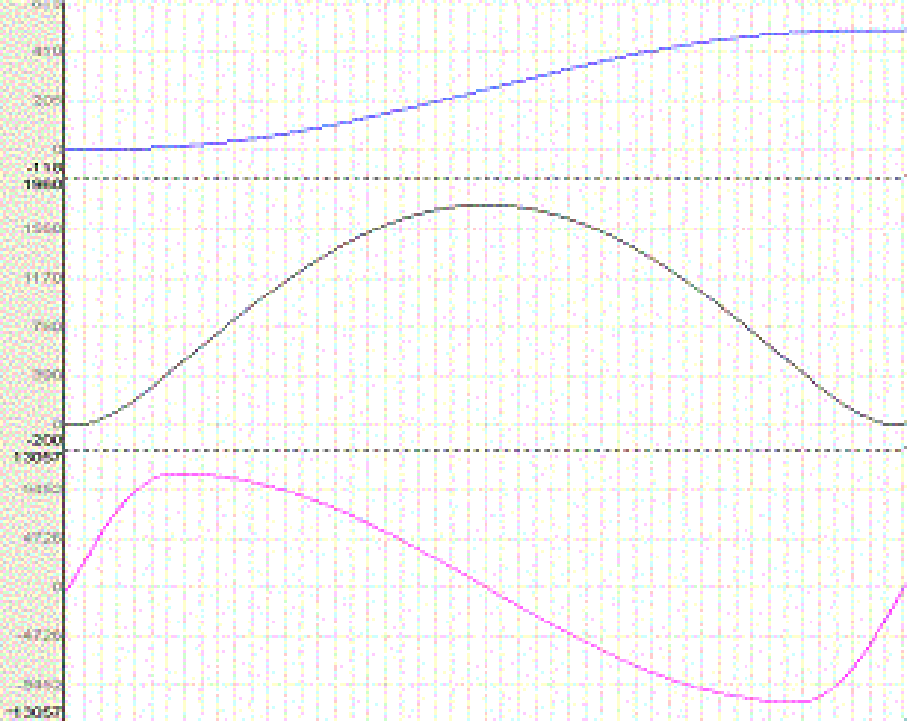
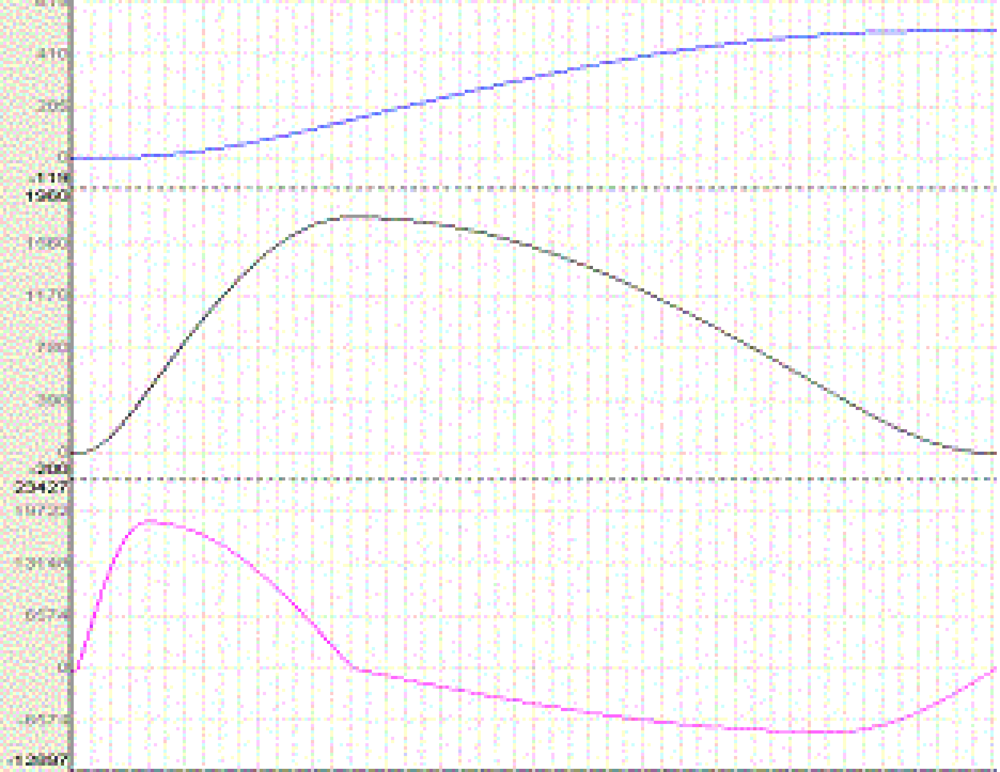
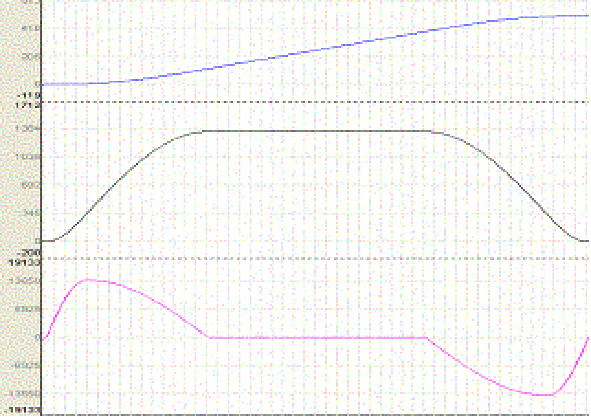
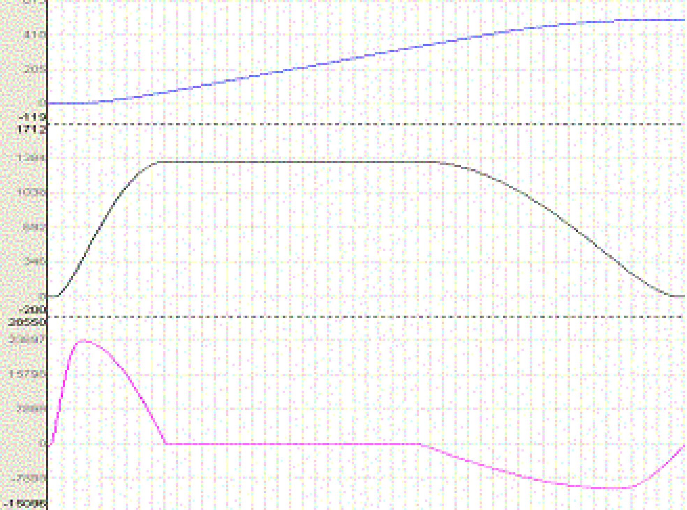

# FC\_ProfileSetC

## Overview

|  |  |
| --- | --- |
| Type: | Function |
| Available as of: | SystemInterface\_1.32.6.0 |
| Versions: | Current version |

## Task

Modify the curve component C of the profile.

## Description

You can insert a linear component for certain rules of motion.

Those rules are:

* Quadratic parabola ("parable2"),
* Simple sine ("simplsin"),
* Polynomial of the fifth degree ("poly5"),
* Inclined sine ("inclisin"),
* Modified acceleration trapezoid ("modacctr"), and
* Modified sine ("modisin").

You can define the linear component by using the FC\_ProfilSetC(lrC) function to set curve component C of the resulting rule of motion. The linear component of the resulting rule is 1 – C. That means that a rule with C = 1 contains no linear component (and is therefore equal to the initial rule), a rule with C= 0.7 has a linear component of 30 %, and so on. The permissible value range for C is 0.0001 ... 1.

The function FC\_ProfileSetLambda() maintains its validity. For C=1, it determines the position of the turning point, for C < 1 it determines the position of the linear component (see diagrams below).

## Interface

| Input | Data type | Description |
| --- | --- | --- |
| i\_diProfileId | DINT | Logical address of the profile |
| i\_lrC | LREAL | Curve component |

## Return Value

| Data type | Description |
| --- | --- |
| DINT | 0: OK  -1: i\_diProfileId invalid  -2: C is outside the value range allowed  -20: The function is not supported by the selected profile (not possible to set the curve component)  -30: Profile is being used by another function and therefore is blocked. |

## Examples

The following diagrams illustrate the above discussion. The position is blue, the velocity is black, and the acceleration is pink.

Original rule: centered turning point, no linear component (Lambda=0.5, C=1)

Rule with shifted turning point, no linear component (lambda=0.3, C=1)

Rule with centered turning point of 40%, (lambda=0.5, C=0.6)

Rule with shifted turning point of 40%, (lambda=0.3, C=0.6)

In the case of the profiles mentioned above, the initialization Lambda=0.5, C=1 is carried out in case of loading via FC\_ProfilLoad() so that the rule is available in its standard form.

EIO0000002680.05