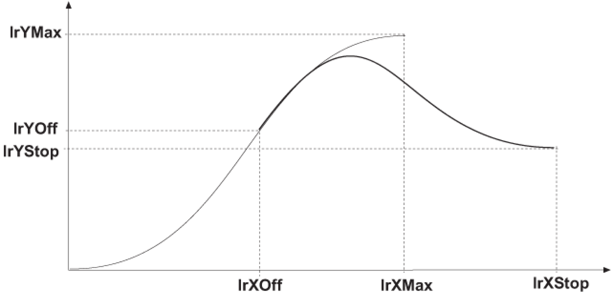

# FC\_ProfileSetCoeff

## Overview

|  |  |
| --- | --- |
| Type: | Function |
| Available as of: | SystemInterface\_1.32.6.0 |
| Versions: | Current version |

## Task

Set the coefficient for a general polynomial of the fifth degree.

## Description

The function FC\_ProfileSetCoeff() calculates the coefficients for a polynomial of the fifth degree so that the profile matches the specified values in the boundary points and therefore can be joined with every other profile. This lets you join any type of curves together. For example, one straight line with another straight line, the end point of the one being different from the start point of the other.

## Interface

| Input | Data type | Description |
| --- | --- | --- |
| i\_diProfileId | DINT | Logical address of the profile |
| i\_lrF | LREAL | YFactor / XFactor |
| i\_lrV0 | LREAL | Left boundary slope |
| i\_lrV1 | LREAL | Right boundary slope |
| i\_lrA0 | LREAL | Left boundary bend |
| i\_lrA1 | LREAL | Right boundary bend |

## Return Value

| Data type | Description |
| --- | --- |
| DINT | 0: OK  -1: i\_diProfileId invalid  -20: The function is not supported by the selected profile  -30: Profile is being used by another function and therefore is blocked. |

## Examples

At any time, travel shall be possible from a specific curve to a specific end position.

Cancelation of any curve with a general polynomial of the fifth degree



Determining position, slope and bend: At the break-off point lrXOff, slave position, slope, and bend of the current curve must first be determined.

```
 CASE lState OF 
1:
```

```
   FC_SetMasterEncoder( _LEnc_1, _VMEnc_1 );
```

```
   lCamId:=FC_ProfileLoad( i_diProfileName:='modisin' );
```

```
    lStopCamId:= FC_ProfileLoad(i_sProfileName:='poly5com');
```

```
    FC_ControllerEnableSet( i_stAxisId :=Gc_stLogAddrAllTypes );
```

```
   VMEnc_1.Enable := TRUE;
```

```
   VMEnc_1.RefVelocity := 5000;
```

```
   lState:=lState+1; 
2:
```

```
   Cam( AxisId:= _Axis_1, EncId:= _LEnc_1, 
      ProfilId:= lCamId, XOffset:= 0.0, YOffset:= 0.0, 
      XFactor:= lrXMax, YFactor:= lrYMax, 
      XLimMin:= 0.0, XLimMax:= lrXMax, XLimMinOn:= TRUE, XLimMaxOn:= TRUE, 
      XSetposMode:= ABSOLUT, XSetposPos:= 0.0, 
      YSetposMode:= ABSOLUT, YSetposPos:= 0.0, 
      Mode:= 0, JobId:= 0, Start:= TRUE); 
   lState:=lState+1; 
3:
```

```
   Cam( Start:= FALSE); 
   IF Cam.Result = 0 THEN
```

```
      FC_ProfileCompute(
```

```
         i_diProfileId:=lCamId, 
         i_lrXPos:= lrXOff-1, 
         i_lrXOffset:= 0, 
         i_lrYOffset:= 0, 
         i_lrXFactor:= lrXMax, 
         i_lrYFactor:= lrYMax, 
         iq_lrYPos:= lrY1); 
      FC_ProfileCompute(
```

```
         i_diProfileId:=lCamId, 
         i_lrXPos:= lrXOff, 
         i_lrXOffset:= 0, 
         i_lrYOffset:= 0, 
         i_lrXFactor:= lrXMax, 
         i_lrYFactor:= lrYMax, 
         iq_lrYPos:= lrY2); 
      FC_ProfileCompute(
```

```
         i_diProfileId:=lCamId, 
         i_lrXPos:= lrXOff+1, 
         i_lrXOffset:= 0, 
         i_lrYOffset:= 0, 
         i_lrXFactor:= lrXMax, 
         i_lrYFactor:= lrYMax, 
         iq_lrYPos:= lrY3);
```

The function FC\_ProfileCompute() is used to determine slave positions Y1, Y2, Y3 for 3 points at Xoff (+/- 1 unit). The slope and bend at Xoff are then calculated by forming the difference. The values are unit-related and without time reference. The slope and bend for Ystop is zero.

```
      lrYOff:= lrY2;
```

```
      lrV:= (lrY3-lrY1) / 2;
```

```
      lrA:= lrY3 + lrY1 - 2 * lrY2;
```

```
      lResult:= PDL.FC_ProfileSetCoeff(i_diProfileId:= lStopCamId,
```

```
      i_lrF:= lrYStop - lrYOff,
```

```
      i_lrV0:= lrV * (lrXStop - lrXOff), i_lrV1:= 0,
```

```
      i_lrA0:= lrA * EXPT(lrXStop-lrXOff, 2), i_lrA1:=0);
```

```
      Cam( 
         AxisId:= _Axis_1, 
         EncId:= _LEnc_1, 
         ProfilId:= lStopCamId, 
         XOffset:= lrXOff, 
         YOffset:= lrYOff, 
         XFactor:= lrXStop-lrXOff, 
         YFactor:= 1.0,
```

```
         XLimMin:= 0, 
         XLimMax:= lrXStop, 
         XLimMinOn:= FALSE, 
         XLimMaxOn:= TRUE, 
         XSetposMode:= NONE, 
         XSetposPos:= 0, 
         YSetposMode:= NONE, 
         YSetposPos:= 0, 
         Mode:= 0, 
         JobId:= 2, 
         Start:= TRUE);
```

```
      CamMasterSetXLim( 
         i_stAxisId:=_Axis_1, 
         i_lrXLimMin:=0.0, 
         i_lrXLimMax:=lrXOff, 
         i_xXLimMinOn:=FALSE, 
         i_xXLimMaxOn:=TRUE); 
      lState:=lState+1; 
   ELSIF Cam.Result < 0 THEN 
      lState:=99; 
      sErrText:=GetResultText(Result:=Cam.Result); 
   END_IF 
4:
```

```
   Cam( Start:= FALSE); 
   IF Cam.Result = 0 THEN 
      lState:=2; 
   ELSIF Cam.Result < 0 THEN 
      lState:=99; 
      sErrText:=GetResultText(Result:=Cam.Result); 
   END_IF; 
99:
```

```
   ; 
ELSE 
   lState:=99; 
END_CASE;
```

EIO0000002680.05