# FC\_ProfileSetParam

## Overview

|  |  |
| --- | --- |
| Type: | Function |
| Available as of: | SystemInterface\_1.32.6.0 |
| Versions: | Current version |

## Task

Adjust profile.

## Description

The following general rules of motion are available:

* General modified sinusoidal line ("modisincom"),
* General modified acceleration trapezoid ("modacctrcom"),
* Harmonic combination ("harmocomb"), and
* Sine-straight combination ("sinstraightcomb").

The name in parentheses is the name of the profile to be used when calling the function FC\_ProfileLoad().

The adaptation of these profiles is effected by using the function FC\_ProfileSetParam().

## Interface

| Input | Data type | Description |
| --- | --- | --- |
| i\_diProfileId | DINT | Logical address of the profile |
| i\_diSubType | DINT | The "general modified acceleration trapezoid" and "harmonic combination" motion laws can be used for more than one standard motion task.  The function of i\_diSubType depends on the profile and is explained for the corresponding profile (see below, "Examples"). The parameter is only significant for profiles where the output and final state are different (for example, Velocity -> Reverse or rest -> Reverse). The value 0 represents the literal interpretation and the value 1 represents the inverted interpretation (Velocity -> Reverse inverted results in Reverse -> Velocity). |
| i\_diParSelect | DINT | The parameters iq\_lrLambda, iq\_lrC, iq\_lrY1, iq\_lrM0, iq\_lrM1, iq\_lrK0, iq\_lrK1 are values that can be used to define properties of the resulting profile. However, only a certain subset of parameters from the above list can be preset, never all of them. The i\_diParSelect parameter is used to specify the parameters from the above list that have to be preset. It sequences the positions of the corresponding parameters from the above list in ascending order. i\_diParSelect = 137 then means that parameters iq\_lrLambda, iq\_lrY1, iq\_lrK1 are to be preset. The parameters from the list are defined as VAR\_IN\_OUT. Parameters that are not preset are determined clearly by the preset parameters and are returned as calculation results. They are needed to calculate the connection conditions for other profiles. The preset options depend on the profile and are discussed below. |

| Input/Output | Data type | Description |
| --- | --- | --- |
| iq\_lrLambda | LREAL | Position of the profile turning point  The valid range for the profiles of this section is generally 0.0001...0.9999. |
| iq\_lrC | LREAL | Curve component of the profile  The valid range for the profiles of this section is generally 0.0001...1. |
| iq\_lrY1 | LREAL | Position in the end point of the profile (F(1))  Not all profiles of this section are standardized. Therefore, it is necessary either to preset this variable or to know its value. |
| iq\_lrM0 | LREAL | Slope in the starting point of the profile (F‘(0)) |
| iq\_lrM1 | LREAL | Slope in the end point of the profile (F‘(1)) |
| iq\_lrK0 | LREAL | Bend in the starting point of the profile (F‘‘(0)) |
| iq\_lrK1 | LREAL | Bend in the end point of the profile (F‘‘(1)) |

## Return Value

| Data type | Description |
| --- | --- |
| DINT | 0: OK  -1: i\_diProfileId invalid  -2: The value of the parameter iq\_lrLambda is invalid  -3: The value of the parameter i\_diSubType is invalid  -4: The value of the parameter i\_diParSelect is invalid  -5: The value of the parameter iq\_lrY1 is invalid  -6: The value of the parameter iq\_lrM0 is invalid  -7: The value of the parameter iq\_lrM1 is invalid  -8: The value of the parameter iq\_lrK0 is invalid  -9: The value of the parameter iq\_lrK1 is invalid  -10: The value of the parameter iq\_lrC is invalid  -20: The function is not supported by the selected profile  -30: Profile is being used by another function and therefore is blocked. |

## Examples

NOTE: The functions FC\_ProfileSetLambda() and FC\_ProfileSetC() cannot be used for the profiles of this section.

This means that the "new" profiles can only be parameterized with the function FC\_ProfileSetParam(). It is not possible to use the functions FC\_ProfileSetLambda() or FC\_ProfileSetC() to modify only the parameter Lambda or C of the profile. This is not possible because, in contrast to previous profiles, the allowable value ranges for these parameters are dependent on the remaining parameters. Therefore, the compatibility of ALL parameters must be checked. This can only be done in the FC\_ProfileSetParam() function.

Detailed properties of the profiles:

**General modified sinusoidal line**

Motion task: "Velocity to velocity"

Only the combination of parameters iq\_lrLambda, iq\_lrM0, iq\_lrM1 can be preset. i\_diSubType and i\_diParSelect have no meaning on this rule.

**General mod. acceleration trapezoid**

Motion tasks: "Rest to reverse" and "Reverse to rest"

The motion task is selected by the parameter i\_diSubType:

i\_diSubType = 0 : „Rest to reverse“

i\_diSubType = 1 : „'Reverse to rest“

For "Rest to reverse", there are the following preset options:

1. iq\_lrLambda and iq\_lrY1\* (i\_diParSelect = 13)

2. iq\_lrK1 (i\_diParSelect = 7)

For "Reverse to rest" there are the following preset options:

1. iq\_lrLambda and iq\_lrY1\* (i\_diParSelect = 13)

2. iq\_lrK0 (i\_diParSelect = 6)

\*Note: Only the sign of iq\_lrY1 can be preset. The value is always 1.

If iq\_lrK0 or iq\_lrK1 is preset, then the following must apply: | iq\_lrK0 |, | iq\_lrK1 | >= 2.025

**Harmonic combination**

Motion tasks: "Velocity to reverse" and "Reverse to velocity"

The selection of the motion task is effected via i\_diSubType:

i\_diSubType = 0: Velocity to reverse

i\_diSubType = 1: Reverse to velocity

Parameter combinations that can be preset:

i\_diSubType = 0:

1. iq\_lrLambda, iq\_lrM0, iq\_lrK1 (i\_diParSelect = 147)

The following conditions must be met:

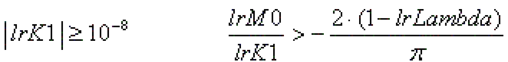

2. iq\_lrLambda, iq\_lrY1, iq\_lrK1 (i\_diParSelect = 137)

The following conditions must be met:

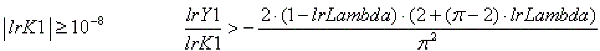

3. iq\_lrLambda, iq\_lrY1, iq\_lrM0 (i\_diParSelect = 134)

The following conditions must be met:

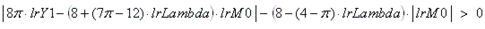

4. iq\_lrY1, iq\_lrM0, iq\_lrK1 (i\_diParSelect = 347)

The following conditions must be met:

With the definitions

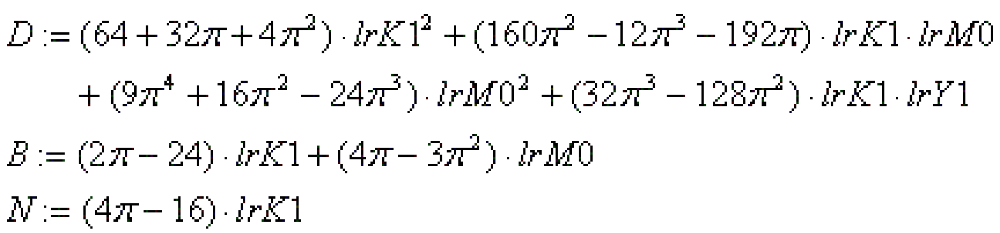

the following must be valid:

(1)

(2) One of the following values must be between 0.0001 and 0.9999:

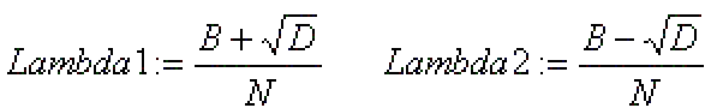

This value is called Lambda. With it, the following must be valid

(3)

i\_diSubType = 1: 1. iq\_lrLambda, iq\_lrM1, iq\_lrK0 (i\_diParSelect = 156)

The following conditions must be met:

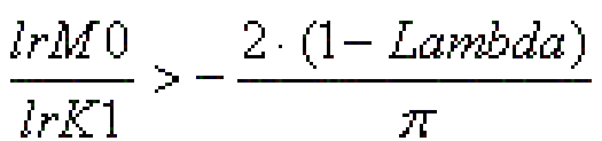

2. iq\_lrLambda, iq\_lrY1, iq\_lrK0 (i\_diParSelect = 136)

The following conditions must be met:

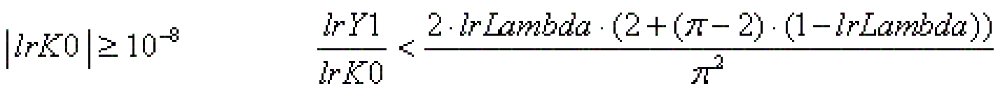

3. iq\_lrLambda, iq\_lrY1, iq\_lrM1 (i\_diParSelect = 135)

The following conditions must be met:

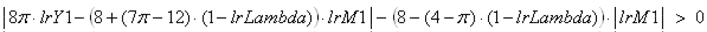

4. iq\_lrY1, iq\_lrM1, iq\_lrK0 (i\_diParSelect = 356)

The following conditions must be met:

With the definitions

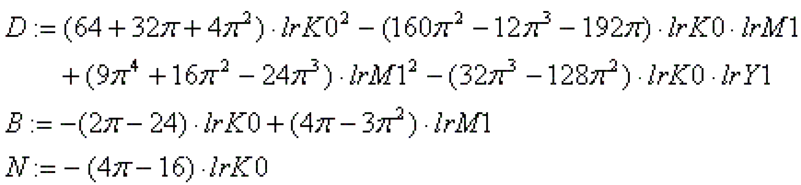

the following must be valid:

(1)

(2) One of the following values must be between 0.0001 and 0.9999:

This value is called Lambda.

With it, the following must be valid

(3)

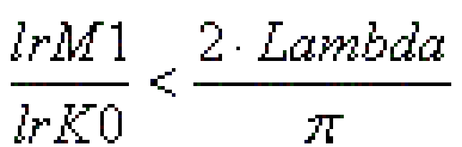

**Sinus-straight line combination**

Motion task: "Reverse to reverse"

Predetermined parameter combinations (related value from i\_diParSelect in parentheses):

iq\_lrY1, iq\_lrK0, iq\_lrK1 (i\_diParSelect = 367)

iq\_lrC, iq\_lrK0, iq\_lrK1 (i\_diParSelect = 267)

iq\_lrLambda, iq\_lrY1, iq\_lrK0 (i\_diParSelect = 136)

iq\_lrC, iq\_lrY1, iq\_lrK0 (i\_diParSelect = 236)

iq\_lrLambda, iq\_lrC, iq\_lrK0 (i\_diParSelect = 126)

iq\_lrLambda, iq\_lrY1, iq\_lrK1 (i\_diParSelect = 137)

iq\_lrC, iq\_lrY1, iq\_lrK1 (i\_diParSelect = 237)

iq\_lrLambda, iq\_lrC, iq\_lrK1 (i\_diParSelect = 127)

iq\_lrLambda, iq\_lrC, iq\_lrY1 (i\_diParSelect = 123)

Note: If iq\_lrK0 or iq\_lrK1 is preset, then the following must always apply:

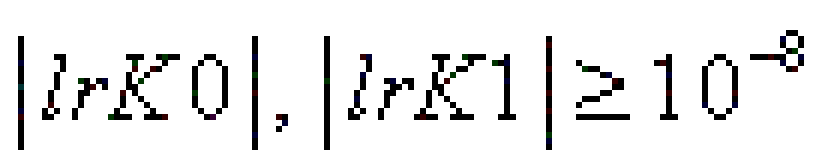

If both are preset, then they must have different signs.

EIO0000002680.05