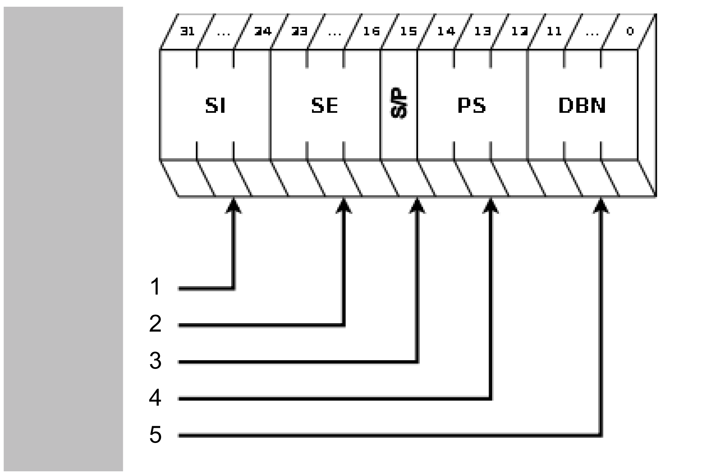
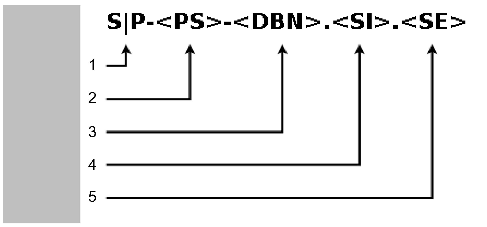

# Using FC\_SercosSetUserRealTimeControlBits

## Identification Number (IDN)

A Sercos command is addressed via the identification number (IDN). The IDN has a 32-bit value.

The following figures describe the structure and notation of the IDN.

Structure IDN



**1** Structure instance (SI)

**2** Structure element (SE)

**3** S/P parameter (0:=S; 1:=P)

**4** Parameter set (PS)

**5** Data block number (DBN)

Notation IDN



**1** S/P parameter (SP)

**2** Parameter set (PS)

**3** Data block number (DBN)

**4** Structure instance (SI)

**5** Structure element (SE)

The IDN for DC\_BusVoltage (P-Parameter) is for example **S-0-0380.0.0**.

## Bit Types

Within a Sercos command the following bit types are used:

* Functional bit type
* Reserved bit type
* Internal bit type

| Bit type | Description |
| --- | --- |
| Functional bit type | Functional bits can be written and read. Via functional bits a certain function can be performed on a Sercos device, for example setting the motor brake. |
| Reserved bit type | Reserved bits are reserved for the future use. |
| Internal bit type | Internal bits can be read but not written. These bits are reserved for the internal use. |

## Example

The real-time bits described in the following list are contained in the Sercos IDN **P-0-0409.0.0** (in hexadecimal notation: **16#0008199**).

Only the functional bits 7, 9, 10, 11 and 13 can be written and read. Other bits are internal bits that only can be read.

| Bit no. | Description |
| --- | --- |
| 15 | Value from OUT\_1 only Lexium LXM52 Drive and Lexium LXM62 Drive) |
| 14 | Value from OUT\_0 (only Lexium LXM52 Drive and Lexium LXM62 Drive) |
| 13 | Configurable real-time bit #1  Standard configuration: Real-time control brake  0 = Brake closed  1 = Brake released  To use this bit, the parameter BrakeMode must be set to "Control brake via user program / 3".  If the parameter BrakeMode is set to another value, the brake is not controlled by bit 13. |
| 12 | Speed-torque-characteristic curve (SpeedTorqueCurve)  0 = Deactivating the speed-torque-characteristic curve  1 = Activating the speed-torque-characteristic curve |
| 11 | Configurable real-time bit #2 |
| 10 | Configurable real-time bit #3 |
| 9 | Configurable real-time bit #4 |
| 8 | ACTIVE\_PS  0 = Power supply is deactivated.  1 = Power supply is activated. |
| 7 | Configurable real-time bit #5 |
| 6 | Moment of inertia-feed forward mode  0 = Moment of inertia-feed forward = Motor moment of inertia + J\_Gear + J\_Load (Default)  1 = Moment of inertia-feed forward = Motor moment of inertia + J\_Gear |
| 5 | Current feed forward (User)  0 = Current feed forward (User) deactivated.  1 = Current feed forward (User) activated. |
| 4 | Current feed forward  0 = Current feed forward deactivated.  1 = Current feed forward activated (Default) |
| 3 | OverloadDetectionQuit  0->1 = Acknowledging the overload reaction (low -> high) |
| 2 | OverloadDetectionOn  0 = Overload detection is deactivated.  1 = Overload detection for FeedbackCurrent is active. |
| 1 | UserCurrentOn  0 = Current on DrivePeakCurrent is limited.  1 = Current on UserCurrent is limited. |
| 0 | AccelerationOverflow  0 = The acceleration is inside the defined range.  1 = The acceleration exceeds the defined range. |

## Example

The following example explains how to release the brakes. Therefore a mask is defined which allows access to the configurable bits. Furthermore the value to release the brakes is defined.

**Declaration**

```
PROGR AM SR_Demo 
VAR 
   xOnce : BOOL := TRUE; 
   diResult : DINT := -99; 
   dwMask : DWORD := 16#00000000; 
   dwIDN : DWORD := 16#00000000; 
   dwValue : DWORD := 16#00000000; 
END_VAR
```

**Program**

```
IF xOnce = TRUE THEN 
xOnce := FALSE; 
   dwMask := 16#00002E80;  (* Only the configurable bits 7, 9, 10, 11 and 13 are accessible *)
   dwIDN := 16#00008199;  (* IDN for P-0-0409.0.0 *)
   dwValue:= 16#00002000;  (* bit 13 = TRUE, value to relase the brakes *)
   diResult := FC_SercosSetUserRealTimeControlBits( 
      i_stLogAddr := DRV_Lexium62.stLogicalAddress, 
      i_dwMask := dwMask, 
      i_dwIDN := dwIDN, 
      iq_dwValue := dwValue); 
END_IF
```

EIO0000002680.05