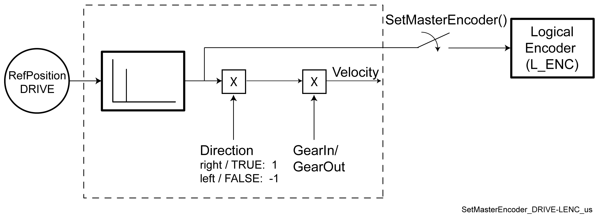
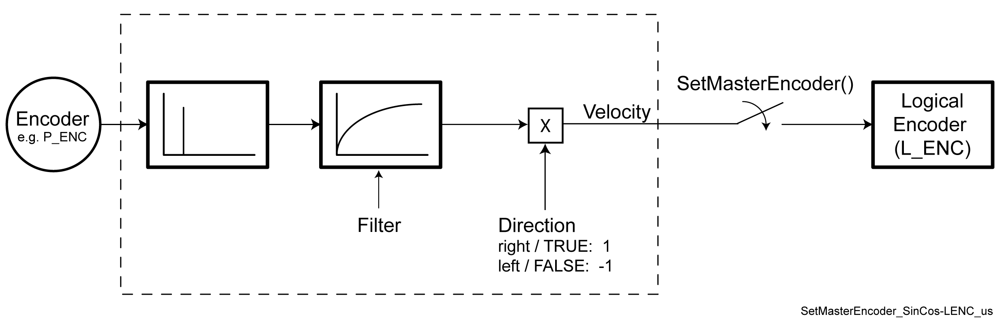

# FC\_SetMasterEncoder

## Overview

|  |  |
| --- | --- |
| Type: | Function |
| Available as of: | SystemInterface\_1.32.6.0 |
| Versions: | Current version |

## Task

Pass the velocity signal of a master encoder to a Logical encoder or an encoder output (Incremental encoder output on the bus terminal **BT-4/ENC1** or synchronized encoder output on the encoder network).

## Description

The "logical encoder" or the encoder output with the logical address i\_stLEncId is connected to the master encoder (velocity source) with the logical address i\_stMasterId. With this connection, the velocity signal (*[Velocity](../../../../../api/crossBook?lang=en-US&virtualBookName=PD.Parameter.LMCPro&topicID=D_SE_0075788)*, *[RefVelocity](../../../../../api/crossBook?lang=en-US&virtualBookName=PD.Parameter.LXM52Drive&topicID=D_SE_0071512)*) of the master encoder is passed on.

For an axis, RefVelocity is used which normally leads to smoother system performance than if the actual velocity were used.

The name of the current master encoder is displayed in the parameter *[InObject](../../../../../api/crossBook?lang=en-US&virtualBookName=PD.Parameter.LMCPro&topicID=D_SE_0082964)* in the logical encoder or incremental encoder output.

| Master encoder | Parameter "Direction" of the master encoder |
| --- | --- |
| Lexium LXM62 Drive (LXM62DxS)  Lexium LXM52 Drive (LXM52)  Lexium ILM62 Drive Module (ILM62) | This does NOT affect the velocity signal which is passed on from the master encoder. That is, in the case of the direction of rotation "left", the velocity signal is NOT multiplied by -1. |
| Physical SinCos encoder (P\_ENC) | This affects the velocity signal which is passed on from the master encoder. That is, in the case of the direction of rotation "left", the velocity signal is multiplied by -1. |
| Incremental encoder input (INC\_IN) | This affects the velocity signal which is passed on from the master encoder. That is, in the case of the direction of rotation "left", the velocity signal is multiplied by -1. |
| Virtual encoder (V\_ENC) | Parameter does not exist. |
| Sum master encoder (SMENC) | Parameter does not exist. |

Connection "DRIVE" - "Logical Encoder":



Connection "Master Encoder" (P\_ENC, INC\_IN) - "Logical Encoder":



NOTE: The function FC\_GetPacDriveBootState() should be used to ensure that the boot procedure for the PacDrive controller is completed and the physical encoder is initialized.

## Interface

| Input | Data type | Description |
| --- | --- | --- |
| i\_stLEncId | ST\_LogicalAddress | Logical address of the logical encoder or incremental encoder output or synchronized encoder output |
| i\_stMasterId | ST\_LogicalAddress | Logical address of the master encoder whose velocity signal is passed on.  If i\_stMasterId = Gc\_stLogAddrAllTypes is transferred, then the master encoder is decoupled by the "Logical encoder" or the encoder output. |

## Return Value

| Data type | Description |
| --- | --- |
| DINT | 0: OK  -1: No address of a logical encoder  -2: No address of a master encoder |

## Examples

```
 IF FC_GetPacDriveBootState() = 1 THEN
   FC_SetMasterEncoder( VirtuellerGeber.stLogicalAddress, Leitgeber.stLogicalAddress ); 
END_IF;
```

NOTE: If axis encoders are cascaded, then the reference position of the last Sercos cycle is used. A delay of a Sercos cycle occurs.

EIO0000002680.05