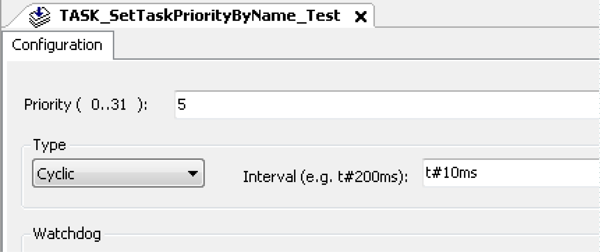
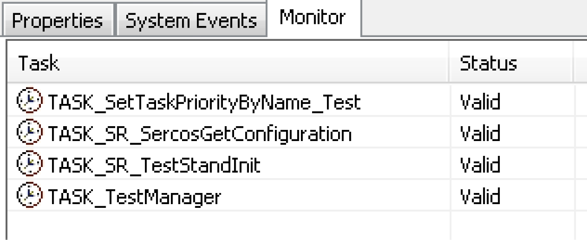

# FC\_SetTaskPriorityByName

## Overview

|  |  |
| --- | --- |
| Type: | Function |
| Available as of: | SystemInterface\_1.53.7.9 |
| Versions: | Current version |

## Task

Modify the priority of a task or multiple tasks with the same name.

## Description

The priority of a task or multiple tasks specified with i\_sTaskName is changed.

It is possible to modify, with a single call of this function, the priority of more than one task specifying as i\_sTaskName the common initial part of the task names.

For instance, as in the example below, with i\_sTaskName = TASK\_S the function modifies priorities of the tasks TASK\_SetTaskPriorityByName\_Test, TASK\_SR\_SercosGetConfiguration, and TASK\_SR\_TestStandInit but not of task Task\_TestManager.

## Interface

| Input | Data type | Description |
| --- | --- | --- |
| i\_sTaskName | STRING(80) | The task or multiple tasks, whose priority shall be changed |
| i\_diPriorityOS | DINT | Priority 0..255 |

## Return Value

| Data type | Description |
| --- | --- |
| DINT | >0: The task priority has been changed. The value indicates the number of affected tasks.  -1: Incorrect task name or priority (i\_diPriorityOS) outside the limitations |

## Example



NOTE: When you use this function, you must provide the system level value. Therefore, you need to add 244 to the value you set for the task priority.

## Example Based on the Following Tasks



```
PROGRAM SR_SetTaskPrioirityByName_Test
VAR
   xPrioTask1_HI : BOOL := FALSE;
   xPrioTask1_LO : BOOL := FALSE;
   xPrioTask2_HI : BOOL := FALSE;
   xPrioTask2_LO : BOOL := FALSE;
END_VAR
// Change priority of a single task
IF xPrioTask1_HI THEN
   IF 1 = FC_SetTaskPriorityByName('TASK_SetTaskPriorityByName_Test', 224 + 31) THEN
      xPrioTask1_HI := FALSE;
   END_IF
END_IF
IF xPrioTask1_LO THEN
   IF 1 = FC_SetTaskPriorityByName('TASK_SetTaskPriorityByName_Test', 224 + 5) THEN
      xPrioTask1_LO := FALSE;
   END_IF
END_IF
// Change priority of a group of matching task names
IF xPrioTask2_HI THEN
   IF 3 = FC_SetTaskPriorityByName('TASK_S', 224 + 31) THEN
      xPrioTask2_HI := FALSE;
   END_IF
END_IF
IF xPrioTask2_LO THEN
   IF 3 = FC_SetTaskPriorityByName('TASK_S', 224 + 10) THEN
      xPrioTask2_LO := FALSE;
   END_IF
END_IF
```

EIO0000002680.05