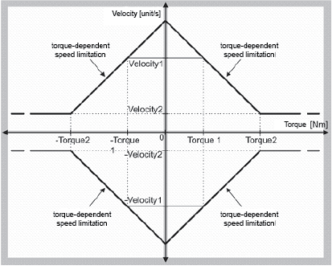

# FC\_SpeedTorqueCurve

## Overview

|  |  |
| --- | --- |
| Type: | Function |
| Available as of: | SystemInterface\_1.36.0.0 |

## Task

Limit the speed of the axis depending on the torque of the motor shaft (torque-dependent speed limitation). This is required to seal bottles, for example.

## Description

In order to solve the task, a torque-speed characteristic curve was implemented to limit the speed in accordance with the current which is proportional to the torque of the motor.

The values entered for the curve are absolute values which are only configured in the first quadrant.

This automatically gives you the characteristic curves for quadrants 2 to 4, whereas the application of the limits is only useful for quadrants 1 and 3. An unstable behavior occurs in both the other quadrants.

To parameterize the characteristic curve for the i\_stAxisId axis, a maximum torque lrTorque1 (x-axis) is specified for a starting speed of rotation lrVelocity1 (y-axis). This determines the first point on the curve. A minimum speed, lrVelocity2, and a corresponding torque, lrTorque2, are also specified.

The torques are entered in Nm. The speed of rotation is entered in unit/s.

The curve is a straight line which passes through the first point and ends at the second point.

From this second point on, the curve runs parallel to the torque axis (x-axis).

When the minimum speed (second point) is reached, the speed is constantly limited to this minimum even if the torque rises.

The "torque-dependent speed limitation" function is only prepared with this function.

The function is activated via SpeedTorqueCurveOn() in "real-time" and de-activated again via SpeedTorqueCurveOff() in "real-time".

This distinguishes the function from SpeedTorqueCurveSet().

NOTE: When using this function, the diagnostic message [8132 "Tracking deviation exceeded"](../../../../../api/crossBook?lang=en-US&virtualBookName=PD.Diagnostic&topicID=D_SE_0063868) or [8111 "Shutdown due to tracking deviation"](../../../../../api/crossBook?lang=en-US&virtualBookName=PD.Diagnostic&topicID=D_SE_0063854) may occur.

This is due to your intervention with the control using this function (torque-dependent speed limitation).

The diagnostic messages can be influenced via the parameters FollowingLimit and Pos\_P\_Gain.

## Interface

| Input | Data type | Description |
| --- | --- | --- |
| i\_stAxisId | ST\_LogicalAddress | Logical address of the axis |
| i\_lrTorque1 | LREAL | Maximum torque x-axis |
| i\_lrVelocity1 | LREAL | Starting speed y-axis |
| i\_lrTorque2 | LREAL | Minimum torque x-axis |
| i\_lrVelocity2 | LREAL | Minimum speed of rotation y-axis |

## Return Value

| Data type | Description |
| --- | --- |
| DINT | 0: OK  -1: i\_stAxisId invalid  -2: i\_lrTorque2 exceeds the maximum torque (maximum torque = DrivePeakC \* TorqueConstant / 1000)  -3: i\_lrTorque1 is greater or equal to Torque2  -4: i\_lrTorque1 is negative  -5: i\_lrVelocity1 exceeds maximum speed (MaxVel)  -6: i\_lrVelocity2 is greater than Velocitiy1  -7: i\_lrVelocity2 is negative  -8: Intersection with the y-axis is greater than 60000 rpm  -9: Intersection with the y-axis is zero  -10: Gradient exceeds the maximum value  -11: Firmware of the axis is not supported |

EIO0000002680.05