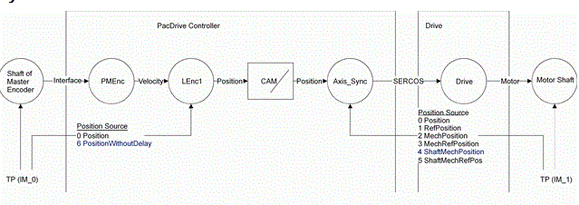
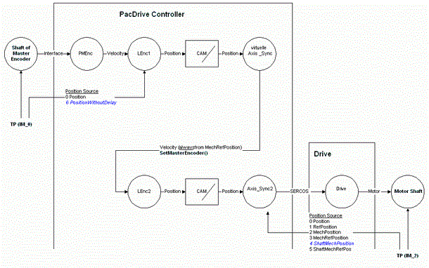
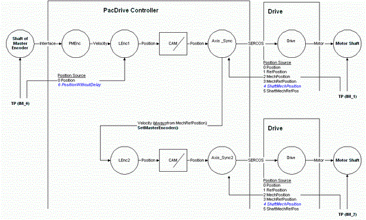

# Compensating for Dead Times

## General

To compensate for dead time, a constant velocity is required for the duration of the compensation time.

Consider the type if the encoder position is shared via C2C:

* For a physical master encoder: LE.Delay = -Axis.ShaftRefDelay + C2C\_EncIn.DataDelay
* For an axis: LE.Delay = One SERCOS cycle of C2C controller with connected master axis + C2C\_EncIn.DataDelay

## Synchronous Run: Axis Follows Master Encoder

Example of synchronous run of an axis to a master encoder:

Values of the delay parameters with a Sercos Cycle Time of 1 ms

| Object | Parameter | Type | Value [ms] | Reasoning |
| --- | --- | --- | --- | --- |
| LEnc2 | Delay | EF | -Axis\_Sync.ShaftRefDelay | Compensation of the "Sercos distance". |
| Axis\_Sync2 | ShaftDelay | AD | 0.46994 ms(1) | Dead time of the "Sercos distance" for the actual position. |
| Axis\_Sync2 | ShaftRefDelay | AD | -3.90506 ms(1) | Dead time of the "Sercos distance" for the target position. |
| **1.** Example value | | | | |

NOTE: The parameters ShaftDelay and ShaftRefDelay indicate the current dead time in the system. These, among other things, depend on the number of Sercos members and the cable length.

## Touchprobe

PositionWithoutDelay is used to maintain the position of the master encoder shaft at a marker (TouchProbe event).

`FC_TPEdge(TPld:=IM_0.LogAdr, DevId:=LEnc1.LogAdr, ParType:=6, (*PositionWithoutDelay*) PoaEdge:=TRUE, LowLimit:=IrLowLimit, HighLimit:=IrHighLimit);`

ShaftMechPosition is used to maintain the position of the shaft of the "subsequent" axis at a marker (TouchProbe event).

`FC_TPEdge(TPId:=IM_1.LogAdr, DevId:= Axis_Sync.LogAdr, ParType:= 4, (* ShaftMechPosition *) PosEdge:= TRUE, LowLimit:= lrLowLimit, HighLimit:= lrHighLimit);`

## Synchronous Run: Axis Follows Virtual Axis That Follows a Master Encoder

Example of a synchronous run of an axis to a virtual axis that follows a master encoder:

Values of the delay parameters with a Sercos CycleTime of 1 ms

| Object | Parameter | Type | Value [ms] | Reasoning |
| --- | --- | --- | --- | --- |
| LEnc1 | Delay | EFC | -Axis\_Sync.ShaftRefDelay | Compensation of the "Sercos distance". |
| Axis\_Sync | ShaftDelay | AD | 0 ms | 0,since axis is virtual. |
| Axis\_Sync | ShaftRefDelay | AD | 0 ms | 0,since axis is virtual. |
| LEnc2 | Delay | EFC | -Axis\_Sync2.ShaftRefDelay | Compensation of the "Sercos distance". |
| AxisSync2 | ShaftDelay | AD | 0.46994 ms (1) | Dead time of the "Sercos distance" for the actual position. |
| Axis\_Sync2 | ShaftRefDelay | AD | -3.90506 ms(1) | Dead time of the "Sercos distance" for the target values. |
| **1.** Example value | | | | |

NOTE: The parameters ShaftDelay and ShaftRefDelay indicate the current dead times in the system. These, among other things, depend on the number of Sercos members in the cable length.

## Synchronous Run: Axis Follows Axis That Follows a Master Encoder

Values of the delay parameters with a Sercos CycleTime of 1 ms

| Object | Parameter | Type | Value [ms] | Reasoning |
| --- | --- | --- | --- | --- |
| LEnc1 | Delay | EFC | -Axis\_Sync.ShaftRefDelay | Compensation of the "Sercos distance". |
| Axis\_Sync | ShaftDelay | AD | 0.41975 ms (1) | Dead time of the "Sercos distance" for the actual position. |
| Axis\_Sync | ShaftRefDelay | AD | -3.230250 ms (1) | Dead time of the "Sercos distance" for the target values. |
| LEnc2 | Delay | EFC | 0 | 0, since "Sercos distance" is already compensated for in LEnc1 and Axis\_Sync is a real axis. |
| Axis\_Sync2 | ShaftDelay | AD | 0.41975 ms (1) | Dead time of the "Sercos distance" for the actual position. |
| Axis\_Sync2 | ShaftRefDelay | AD | -3.230250 ms (1) | Dead time of the "Sercos distance" for the target values. |
| **1.** Example value | | | | |

NOTE: The parameters ShaftDelay and ShaftRefDelay indicate the current dead times in the system. These, among other things, depend on the number of Sercos members and the cable length.

EIO0000002285.11