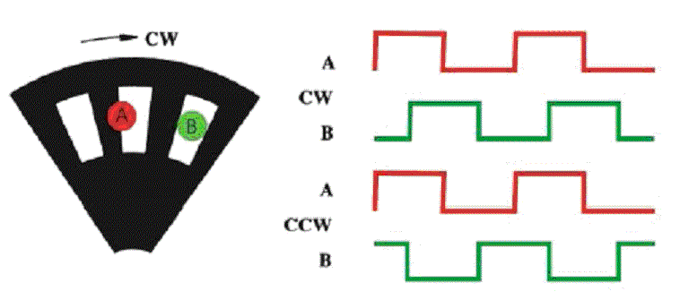
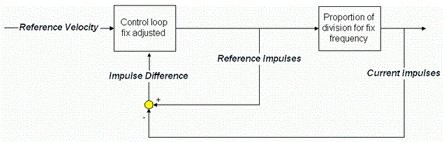
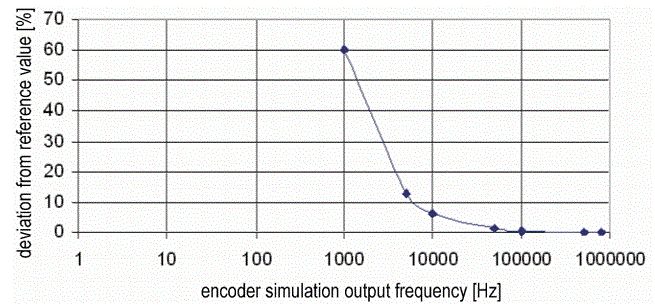
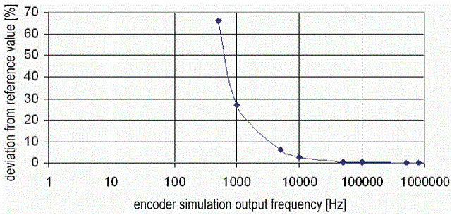
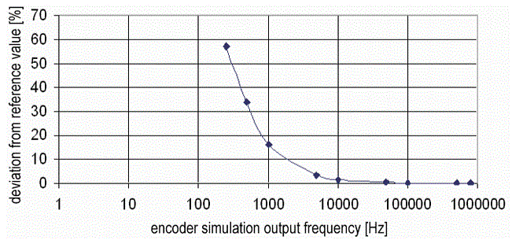

# Incremental Encoder Output

## Task

There are a number of cases that require several machines to be coupled using velocity alignment or even angular alignment. One example is when a product is moved from one machine to another.

This makes a flexible angle-synchronous coupling available. Further measures are required for the one-off balancing of the position between both machines as well as a continual exchange of status and error information.

An alternative solution is the **encoder network**. Based on the PacDrive controllers Ethernet connection, you can use Ethernet to distribute “encoder data” to distributed controllers to synchronize machines.

## Contents of This Topic

This topic contains the following subtopics

* [Assembly of an incremental encoder](#D-SE-0070717__D-SE-0070717.7)
* [Generating the output impulse](#D-SE-0070717__D-SE-0070717.8)
* [Smallest frequency that can be released](#D-SE-0070717__D-SE-0070717.9)
* [Percentage frequency variation](#D-SE-0070717__D-SE-0070717.10)
* [Compare encoder with encoder simulation](#D-SE-0070717__D-SE-0070717.11)
* [Application instructions](#D-SE-0070717__D-SE-0070717.12)

## Assembly of an Incremental Encoder

An incremental encoder basically comprises a round disk with a recess of the same size and web of the same size. These are evaluated using photo elements.

Assembly of an incremental encoder with signal tracks:

The following signal procedures result depending on the direction of rotation:

* CW: clockwise
* CCW: counter-clockwise

If the encoder shaft is driven with constant speed, this results in a constant output frequency of a signal track.

A one-off zero impulse / rotation is not illustrated here. It appears once in relation to one rotation of the encoder shaft and therefore, always the equal quantity of impulses from track A or track B.

An application is taken on, where the encoder records the movement of a belt via a runner. The runner has a certain circumference.

Relevant size for the application

| Value | Meaning |
| --- | --- |
| Resolution Res | Resolution of encoder increments per rotation of the encoder shaft for example, 1024 Increments / rotation |
| Scaling factor SF | Mechanical units per rotation of the encoder shaft  For example, the circumference of the runner in mm |
| Velocity V | For measuring the mechanical velocity in mechanical units per second  For example, belt velocity in mm/s |
| Output frequency f | Output frequency of a signal track of the incremental encoder in Hz for example, Track A |

The maximum frequency of the signal track is relevant for the evaluation unit of encoder signals.

This is why the resolution of the encoder has to be selected in combination with the scaling factor in such a way that the output frequency **f** of a signal track is not exceeded with the maximum velocity **v** to be recorded.

The formulas apply relating to the frequency of the output signal (for example, Track A):

Output frequency: f = (v \* Res) / SF

Path with 1 increment (= maximum position resolution): s = SF / Res

Mechanical velocity at 1 Hz Signal frequency: v = 1 Hz \* SF / Res

## Generating The Output Impulse

The encoder simulation at the Incremental Encoder Output is based on the output of an impulse frequency per Sercos cycle. Therefore the output frequency of the incremental encoder output only can be modified in Sercos cycle pattern.

Due to the technical hardware implementation via a basic oscillation and integer partition ratio, any output frequencies can be generated for the signal tracks.

This leads to a principle-related inaccuracy within a Sercos cycle. A fixed set controller ensures that no position drifts occur.

Block diagram incremental encoder simulation:

1. Calculation of the output frequency for the following Sercos cycle:

   * v = (Positionactual cycle - Positionprevious cycle) / Sercos cycle
   * f = (v \* Res) / SF
2. Then the possible frequency is determined from the required output frequency **f** due to the integer partition of a basic frequency and released.
3. At the same time, an internal calculation is performed as to how many impulses should be released in the following Sercos cycle due to the setpoint frequency (Soll\_Impulse).
4. The actual impulses released are counted (Ist\_Impulse).
5. The difference (Impulse difference) of the number of setpoint impulses and impulses released are determined and are also released as an offset for the output frequency in the following Sercos cycle.

   With this, no position differences result in the steady state condition.

The maximum output frequency or a signal track is 1 MHz.

## Smallest Frequency That Can Be Released

The smallest of zero different numbers of impulses in a Sercos cycle that can be released is 1. Therefore, the minimum output frequency is dependent on the Sercos cycle:

Minimum possible frequencies depending on the Sercos cycle

| Sercos cycle (CycleTime) | Impulse | Output frequency |
| --- | --- | --- |
| 1 ms | 1000 / s | 1000 Hz |
| 2 ms | 500 / s | 500 Hz |
| 4 ms | 250 / s | 250 Hz |

Frequencies that lie below this level can only be simulated that the smallest frequency can be released for 1 Sercos cycle and then the frequency 0 for a respective number of Sercos

This is why the oscillation of the output frequency reduces when the Sercos cycle increases (parameter [CycleTime](D-SE-0073362.html#D-SE-0073362)). The reason is that finer frequency stages are possible per Sercos cycle.

## Percentage Frequency Variation

Percentage frequency variation from the average value at 1 ms Sercos cycle:

Percentage frequency variation from the average value at 2 ms Sercos cycle:

Percentage frequency variation from the average value at 4 ms Sercos cycle:

## Compare Encoder with Encoder Simulation

if one compares a real incremental encoder with the incremental encoder simulation, the following differences result:

Increment encoder difference <-> encoder simulation

| Value | Encoder | Encoder simulation |
| --- | --- | --- |
| Impulse generation | Photo elements, output signal depending on the position of the disk | Compilation of differences in position, conversion to an output frequency / Sercos cycle |
| Output frequency with constant velocity | Constant | Generally fluctuations around and average value, deviations of the average value are even more the smaller the frequency is |
| Possible output frequencies | Continual | Discreet frequencies, maximum 1 MHz |
| Resolution | Determined | Variably selectable |
| Scaling factor | Depending on the mechanical coupling (for example, runner diameter) | Variably selectable |
| Position deviation between the mechanical position and signals released | Apart from running times in the electrics, direct position transfer | By converting position differences to velocity and reproduction of discreet output frequency velocity and therefore position deviations; however, no position deviation when standing still (no accumulation of errors) |
| Impulse generation | Photo elements, output signal depending on the position of the disk | Compilation of differences in position, conversion to an output frequency / Sercos cycle |

## Application Instructions

When using the Incremental Encoder Output (encoder simulation), bearing the reduced oscillation of the output frequency in mind and therefore the dynamic oscillation of the position information, the following must be observed:

* FeedConstant and Resolution should be selected in such way that an output frequency of almost 1 MHz is released at maximum machine velocity.

  Adjusting instructions: At a maximum machine velocity: 800 kHz output frequency (20% reserve)
* The maximum possible output frequency can also be limited by the following evaluation electronics (for example, evaluation card of a printer).

## Coupling of PacDrive Controllers Via Incremental Outputs / Inputs

Practical experience has shown that the coupling of two controllers via incremental outputs / inputs when utilizing the 1 MHz limit and constant maximum machine performance has an adequate accuracy. Considerable position offset caused by oscillating output frequencies is not observed here.

If the machine should be operated with a continuous cycle spectrum, due to the relatively high oscillations with low output frequencies, the following must be checked:

* Does this correspond with the requirements to the synchronous coupling?
* Does this lead to a mechanical oscillation?

EIO0000002285.11