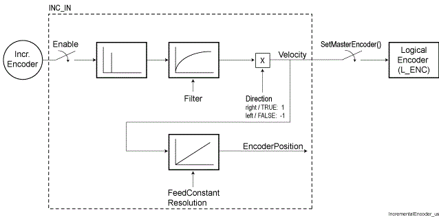

# Incremental Encoder Input

## Task

To be able to process an [increment encoder](D-SE-0070736.html#D-SE-0070736) in the PacDrive system, these must be connected to the controller or on the bus terminal BT-4/ENC1. The Incremental Encoder Input must be attached to the controller (or the bus terminal) in the controller configuration to enable the PacDrive system to process the signal of the encoder.

## Functional Description

Functional principle of the incremental encoder input:

The speed signal of the master encoder is fed to the Log. encoder. The allocation to the master encoder is carried out with the SetMasterEncoder() function.

EIO0000002285.11