# Logical Encoder

## Task

For using and manipulating signals of a speed and position source in the PacDrive system independently, the logical encoder is integrated in the system as “Software encoder”.

Tasks of the logical encoder:

* Coupling various encoder types to a “Standard encoder”
* Coupling multiple Log. encoder to a master encoder
* Generating position values from the Master encoder speed value
* Manipulating the master encoder speed signal
* Software gear (multiplication) of the speed signal
* Adding a speed signal to the speed signal of the master encoder
* Software coupling
* Realizing a phase displacement trough the system
* Master position source for electronic curve (“x-axis”)
* Master position source for cam switch

## Contents of This Topic

This topic contains the following subtopics:

* [Functional Description](#D-SE-0070718__D-SE-0070718.5)
* [Velocity Generator](#D-SE-0070718__D-SE-0070718.21)
* [Phase Generator](#D-SE-0070718__D-SE-0070718.22)
* [Gearbox](#D-SE-0070718__D-SE-0070718.23)
* [Coupling](#D-SE-0070718__D-SE-0070718.24)

## Functional Description

Functional principle of the logical encoder (simplified presentation):

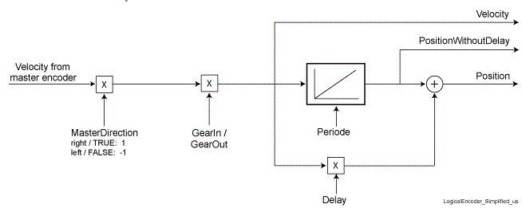

The speed signal of the master encoder is fed to the Log. encoder. The allocation of the master encoder is carried out with the SetMasterEncoder() function.

Possible Master Encoder:

* LXM
* Virtual encoder
* Physical Master Encoder (SinCos)
* Incremental encoder
* Log. encoder
* Sum encoder
* Sum Master Encoder
* Encoder network for sync. Encoder Input

Connection “DRIVE” - “Logical encoder”:

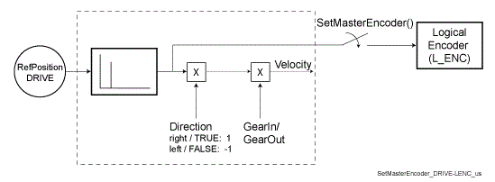

Connection “Master encoder” (P\_ENC, INC\_IN, SYN\_DIN) - “Logical encoder”:

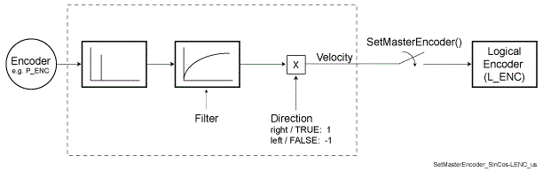

In the simplest application, the speed generator, the phase generator, the gear, and the coupling are switched off.

The speed signal is then integrated trough the position integrator for a position value. Furthermore, the [direction of rotation](D-SE-0075824.html#D-SE-0075824)  of the speed signal delivered by the master encoder is changed.

By specifying a [period](D-SE-0075826.html#D-SE-0075826), the position signal can be kept within a range of 0 ...period value. For example, this can be used for measuring the position signal - independent of the axis period.

A second Log. encoder that is likewise fed with the speed of the master encoder, can be used as actual value source for a measurement function. The position value of this Log. encoder is reset with the program, after evaluating the measurement, e.g. with the Setpos1() function.

## Extended Functionality

The functionality of the logical encoder has been greatly extended over time. These new functions were divided into the following function groups:

* [Velocity Generator](#D-SE-0070718__D-SE-0070718.21)
* [Phase Generator](#D-SE-0070718__D-SE-0070718.22)
* [Gearbox](#D-SE-0070718__D-SE-0070718.23)
* [Coupling](#D-SE-0070718__D-SE-0070718.24)

Functional principle of the logic encoder:

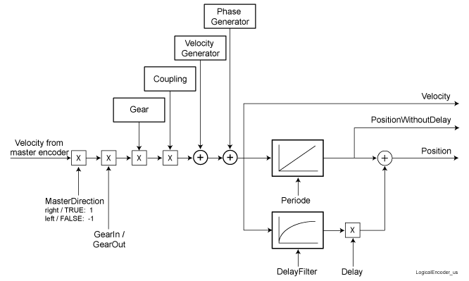

## Velocity Generator

Adding a speed signal to the speed signal of the master encoder.

Typical application

* Registration Correction

  Favorable with a continuous position deviation of the print mark as these can be compensated using a continuous velocity overlapping.

## Functional Description

Functional principle of the logic encoder:

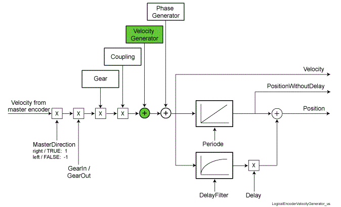

Functional principle of the logic encoder - velocity generator:

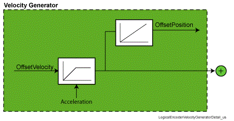

With the OffsetVelocity parameter, the velocity to be added is specified.

To avoid that changes in the parameters OffsetVelocity lead to a leap in the velocity (parameter Velocity of the logical encoder), the changes in velocity is performed by the acceleration determined in the parameter Acceleration.

In many applications, it is necessary to know the changed in position that is generated by OffsetVelocity. This information can be read in the parameter OffsetPosition.

## Phase Generator

Adding a distance as speed signal to the speed signal of the Master encoder.

Typical application

* Registration Correction

  Favorable with correction within a machine cycle.

  With the phase generator, a “virtual” motion is added in theLog. encoder to the master speed. Thus, a “time” manipulated master position is transferred to the axis connected with the Log. encoder so that the position target is reached sooner or later.

## Functional Description

Principle of the logic encoder:

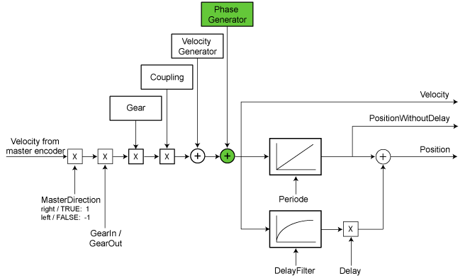

Functional principle of the logic encoder - phase generator:

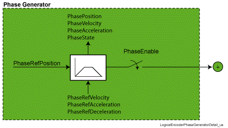

With the PhaseEnable parameter, the phase generator is activated.

With the PhaseRedPosition parameter, the distance is specified.

With the PhaseRefVelocity, PhaseRefAcceleration, and PhaseRedDeceleration parameters, the motion profile of the phase generator (positioning) is determined. In the PhasePosition, PhaseVelocity, PhaseAcceleration, and PhaseState parameters, the actual values of the phase generator are depicted.

## Gearbox

Multiplication of the master encoder speed signal.

Typical application:

* Velocity proportional coupling of drives.

  For example, this can be used for grouping products.

Grouping products with two conveyor belts via velocity proportional coupling.

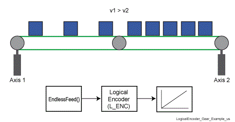

NOTE: In practice, the gearboxes (GearEnable, GearRefFactor, GearFactor, GearChangeRate parameters) are used only rarely, as the position reference is lost. If you have this task, use a solution with curves (curve-based motion flow).

## Functional Description

Functional principle of the logic encoder:

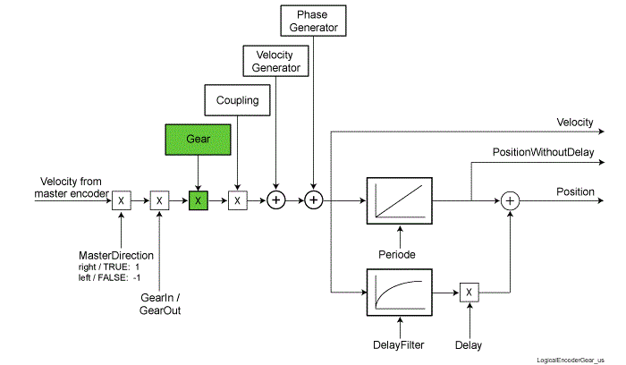

Functional principle of the logic encoder - gearbox:

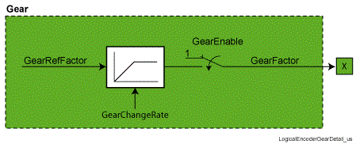

With the GearEnable parameter, the gearbox is activated.

With the GearRefFactor parameters, the gear factor is specified.

To avoid that changes in the parameter GearRefFactor lead to a leap in the velocity (parameter Velocity of the logical encoder), changes in the gearbox factor is performed by the rate of change determined in the parameter GearChangeRate

## Coupling

Engaging and disengaging the speed signal of the master encoder.

Typical application:

* Controlling a slave axis when a product is missing.

  The motion sequence must not be influenced when coupling out and back in again.

Missing product in the fan-type chain -> couple the pressure roller out and in:

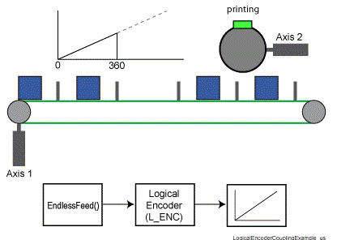

NOTE: In practice, the coupling is used only rarely as it leads to jerks during engaging and disengaging. Moreover, it is not possible to engage and disengage at any positions. If you have this task, use a solution with curves (curve-based motion flow).

## Functional Description

Functional principle of the logic encoder:

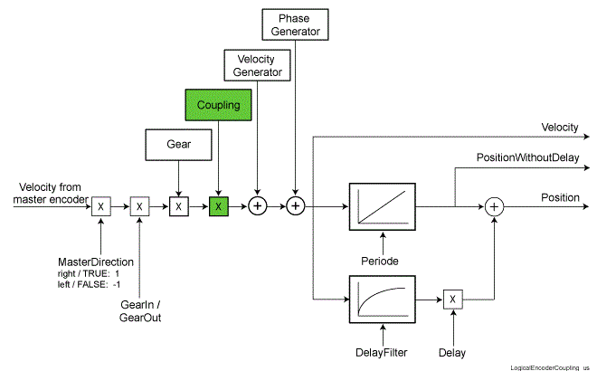

Functional principle of the logic encoder - coupling:

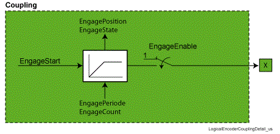

With the EngageEnable parameter, the coupling is activated.

With the EngageStart parameter, the engaging and disengaging is controlled.

To achieve engaging and disengaging without jerks, the speed modify is controlled trough EngagePeriode and EngageCount. In the EngagePosition and EngageState parameters, the actual values of the coupling are depicted.

EIO0000002285.11