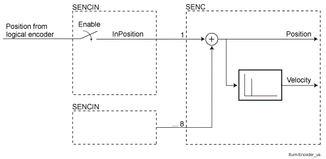

# Sum Encoder

## Task

The Sum encoder was integrated in the system for adding speed position signals in the PacDrive system.

Tasks of the Sum encoder

* Registration Correction

  The position deviation of the print mark is compensated by feeding a correction curve via the Sum encoder.
* Overlapping a corrective curve to the actual curve (phase shift)

  When, for example, compensating a changing pressure angle of the belt drive, a constant production velocity can be achieved by feeding a corrective curve via the Sum encoder.

NOTE: In practice, addition of positions appears difficult because, for example, a jump occurs in the “output position” of the Sum encoder on resetting a “source position”.

Therefore, the Sum Master Encoder must be used.

## Functional Description

Functional principle of the Sum encoder:

The position of the Log. encoder is fed to the Sum encoder. The allocation to the Log. encoderis carried out with the SetSEncIn() function

EIO0000002285.11