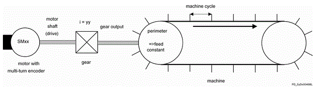
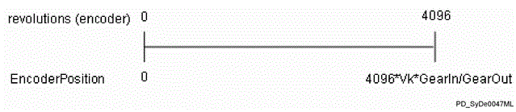
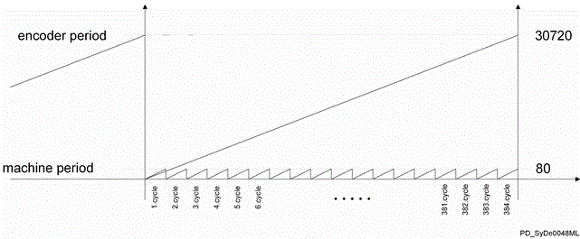

# Absolute Value Encoders in Periodic Applications

## General

Absolute encoders are important functional requirements if a reference run is undesired after switching. For periodic applications, the position must only be determined once in relation to one machine cycle.

Thereafter, the cyclic positioning takes place relatively for each machine cycle. In periodic operation, an "encoder jump" occurs after a defined number of revolutions of the absolute encoder, depending on the system. This is without further meaning for relative positioning when switched on, but is when determining the absolute position in relation to one machine cycle directly after being switched on.

The following report describes the possible solutions and conditions for determining the absolute position if "encoder jumps" occur due to movement of the mechanism while switched off.

## Contents of This Topic

This topic contains the following subtopics:

* [Basics](#D-SE-0070720__D-SE-0070720.17)
* [Receipt of the Absolute Position Using Mechanical Constructions](#D-SE-0070720__D-SE-0070720.18)
* [Receipt of the Absolute Position Using Software](#D-SE-0070720__D-SE-0070720.19)

## Basics

Periodic applications with absolute encoders are possible with various mechanical constructions. A general mechanical structure is shown below:

General mechanical structure of a periodic application for non-stop operation:

The technical background and terms are briefly explained in the following.

## Absolute Value Encoder

Unlike incremental encoders, absolute encoders provide the absolute position based on at least one revolution of the encoder shaft directly after being switched on without finding a zero impulse. If the term "absolute" can be understood here as only one revolution, then it is a single-turn encoder. If the absolute value encoder can resolve multiple revolutions absolutely, then it is a multi-turn encoder.

## Encoder Jump

The number of resolvable revolutions is limited with multi-turn encoders. Typically, 4096 revolutions can be distinguished. After that, the position provided by the encoder repeats. When transferring the maximum possible position to 0, it is called encoder jump.

## Feed Constant VK

The feed constant describes how many mechanical units the machine moves when the gear drop turns by one revolution. In the figure, the feed constant is the circumference of the output roller. Generally, the unit and the absolute dimension of the feed constant can be freely selected.

## EncoderPosition EPos

In the PacDrive system, the "EncoderPosition" shows the actual position of the encoder shaft scaled by the feed constant and the gear ratio.

The number 4096 stands for the resolvable number of revolution of the multi-encoder used. GearIn/GearOut describes the ratio factor of the gear, meaning how many revolutions (GearOut) one must turn the gear input so that the gear output turns by the number of revolutions in GearIn.

Possible range of the “Encoder Position” in the PacDrive system:

## Encoder Period (Encoder Period) EPer

The encoder period "EncoderPeriod" practically represents the maximum position of the EncoderPosition that, therefore, the value from the EncoderPosition that leaps back to 0. The unit is specified here using the feed constant.

EncoderPeriod = 4096 \* [VK](../../../../../api/crossBook?lang=en-US&virtualBookName=D-SE-0075684.html#D-SE-0075684) \* [GearIn](../../PD.Parameter.LXM62Drive&topicID=D_SE_0071811) / [GearOut](../../../../../api/crossBook?lang=en-US&virtualBookName=PD.Parameter.LXM62Drive&topicID=D_SE_0071838)

## Machine Period MPer

The "MachinePeriod" describes the number of mechanical units per machine cycle regarding the feed constants.

## Receipt of The Absolute Position Using Mechanical Construction

The compensation of the encoder jump while switched off can occur once by mechanical construction.

You can use the [figure “General mechanical assembly...”](#D-SE-0070720__D-SE-0070720.17) for illustration. The following values are taken as a basis.

Parameters for illustrated example:

| Parameters application example | Value |
| --- | --- |
| GearIn | 1 |
| GearOut | 64 |
| Output wheel circumference | 480 mm |
| Feed constant VK | 480 mm / revolution |
| MachinePeriod MPer | 80 mm |
| EncoderPeriod EPer | 4096\*480 mm\*1/64 = 30720 mm |
| Number of machine cycles in the encoder period | 30720 mm / 80 mm = 384 |

The following figure shows the relation between the machine cycle and the encoder jump based on the assumed values:

Whole-number amount of machine period in the encoder period:

While maintaining the following conditions, any number of “encoder jumps” can occur while switched off without losing the absolute position in relation to one machine cycle after being switched on.

1. A whole numbered n must be given with -<Infinite> <n<= 12, for applies: After 2 n motor revolutions, a complete number of machine cycles are processed.
2. EPer/MPer is a whole positive number

## Reasoning

1. One divides 4096 by 2 n and if n is a whole number, one always gets a result with a whole number. In other words, one could also say: If there is an -<Infinite> < n < 12 with 2 to the n motor revolutions, with which some machine cycles are processed completely and therefore, a complete number of machine cycles are also processed with 4096 motor revolutions (=encoder jumps). This is a pre-requisite so that the encoder jump is always carried out after a whole number of machine cycles.
2. The second condition has the consequence that complete machine cycles can always be accommodated within one encoder period. The encoder jump likewise always occurs at the same point of the machine cycle. In this way, the position can always be determined relative to the machine cycles.

In practice, the machine period is specified. The gears and diameter of the output wheel or the pitch of the output wheel are the design parameters for the construction. The following function condition applies:

(4096 \* [GearIn](../../../../../api/crossBook?lang=en-US&virtualBookName=PD.Parameter.LXM62Drive&topicID=D_SE_0071811)/[GearOut](../../../../../api/crossBook?lang=en-US&virtualBookName=PD.Parameter.LXM62Drive&topicID=D_SE_0071838) \* [VK](D-SE-0075684.html#D-SE-0075684)/MPer) results in one positive whole number

Depending on the machine period, the resulting feed constant (diameter of the output wheel) must be adjusted to the selected gear. The selected gear stage does not have to exhibit a transmission ratio of 2 n and the motor shaft is not required to perform 2 n revolutions per machine cycle.

With product versions, the machine period should be selected in such a way that they contain a whole number of machine cycles for the versions.

Gears with a transmission ratio of 2 n (0 < n < 4096, n as a whole number) have the advantage that the encoder jump always occurs at the same gear output shaft position. The mechanical function condition is thus automatically adhered to if the output shaft is processed for each revolution with a whole number on the machine cycles.

## Receipt of The Absolute Position Using Software

The mechanics cannot always provide the aforementioned pre-requisites for overflow-safe position determination after being switched on. This can be the case, for example, if the machine is already constructed or the product version does not allow this. With the following solution, an individual encoder jump that occurs while switched off can be recognized and the absolute position is retained.

The absolute position of the encoder is buffered cyclically in a retain variable and saved in the PacDrive controller.

After being switched on, the current position of the encoder is compared with the saved position. In this way, the absolute position can also be determined over a single encoder jump.

Determining the absolute position by using the software is included as a standard function in the template.

For non-Template based applications, on request, a function module is available for this application.

EIO0000002285.11