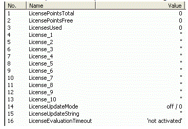

# Purchasing Licensing Points

## General

If components subject to license are used in a project, the necessary number of points must be available in the system. There are two possibilities to obtain points for a PacDriveTM System.

## Package Order of a Controller with Pre-Installed Points

For the package order, you must know when ordering the necessary hardware how many points are needed for the project that is to be executed on the ordered controller. If you order a controller, you can additionally order any number of license points. The ordered points are placed on the memory card during the production process and are available for use immediately. You receive a document that has a 16-digit code along with the controller. This code ensures that the points purchased can be reloaded onto the memory card using Logic Builder in case of loss (such as through formatting or incorrect use of the memory card). You can use the code that is supplied with the controller as often as you like to reset the number of points on the memory card supplied with the controller to the initial state. The explanation of how to use the code (called ‘authorization key’ herein) is given below.

## Purchasing Further Points / Upgrading Using Logic Builder

In addition to ordering controllers that are provided with license points upon delivery, there is the option of using the Logic Builder toolkit to obtain additional license points for an existing system (upgrade).

This would include scenarios such as the following examples:

* Use of new modules subject to cost on a controller that is already in operation
* Addition of new modules that are subject to cost to existing projects
* Completion of an evaluation, development, or start-up phase that previously ran in the aforementioned evaluation mode (six hours)

If you need an upgrade of the current point account you can order an authorization key electronically (by email, telephone). The key can be used to upgrade exactly one memory card. The required contact persons and contact addresses can be found under ContactAddresses. In addition to placing the order, you must also send a request key and specify the current and the desired number of license points. From firmware V00.20.00, the respective controller has received a new parameter group Licensing. In the Logic Builder PLC configuration, this group contains the parameters LicenseUpdateMode and LicenseUpdateString, both of which are required for upgrading license points.

## Procedure

In this example, the system has fewer points available than required (the number of points is 0 and the required number of points is 95). In the PLC configuration, the parameter group Licensing is displayed as follows:

| Step | Action |
| --- | --- |
| 1 | A request key must first be generated that can be used to order the points. The LicenseUpdateMode parameter must be changed to the value request key / 1: |
| 2 | Press the keyboard shortcut Ctrl + F7 to apply the values to the controller. (This step is always necessary when changing parameters):    **Result:** Immediately after the changed LicenseUpdateMode parameter is applied, the LicenseUpdateString parameter contains the request key required: |
| 3 | Copy this key manually and send it in by email or phone, along with the number of existing points and an order for new points.    Once an order is received together with a request key, you receive an authorization key. |
| 4 | Set LicenseUpdateMode in the Logic Builder PLC configuration to the value authorization key / 2. |
| 5 | Write the authorization key into the parameter LicenseUpdateString:    **Result:** After the key is applied, the PLC configuration should look like this: |
| 6 | Reset the controller to take over the entry: Online > Cold reset of controller  **Result:** After the boot process is complete and if the authorization key is correct, the license points purchased are available in the system after restarting: These are displayed in the parameter LicensePointsTotal.  **Result:** If an incorrect authorization key has been entered or the key does not match the memory card, the parameter LicenseUpdateMode remains in the mode authorization key / 2 after restarting and the (incorrect) key entered will be displayed in the parameter LicenseUpdateString. This status remains until a correct key is entered. |

EIO0000002285.11