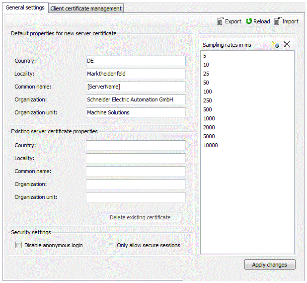
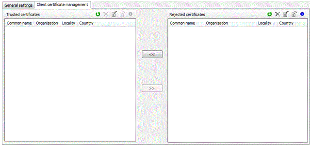

# OPC UA Server Configuration

## Contents of This Topic

This topic contains the following subtopics:

* [Introduction](#D-SE-0070729__D-SE-0070729.3)
* [General Settings Tab](#D-SE-0070729__D-SE-0070729.5)
* [OP UA Task Cycle Times and Priorities](#D-SE-0070729__D-SE-0070729.12)
* [Client Certificate Management Tab](#D-SE-0070729__D-SE-0070729.13)

## Introduction

In the Logic Builder > Devices tree, double-click the controller to open the OPC UA server configuration tab of the controller.

The OPC UA server configuration tab provides various functionalities to edit the server configuration file ServerConfig.ini on the memory card of the controller.

The ServerConfig.ini is saved as ide0:\ESystem\opcua\ServerConfig.ini on the memory card.

The OPC UA server configuration tab allows you to:

* Define default properties for new server certificates
* View and delete existing server certificates
* View and add sampling rates
* Import and export server certificates
* Enable security and manage various security settings

## General Settings Tab

OPC UA server configuration, General settings tab

## General Settings Tab, Toolbar

| Element | Description |
| --- | --- |
|  | Opens a Windows dialog box (Save as) to export the server configuration file as an .ini file. |
|  | The server settings are loaded and refreshed.  NOTE: Comments in loaded configuration files are removed if changes in the server settings are saved. |
|  | opens a Windows dialog box (Open) to import a server configuration file (\*.ini). |

## Default Properties for New Server Certificate

In this section you can define the default properties for a new OPC UA server certificate:

| Element | Description |
| --- | --- |
| Country | Country code consisting of two letters that indicates the country in which the OPC UA server is operated. |
| Locality | Name of the city from where the OPC UA server is operated. |
| Organization | Name of the organization that uses the OPC UA server. |
| Organization unit | Name of the organization unit that uses the OPC UA server. |

NOTE: With firmware version <V1.64.x.x (LMC): When generating a new server certificate the date, from which the certificate is valid, is registered in the certificate. This date is registered in UTC (Coordinated Universal Time).

When the client tries to establish a connection to the server and the system (client and server) is not located in this UTC time zone, an error may occur and the connection build-up is canceled. In this case the connection to the server is only possible after a certain period of time. This period of time is equal to the time difference (in hours) between the local standard time and UTC.

**Example:**

Location of the system: Germany

Standard time of Germany: CET (Central European Time) = UTC + 1 hour

Difference between CET and UTC: 1 hour

=> The connection build-up between the client and the server can only be established one hour after the generation of the new server certificate.

## Existing Server Certificate Properties

If the selected controller already provides a server certificate, the properties of this certificate are displayed in the fields of this section.

| Element | Description |
| --- | --- |
| Country | Country code consisting of two letters that indicates the country in which the OPC UA server is operated. |
| Locality | Name of the city from where the OPC UA server is operated. |
| Organization | Name of the OPC UA server |
| Organization unit | Name of the organization unit that provides the OPC UA server. |
| [Delete existing certificate] button | Deletes the existing server certificate of the selected controller. |

## Security Settings

In this section you can change the security aspect of the OPC UA server:

| Element | Description |
| --- | --- |
| Disable anonymous login | If this option is activated an anonymous connection to the controller is not possible. Only a login with a user name and password is allowed.  Users with access to the object 'OPC\_UA' can log in.  For details refer to the [M262 Logic/Motion Controller - Programming Guide](https://product-help.schneider-electric.com/Machine%20Expert/V2.0/en/m262prg/index.htm#t=m262prg%2FD-SE-0095294.html&rhsearch=controller%20device%20editor&rhsyns=%20).  Default setting: Enabled. |
| Only allow secure sessions | If this option is activated the server only enables an encryption for the login and the data exchange.  If this option is not set, the server still offers the encryptions but provides an unencrypted data exchange also.  Default setting: Enabled. |

## Sample Rates in ms

The sample rate indicates a time interval in milliseconds. When an interval has passed, the server sends the requested data to the client.

| Element | Description |
| --- | --- |
|  | Adds a new sample rate to the sample rate list.  It is not allowed to add more than 20 sample rates.  If an entered sample rate is invalid, a corresponding message prompt is displayed.  The sample rate values must be at least 1 and they are restricted to 60000. |
|  | Deletes the selected sample rate. |
| Sample rate list | Displays the available sampling rates.  By default, the sampling rates are set to values from 5 to 10000. Double-click a value in the list to modify it. |

## Buttons

| Element | Description |
| --- | --- |
| [Apply changes] button | Saves the changes you made on this tab to the configuration file Serverconfig.ini and concerns the general settings.  The Apply changes button is only activated if the general settings are valid.  A restart of the controller is necessary to take over the settings. |

## OP UA Task Cycle Times and Priorities

The following table shows the priorities of the OPC UA monitoring task.

Default configuration

* Eleven pre-configured scan times
* 5 ms, 10 ms, ..., 10 s
* Dedicated monitoring tasks for each scan time
* No CPU load for unused scan times

Expert mode

* Individual scan time configuration via ini file is possible

Detailed Function

* Cyclic reading of monitoring items
* Check for modifications
* Send modified items
* Manage project changes and OLC
* Set the items to “non-operational node - id unknown” before download OLC
* After download and OLC

  + Registers items automatically
  + Available items are set to “good”
  + Unavailable items are marked as “non-operational node - id unknown”

Priority and cycle times

| Task name | Cycle time | Priority |
| --- | --- | --- |
| TaskOpcUaAsyncJob5 ms | 5 ms | IEC15 (235) |
| TaskOpcUaAsyncJob10 ms | 10 ms | IEC15 (235) |
| TaskOpcUaAsyncJob25ms | 25 ms | IEC15 (235) |
| TaskOpcUaAsyncJob50ms | 50 ms | IEC31 (251) |
| TaskOpcUaAsyncJob100ms | 100 ms | IEC31 (251) |
| TaskOpcUaAsyncJob250ms | 250 ms | IEC31 (251) |
| TaskOpcUaAsyncJob500ms | 500 ms | IEC31+1 (252) |
| TaskOpcUaAsyncJob1000ms | 1 s | IEC31+1 (252) |
| TaskOpcUaAsyncJob2000ms | 2 s | IEC31+1 (252) |
| TaskOpcUaAsyncJob5000ms | 5 s | IEC31+1 (252) |
| TaskOpcUaAsyncJob10000ms | 10 s | IEC31+1 (252) |

## Client Certificate Management Tab

This tab allows you to determine which client certificates are trusted and which clients are allowed to communicate with the server.

## Client Certificate Management Tab, Toolbar

| Element | Description |
| --- | --- |
|  | Both certificate lists are loaded or refreshed. |
|  | Deletes the selected certificates. |
|  | Opens a Windows dialog box (Open) to import a certificate that is uploaded to the selected certificate list (trusted certificates list or rejected certificates list). |
|  | Opens a Windows dialog box (Save as) to export the selected certificates to a selectable path. |
|  | Opens a dialog box containing additional information on the selected certificate. |

## Trusted Certificates List and Rejected Certificates List

A certificate contains common information about the company that owns the certificate, how long a certificate is valid, and so on. The certificate management provides two list views that display the content of the trusted and rejected certificates.

| Element | Description |
| --- | --- |
| Trusted certificates | This list includes the client certificates the server trusts. |
| Rejected certificates | This list includes the client certificates the server does not trust. |
|  | Use the << and >> buttons to move a rejected certificate to the Trusted certificates list or the opposite way.  During the moving procedure, a progress bar appears and displays the remaining files.  See also [Enabling Security](D-SE-0070730.html#D-SE-0070730__D-SE-0070730.7). |

EIO0000002285.11