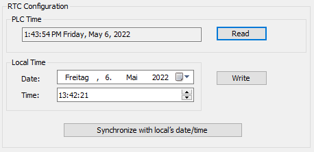

# Configuration of the Real-Time Clock

The real-time clock of the controller can be adjusted via the Services tab of the controller configuration.

The Services tab provides the following possibilities:

* Reading the time and date of the controller
* Setting the time and date of the controller

| Element | Description |
| --- | --- |
| PLC Time field | Displays the date and time read from the controller when you click the Read button, with no conversion applied. This read-only field is initially empty. |
| Read button | Reads the date and time saved on the controller and displays the values in the PLC Time field. |
| Local time fields | Defines a date and time to send to the controller when you click the Write button. If necessary, modify the default values before clicking the Write button. A message box informs you about the result of the command. The date and time fields are initially filled with the PC settings. |
| Write button | Writes the date and time defined in the Local time fields to the logic controller. A message box informs you of the result of the command. |
| Synchronize controller with computer’s date/time button | Sends the PC date and time. A message box informs you of the result of the command. |

EIO0000002285.11